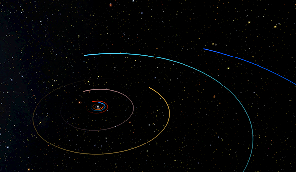
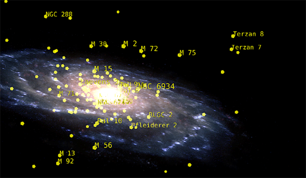

---
authors:
  - name: Brian Abbott
    affiliation: American Museum of Natural History
---

# Content

{menuselection}`Scene`

::::{grid} 1 2 2 3
:gutter: 1 1 1 2

:::{grid-item-card} 

:::

:::{grid-item-card} 

:::

:::{grid-item-card} 

:::

::::

:::{toctree}
:maxdepth: 1
:hidden:

solar-system/index
milky-way/index
universe/index
:::
