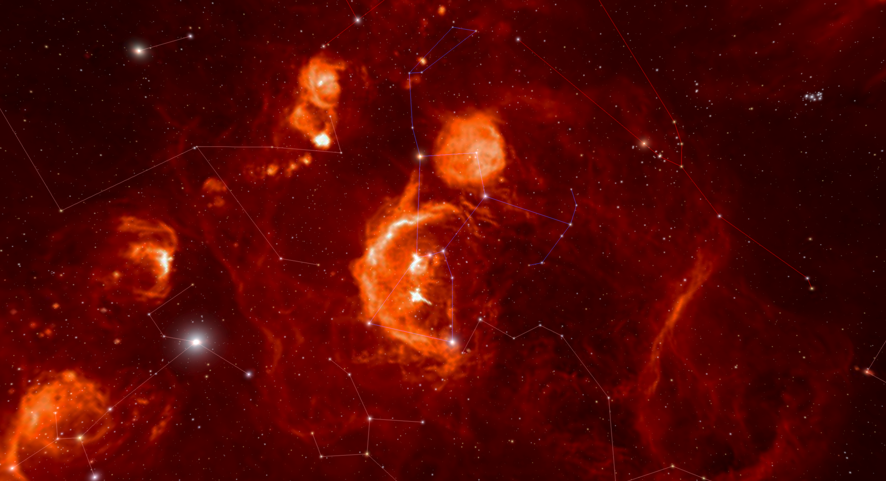
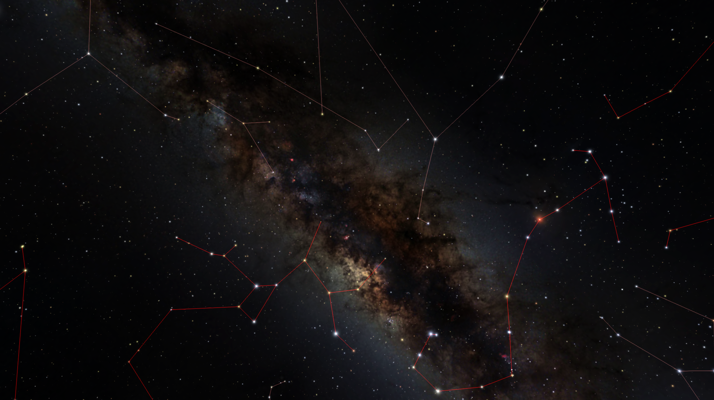

---
authors:
  - name: Brian Abbott
    affiliation: American Museum of Natural History
---

# All-sky Images

{menuselection}`Scene --> Milky Way --> All-sky Images`

An all-sky image is our view of the night sky as seen through a variety of telescopes. The most common is the image we see with our eye---the visible sky. This normally includes stars as well as the band of light that sweeps across the sky we call the Milky Way. In these images, the stars are removed to better see the gas and dust in the sky.

For the visible sky, we are left with the gas and dust that makes up the Milky Way. Overlaying {menuselection}`Scene --> Milky Way --> Stars --> Stars` will complement the image.

## Assets
::::{grid} 1 2 2 3
:gutter: 1 1 1 2

:::{grid-item-card} 

:::

:::{grid-item-card} 

:::

::::

:::{toctree}
:maxdepth: 1
:caption: Assets

hydrogen-alpha/index
visible-milky-way/index
:::
