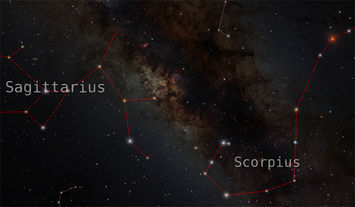
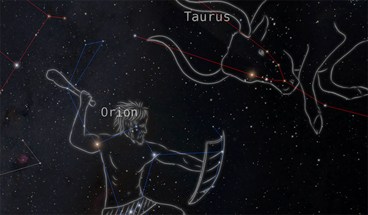
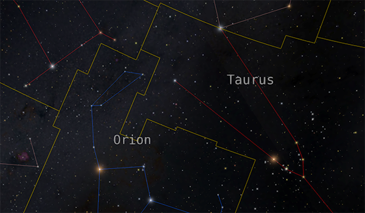

---
authors:
  - name: Brian Abbott
    affiliation: American Museum of Natural History
---

# Constellations

{menuselection}`Scene --> Milky Way --> Constellations`

Constellations are the objects, animals, and people conjured up from star patterns the ancients perceived in the night sky. Passed down through the millennia, eventually astronomers adopted eighty-eight official constellations located over the entire sky.

We represent constellations in three ways:
::::{grid} 1 2 2 3
:gutter: 1 1 1 2

:::{grid-item-card} [Lines](./constellation-lines/index)

:::

:::{grid-item-card} [Art](./constellation-art/index)

:::

:::{grid-item-card} [Boundaries](./constellation-boundaries/index)

:::

::::

(constellation-history)=
## History

Constellations originate from prehistoric times---before humans had a system of writing. Ancients used star patterns, and often the shape of the Milky Way's light itself, as a form of storytelling about their beliefs, mythology, and creation. Different cultures developed their own constellations in isolation, but scientists have adopted "official" constellations that act to standardize the night sky for modern times.

The earliest accepted evidence for constellations dates back to roughly 3000 BCE as seen in writing tablets from Mesopotamia (modern Iraq). Many of their constellations appear to be adopted by the Greeks around that time. As we invented symbols and language, information passed freely among our social species. Several constellations are mentioned in the Bible as well.

*[The Almagest](https://en.wikipedia.org/wiki/Almagest)* by Ptolemy (c. 100--170 CE), a resident of Roman-ruled Egypt, is the source of today's Western constellations. His treatise on math and astronomy was one of the most influential scientific books in history, and remained the standard for over 1,000 years until the early Renaissance and Copernicus.

For almost 2,000 years these figures were passed down on star charts. Most of the northern-hemisphere constellations date from antiquity and adopt the names of ancient Greek legends and lore. Many southern-hemisphere constellations are more modern in origin.

:::{image} ./constellation-art/Ioannis_Bayeri_Rhainani_Vranometria_1661_(84129163).png
:align: left
:width: 40%
:::

Johann Bayer's (1572--1625) *[Uranometria](https://en.wikipedia.org/wiki/Uranometria)* of 1603 was the first text to assign stars to individual constellations, and gave the stars within each constellation Greek letter designations.

French astronomer [Nicolas Louis de Lacaille](https://en.wikipedia.org/wiki/Nicolas-Louis_de_Lacaille) (1713--1762) studied the night sky from the Cape of Good Hope, near Cape Town, South Africa. His voyage there was mainly to determine the distance to the planets using the longest possible trigonometric baseline (which required simultaneous observations in Europe). However, while there, Lacaille developed a southern catalog of stars where he introduced fourteen new constellations that have been adopted today.

The list of eighty-eight constellations now adopted by astronomers was produced for the International Astronomical Union (IAU) in 1922 by American astronomer [Henry Norris Russell](https://en.wikipedia.org/wiki/Henry_Norris_Russell) (1877--1957). Several years later boundaries were devised by Belgian astronomer [Eugene Delporte](https://en.wikipedia.org/wiki/Eug%C3%A8ne_Joseph_Delporte) (1882--1955) that delineated an area for each of the eighty-eight constellations.

(celestial-sphere)=
## The Celestial Sphere

Relevant to the constellations, and a [few other data sets](../all-sky-images/index), is the concept of the _celestial sphere_. The celestial sphere is a phenomenon of our perspective as we look toward the sky. While we understand the remote distance of astrophysical objects, from our perspective on Earth, everything we see---the Sun, planets, and stars---all appear to be projected on a sphere at some arbitrary distance.

This is especially pertinent to the constellations because they are built from lines that connect two stars. To the ancients, who had no concept of the vast distances of the stars, these lines were devised as one would paint a line on canvas. Now, we understand the stars, and while thery may be near one another in the sky, we know now that they may be no where near one another in space. 

For this reason, the constellations only work from Earth's perspective. Once you fly away from Earth, the figures begin to distort and become unrecognizable. Visually, this has utility, particularly as one flies away from the Solar System and into the neighboring stars where the true dimensionality of the Galaxy is highlighted by the distorted constellation lines.

## Assets
::::{grid} 1 2 2 3
:gutter: 1 1 1 2

:::{grid-item-card} 

:::

:::{grid-item-card} 

:::

:::{grid-item-card} 

:::

::::

:::{toctree}
:maxdepth: 1
:caption: Assets
:hidden:

constellation-lines/index
constellation-art/index
constellation-boundaries/index
:::
