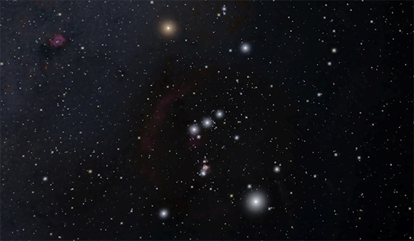
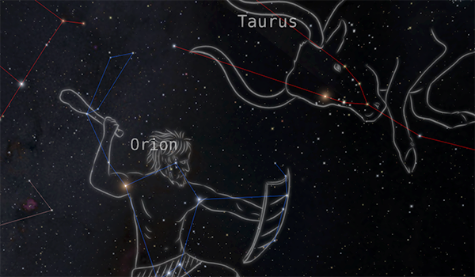
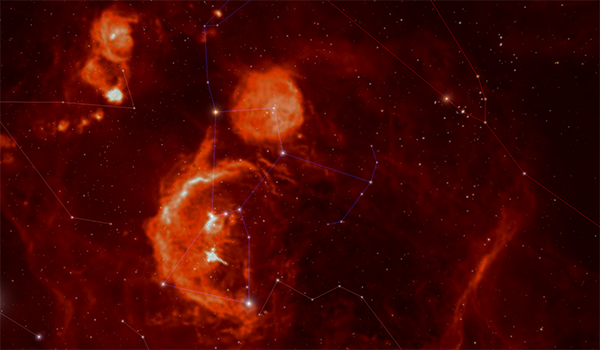
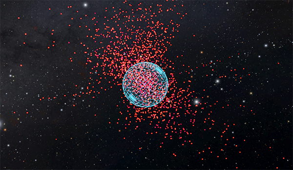
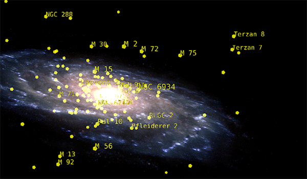
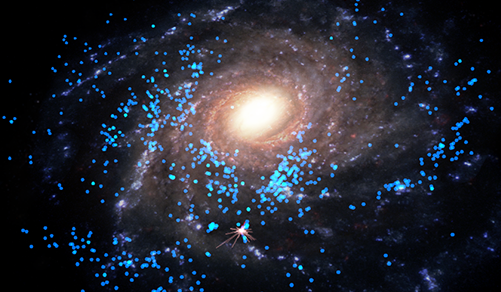
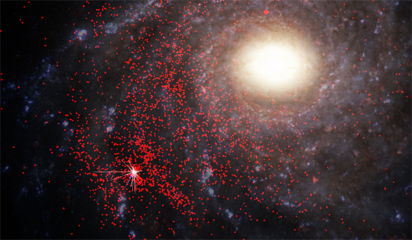
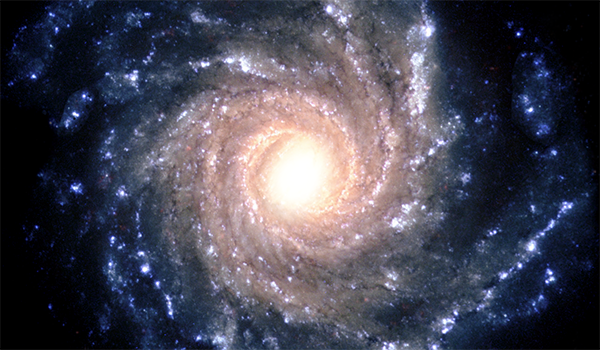

---
authors:
  - name: Brian Abbott
    affiliation: American Museum of Natural History
---

# Milky Way

{menuselection}`Scene --> Milky Way`

::::{grid} 1 2 2 3
:gutter: 1 1 1 2

:::{grid-item-card} 

:::

:::{grid-item-card} 

:::

:::{grid-item-card} 

:::

:::{grid-item-card} 

:::

:::{grid-item-card} 

:::

:::{grid-item-card} 

:::

:::{grid-item-card} 

:::

:::{grid-item-card} 

:::

:::{grid-item-card} 

:::

::::

In OpenSpace, {menuselection}`Milky Way` broadly includes anything outside the Solar System but within the Milky Way Galaxy.

The local stars that make up the night sky form a basis for these data sets, and we fill out the galaxy with exoplanets, star clusters, stellar remnants, and gaseous nebulae, among other objects.

:::{figure} milky_way_all.png
:align: left
:alt: A view of the Milky Way Galaxy from outside, with colored points scattered all over the galaxy, each representing a different data set among the zoo of objects in the Galaxy.

**The bountiful universe.** Here we see the Milky Way Galaxy with many of the Milky Way data sets turned on---the zoo of objects that we find in the Galaxy. In the sections below, we will explore each of these, one-by-one, and gain a basic understanding of what these objects are and what they mean for our understanding of the universe.
:::

:::{note}
The term _Milky Way_ takes on two meanings in astronomy. Originally, it referred to that band of light we see in the night sky. Later, as we understood the nature of the universe, it referred to the galaxy that we live in. 

Here, we will refer to that band of light as the _Milky Way_, and the 3-D galaxy as the _Milky Way Galaxy_, or just _Galaxy_ (in uppercase).
:::

:::{toctree}
:maxdepth: 1
:caption: Subsections
:hidden:

stars/index
constellations/index
all-sky-images/index
substellar-objects/index
exoplanets/index
star-clusters/index
nebulae/index
stellar-remnants/index
galaxy/index
:::

