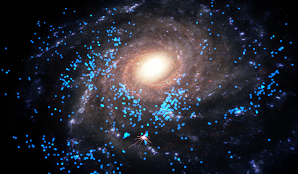
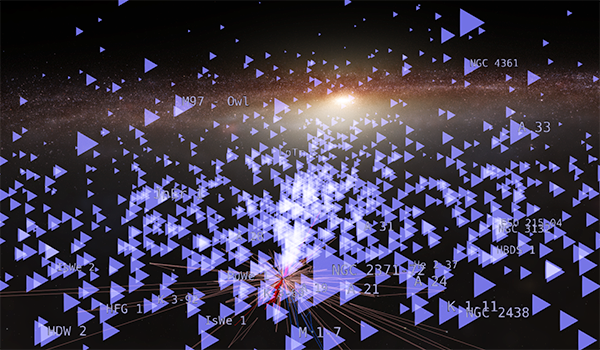
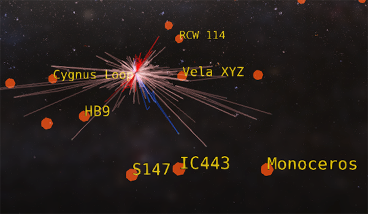

---
authors:
  - name: Brian Abbott
    affiliation: American Museum of Natural History
---

# Nebulae

{menuselection}`Scene --> Milky Way --> Nebulae`

Historically, the word _nebula_ was used to describe any diffuse, glowing object in the sky, including distant galaxies. We now understand them to be illuminated clouds of gas and dust, energized to glow from nearby starlight that excites the gas within them.

Some nebulae are associated with the birth of stars: the so-called star forming regions, or _HII regions_ (pronounced "H-two"). The misnomered _planetary nebulae_ form in the late stages of some star's lives (and have nothing to do with planets). And, supernova remnants are the left over ejecta from a supernova explosion---the dramatic end-of-life stages for massive stars.

## Assets
::::{grid} 1 2 2 3
:gutter: 1 1 1 2

:::{grid-item-card} 

:::

:::{grid-item-card} 

:::

:::{grid-item-card} 

:::

::::

:::{toctree}
:maxdepth: 1
:caption: Assets
:hidden:

HII-regions/index
planetary-nebulae/index
supernova-remnants/index
:::
