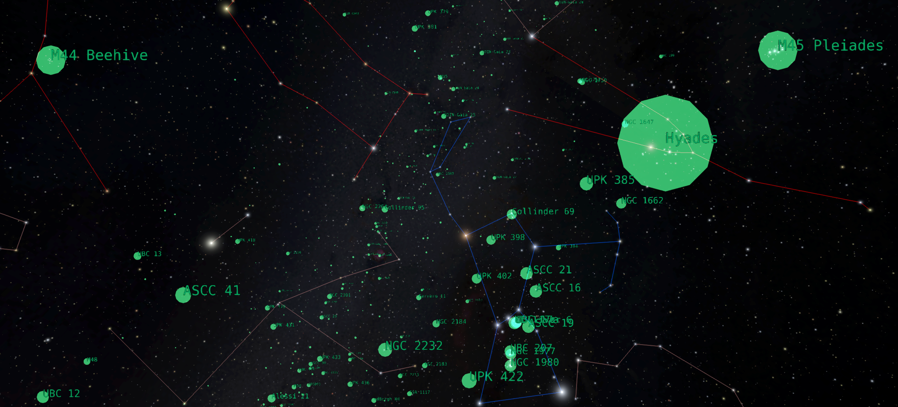
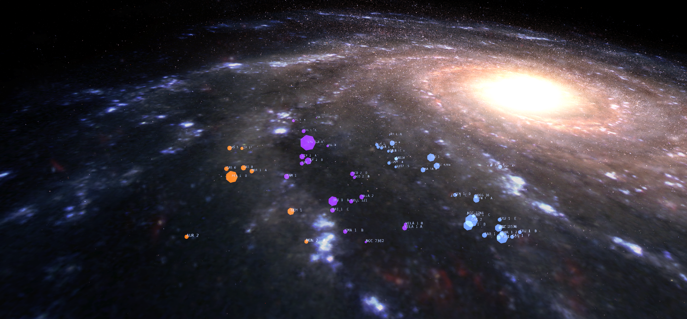

---
authors:
  - name: Brian Abbott
    affiliation: American Museum of Natural History
---

# Star Clusters

{menuselection}`Scene --> Milky Way --> Star Clusters`

Star clusters are groups of stars held together by gravity. Open star clusters form in stellar nurseries within the disk of the Galaxy. Globular clusters are composed of older population stars and exist in the Galactic halo, the spherical component of the Milky Way where older, dimmer stars exist.

OB Associations are groupings of stars that have moved apart over time and are no longer gravitationally bound. These formed together and contain younger stars, but have had enough time for its member stars to drift apart.

:::{figure} star_clusters.png
:align: left
:alt: A view from outside the Milky Way Galaxy with the star cluster data overlaid. Green points indicate the positions of the open clusters, the larger, multicolored points are the OB associations, and the yellow points are the location of the globular clusters.

Looking at the Milky Way Galaxy we see the star cluster data sets overlaid. Green points are the open clusters, the larger, multicolored points are the OB associations, and the yellow points are the globular clusters.
:::

## Assets
::::{grid} 1 2 2 3
:gutter: 1 1 1 2

:::{grid-item-card} 

:::

:::{grid-item-card} 

:::

:::{grid-item-card} 

:::

::::

:::{toctree}
:maxdepth: 1
:caption: Assets
:hidden:

open-clusters/index
ob-associations/index
globular-clusters/index
:::
