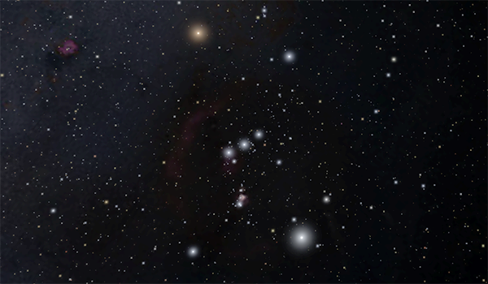
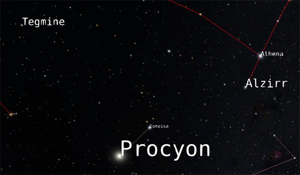
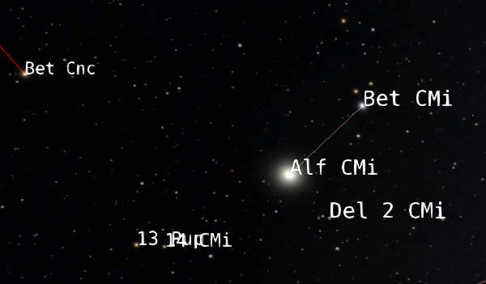
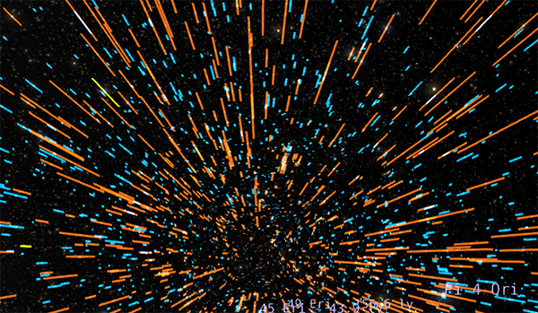
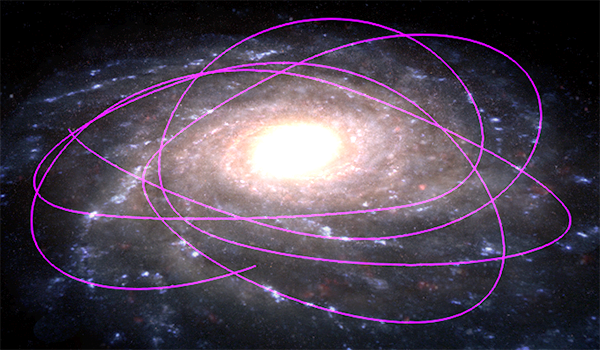

---
authors:
  - name: Brian Abbott
    affiliation: American Museum of Natural History
---

# Stars

{menuselection}`Scene --> Milky Way --> Stars`

::::{grid} 1 2 2 3
:gutter: 1 1 1 2

:::{grid-item-card} 

:::

:::{grid-item-card} 

:::

:::{grid-item-card} 

:::

:::{grid-item-card} 

:::

:::{grid-item-card} 

:::

:::{grid-item-card} 

:::

::::

These data sets contain the local stars, the backbone of the Digital Universe atlas and basis of the stars we see in the night sky. This section also contains various data that enhance our knowledge of the stars, including star labels, orbital paths of a select group of stars, and a visualization of the distance uncertainty of the stars.

:::{toctree}
:maxdepth: 1
:hidden:

stars/index
star-labels/index
star-labels-alternate/index
star-distance-uncertainty/index
star-orbits/index
sun/index
:::
