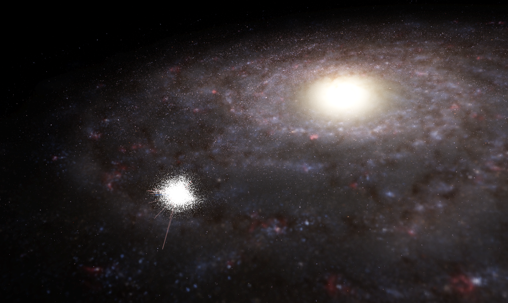
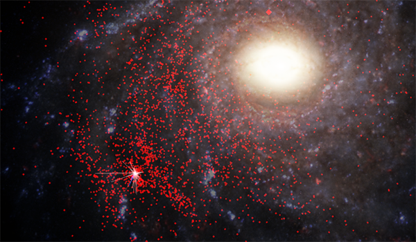

---
authors:
  - name: Brian Abbott
    affiliation: American Museum of Natural History
---

# Stellar Remnants

{menuselection}`Scene --> Milky Way --> Stellar Remnants`

Stellar remnants include objects that are left behind when a star exhausts its fuel and dies. These fall into three categories: white dwarfs, neutron stars, and black holes. Most stars will ultimately become a white dwarf. Pulsars are spinning neutron stars, and you can read more about what a neutron star is in the [Pulsars section](./pulsars/index). Black holes are difficult to get reliable distances to and; therefore, the catalogs are sparse in nature.

## Assets
::::{grid} 1 2 2 3
:gutter: 1 1 1 2

:::{grid-item-card} 

:::

:::{grid-item-card} 

:::

::::

:::{toctree}
:maxdepth: 1
:caption: Assets
:hidden:

white-dwarfs/index
pulsars/index
:::
