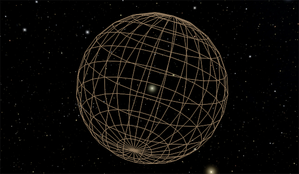

---
authors:
  - name: Brian Abbott
    affiliation: American Museum of Natural History
---

# Comets

{menuselection}`Scene --> Solar System --> Comets`

:::{warning}
This section is incomplete---nothing to see here, yet.
:::

::::{grid} 1 2 2 3
:gutter: 1 1 1 2

:::{grid-item-card} 

:::

::::

Comets are small, icy bodies that orbit the Sun. Perhaps the most famous
is Halley’s Comet, which travels around the Sun in an eccentric
orbit every 76 years and reaches a maximum distance of 35 AU.
Comets were likely ejected from the solar system once the planets
formed. Jupiter, Saturn, Uranus, and Neptune’s strong gravitational
field likely ejected many comet-sized bodies out of the solar system
in random directions, where they settled into a cloud.
Occasionally, one comet in the cloud interacts with another or is
perturbed by a passing star or a passing star’s comet cloud. This
could send the comet toward the Sun and planets, where it may
enter into an eccentric, long-period orbit.

:::{toctree}
:maxdepth: 1
:hidden:

oort-cloud/index

:::

