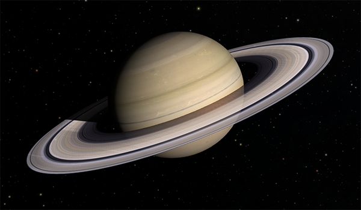
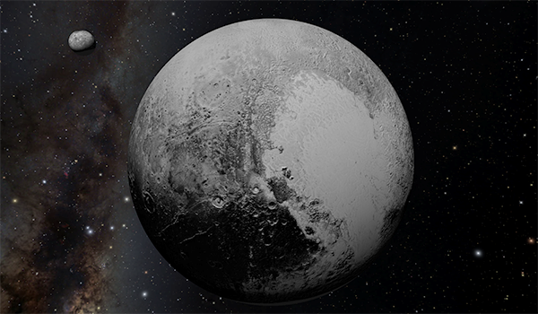
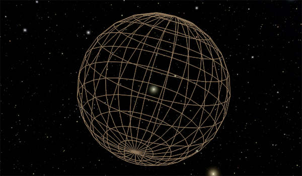

---
authors:
  - name: Brian Abbott
    affiliation: American Museum of Natural History
---

# Solar System

{menuselection}`Scene --> Solar System`

:::{warning}
This section is incomplete---nothing to see here, yet.
:::

::::{grid} 1 2 2 3
:gutter: 1 1 1 2

:::{grid-item-card} 

:::

:::{grid-item-card} 

:::

:::{grid-item-card} 

:::

:::{grid-item-card} 

:::

::::

The Solar System describes everything in our cosmic backyard. Powered by our local star, the Sun, we are accustomed to thinking of the Solar System as merely the planets. However, there is a whole zoo of objects that reside in the Solar System and orbit around the Sun---planets, dwarf planets, asteroids, comets.

Here we explore these objects and the various assets in OpenSpace that we use to display them.

:::{toctree}
:maxdepth: 1
:hidden:

sun/index
planets/index
dwarf-planets/index
comets/index

:::

