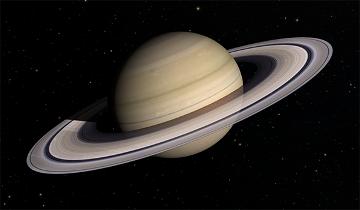

---
authors:
  - name: Brian Abbott
    affiliation: American Museum of Natural History
---

# Planets

{menuselection}`Scene --> Solar System --> Planets`

:::{warning}
This section is incomplete---nothing to see here, yet.
:::

::::{grid} 1 2 2 3
:gutter: 1 1 1 2

:::{grid-item-card} 

:::

:::{grid-item-card} 

:::

:::{grid-item-card} 

:::

:::{grid-item-card} 

:::

:::{grid-item-card} 

:::

:::{grid-item-card} 

:::

:::{grid-item-card} 

:::

:::{grid-item-card} 

:::

::::

:::{toctree}
:maxdepth: 1
:hidden:

mercury/index
venus/index
earth/index
mars/index
jupiter/index
saturn/index
uranus/index
neptune/index
:::

