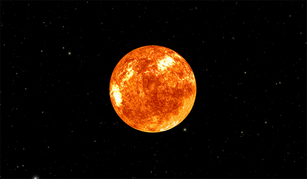
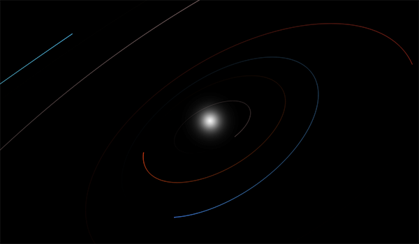
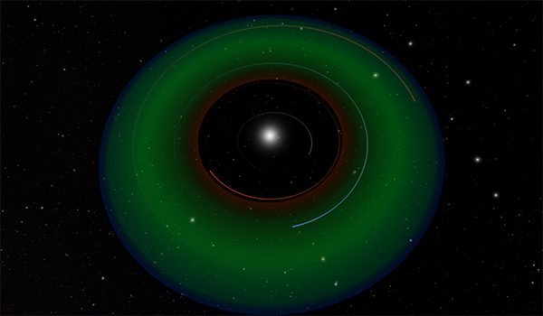

---
authors:
  - name: Brian Abbott
    affiliation: American Museum of Natural History
---

# Sun

{menuselection}`Scene --> Solar System --> Sun`

::::{grid} 1 2 2 3
:gutter: 1 1 1 2

:::{grid-item-card} 

:::

:::{grid-item-card} 

:::

:::{grid-item-card} 

:::

::::

The Sun is our local star. It is responsible for the formation of the Solar System,  provides energy to the planets, drives the weather, and allows for plants to thrive and feed us---it enables the conditions for life itself to exist on our world. The Sun is vital to our very existence on Earth, but when compared to the hundreds of billions of stars in the Milky Way Galaxy, it is not terribly special in any way. In fact, it is an average star, and perhaps that is good for us.

## The Life of the Sun

Stars are light factories. The Sun fuses hydrogen into helium and, as a byproduct, produces light. This light is emitted from the Sun and takes eight minutes to reach Earth. 

Stars have defined lifetimes---they are born, they exist in a stable state, and they grow unstable and die. How that all happens is dependent on the initial mass of the star. The Sun is a middle-of-the-road star, born about 4.6 billion years ago from a giant [molecular cloud](https://en.wikipedia.org/wiki/Molecular_cloud). Condensations in the cloud's gas, perhaps from a nearby supernova's shockwave for example, led to a runaway gravitational collapse causing many protostars to form. Ultimately, this region of the cloud would become an [HII region](../../milky-way/nebulae/HII-regions/index) once the massive, hot stars began producing light. 

Locally, the gas quickly becomes centralized around the future star, and a disk forms around it. Once the gas becomes dense enough and the pressures are high enough, the nuclear processes are kick-started, fusing hydrogen into helium and producing light and [neutrinos](https://en.wikipedia.org/wiki/Neutrino). 

At this point, the star is in equilibrium, when the force of gravity pushing inward is balanced by the radiation pressure of energy from the Star's core. As long as the fuel source (hydrogen) lasts in the core, the star will remain stable, a phase called the [main sequence](https://en.wikipedia.org/wiki/Main_sequence). The Sun is in the middle of this period right now. It reached the main sequence about 4 billion years ago, and has another 5 billion years before the hydrogen in the core is exhausted.

Once the hydrogen is exhausted, the star will no longer be in equilibrium. It enters a phase of its early death throes, beginning a slow progression toward the ultimate fade out---stellar death. The core will collapse and the outer layers will be driven out. The Sun will brighten during this process and ultimately become a [red giant star](https://en.wikipedia.org/wiki/Red_giant). By this time it will expand beyond the orbits of Mercury and Venus, and eventually Earth about 7.5 billion years from now.

After more stages of fits---expanding and contracting---the Sun will ultimately eject half of its mass into a [planetary nebula](../../milky-way/nebulae/planetary-nebulae/index), and its core will become a [white dwarf](../../milky-way/stellar-remnants/white-dwarfs/index). The ionized gas of the planetary nebula will last roughly 10,000 years, while the white dwarf will slowly fade over trillions of years until it no longer radiates any energy.

## Composition

The Sun is a ball of mostly hydrogen and helium in the form of gas and hot plasma. Its chemical composition was inherited from the conditions in which it formed. It has a core that extends about 25% of the Sun's radius and is over 15 million Kelvin. All the thermal energy produced here is via nuclear fusion.

Outside the core is a radiative zone, which is about half the radius of the Sun. Here, energy is radiated from the core to the convective layer, where densities are too low to radiate energy and it, instead, is transported via a convective currents. 

The layer that we see is called the photosphere. It is the "surface" layer, which sits below a transparent solar atmosphere. The temperature at this layer is about 5800 Kelvin. Light that emerges here is mostly in the visible spectrum, with some in the infrared and about 10% of the energy in the ultraviolet.

## Our Place in the Galaxy

The Sun is about two-thirds the way out from the center of the Milky Way Galaxy, roughly 26,000 light years from the Galactic center---in the Galactic suburbs. We are located between two major arms of the Milky Way.

We are accustomed to seeing the plane of the Solar System---the plane that the planets exist in---as oriented horizontally with the Sun at the center. However, there really is no up, down, east, or west in the universe. It helps to see the Solar System in this manner when examining it, but it's all relative to what we're viewing.

Relative to the plane of the Milky Way Galaxy, the orbits of the planets are tipped 62 degrees. The Sun is moving through the Galaxy as it revolves around its center. It has a relatively stable [orbit around the Galaxy](../../milky-way/stars/star-orbits/index), moving at 828,000 kilometers per hour (514,000 miles per hour). Its bevy of planets are along for ride, tipped 62 degrees. At this speed, it takes about 225 million years to complete one orbit around the Galaxy. Given the Sun has been around for about 4.6 billion years, we've only made about 22 revolutions around the Galaxy. Compare that to Earth, which has made 4.6 billion revolutions around the Sun in that time.

:::{toctree}
:maxdepth: 1
:hidden:

sun-glare/index
sun-surface/index
habitable-zone/index

:::

