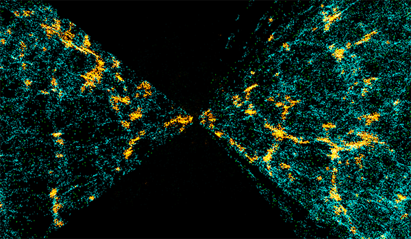
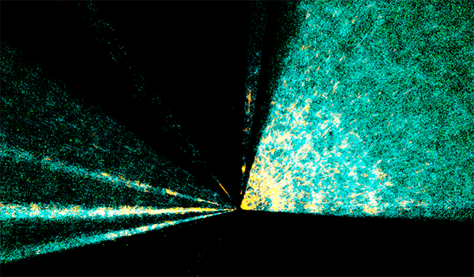
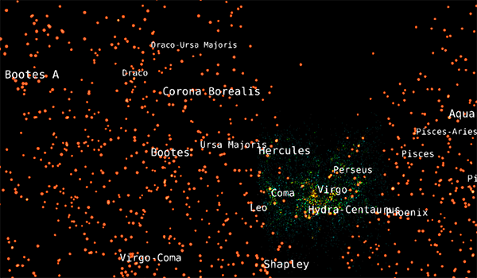
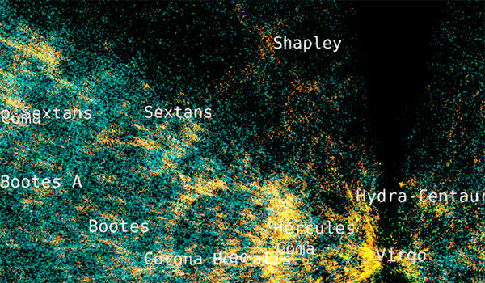
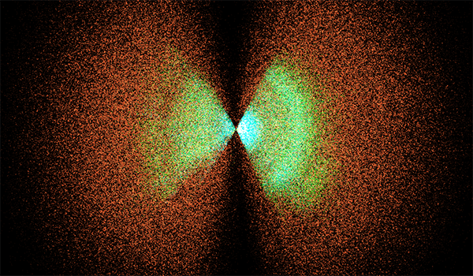

---
authors:
  - name: Brian Abbott
    affiliation: American Museum of Natural History
---

# Deep Sky Surveys

{menuselection}`Scene --> Universe --> Deep Sky Surveys`

Deep Sky Surveys refer to large surveys that probe deeper into the observable universe. These galaxy surveys see deeper, but are far less {term}`complete <completeness>`. Typically, only portions of the sky are observed, leaving whole swaths of the universe unseen.

% :::{figure} deep_sky_surveys.png
% :align: left
% :alt: The two-lobed 2dF galaxies are shown with the Abell galaxy clusters and the supercluster labels.
% 
% The multicolored Two-degree Field (2dF) galaxies alongside the Abell Galaxy Clusters and the Supercluster Labels. The 2dF galaxies, like all the galaxy surveys, are colored by density, with orange and yellow galaxies noting more dense regions of galaxies. The orange points are Abell clusters, each a cluster of hundreds of galaxies.  
% :::

## Assets

::::{grid} 1 2 2 3
:gutter: 1 1 1 2

:::{grid-item-card} 

:::

:::{grid-item-card} 

:::

:::{grid-item-card} 

:::

:::{grid-item-card} 

:::

:::{grid-item-card} 

:::

::::

:::{toctree}
:maxdepth: 1
:caption: Assets
:hidden:

2df-galaxies/index
sloan-galaxies/index
abell-galaxy-clusters/index
supercluster-labels/index
quasars/index
:::

