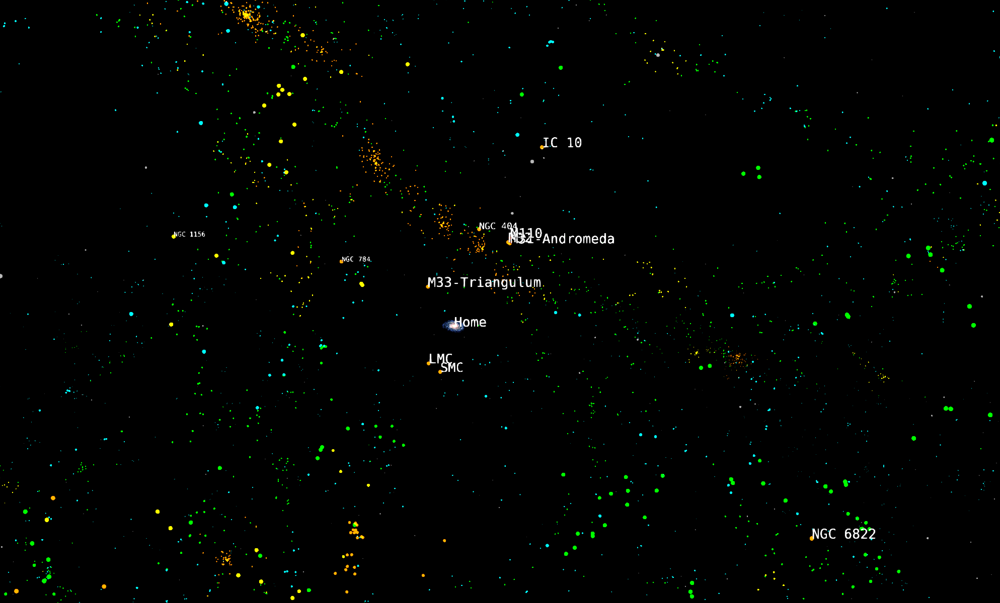
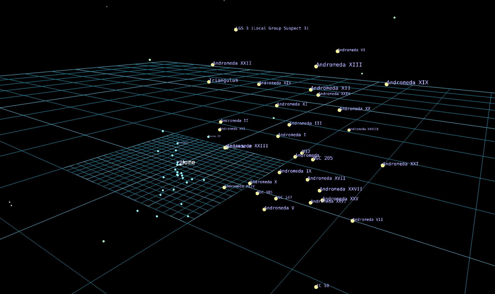
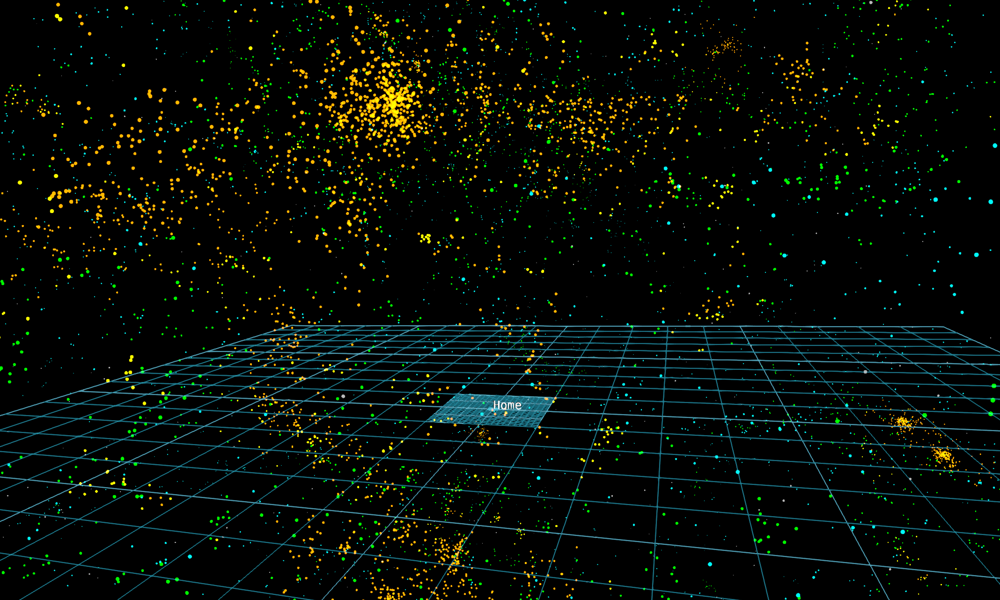
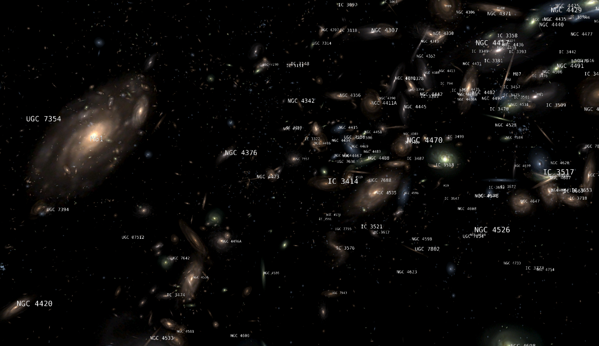
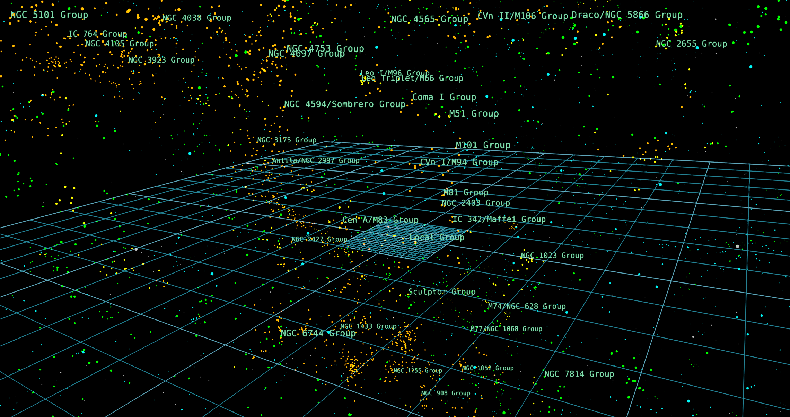
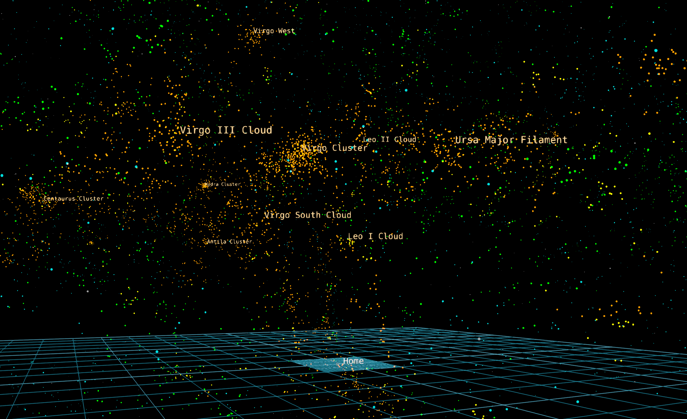
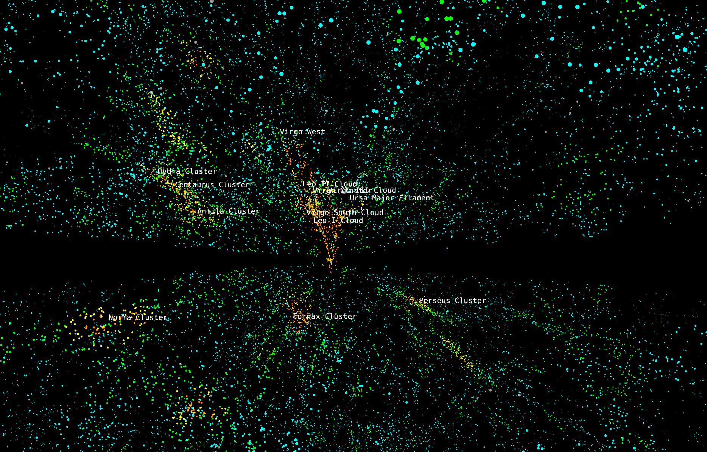
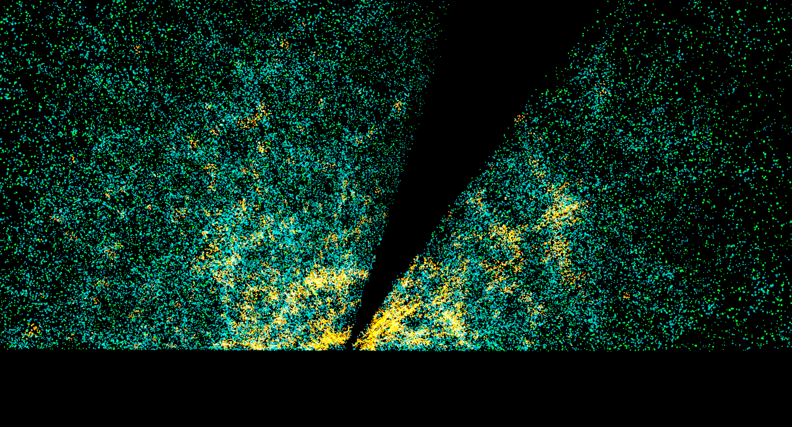
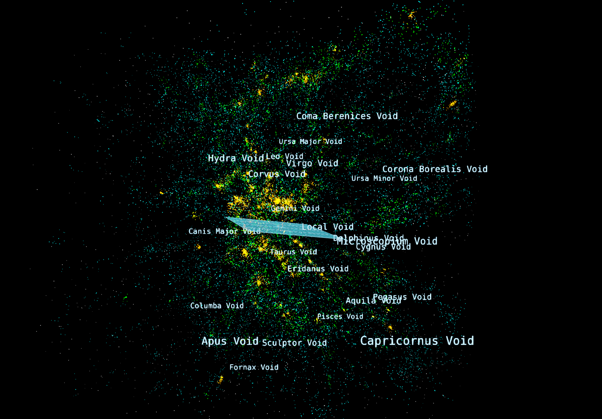

---
authors:
  - name: Brian Abbott
    affiliation: American Museum of Natural History
---

# Nearby Surveys

{menuselection}`Scene --> Universe --> Nearby Surveys`

{menuselection}`Nearby Surveys` describe the neighborhood around the Milky Way Galaxy. Here, we have a better idea of what's out there (hint: galaxies) and the structures formed by those galaxies.

The galaxy surveys here are generally more complete, and they cover most of the sky. Beyond these nearby surveys, galaxy surveys tend to be less complete and cover less area on the night sky.

:::{figure} local_universe.png
:align: left
:alt: A view looking back toward the Milky Way Galaxy with each point representing a galaxy. We see nearby galaxy groups labeled in green, and large galaxy clusters labeled in orange.

A view from the local universe. Each point here is a galaxy, where orange and yellow points are in dense areas while green and aqua points are in less dense regions. The Milky Way, marked Home, is at the center, and we see labels for some of the local galaxy groups near the Milky Way and its galaxy group---the Local Group. In the distance is the Norma Cluster, a large galaxy cluster seen from Earth in the constellation Norma. 
:::

## Assets

::::{grid} 1 2 2 3
:gutter: 1 1 1 2

:::{grid-item-card} 

:::

:::{grid-item-card} 

:::

:::{grid-item-card} 

:::

:::{grid-item-card} 

:::

:::{grid-item-card} 

:::

:::{grid-item-card} 

:::

:::{grid-item-card} 

:::

:::{grid-item-card} 

:::

:::{grid-item-card} 

:::

::::

:::{toctree}
:maxdepth: 1
:caption: Assets
:hidden:

home-label/index
local-group/index
tully-galaxies/index
tully-galaxies-images/index
galaxy-group-labels/index
galaxy-cluster-labels/index
2MASS-galaxies/index
6df-galaxies/index
voids/index
:::

