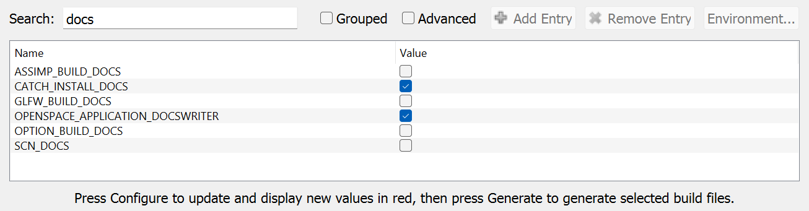

# How to build the documentation locally

If you would like to contribute to the documentation, it can be a good idea to try out how the additions will look. This can be done by building the documentation locally. The documentation repository is [OpenSpace-Docs](https://github.com/OpenSpace/OpenSpace-Docs). It uses [Sphinx](https://www.sphinx-doc.org) to build the documentation that is hosted on [Read the docs](https://about.readthedocs.com/).

For details on how to build the documentation on locally, refer to [this part](https://github.com/OpenSpace/OpenSpace-Docs?tab=readme-ov-file#building-the-documentation-locally) of the README for the [OpenSpace-Docs](https://github.com/OpenSpace/OpenSpace-Docs) repository.

## Generate the OpenSpace reference (optional)

Note that the reference section of the documentation is generated automatically based on files from OpenSpace. If you are just working on markdown files for the documentation page, you do not need to care about the files that are used for the reference.

However, if you are working on a local OpenSpace repository with for example writing asset examples or documentation for the `Asset Components` part of the reference and want to see those changes reflected in the local build of the documentation, you need to generate the files for the reference.

Below is a short explanantion of the files used for the reference. More details on how to generate them are found in [this section of the README](https://github.com/OpenSpace/OpenSpace-Docs?tab=readme-ov-file#generate-openspace-reference-optional)

### `JSON` files from the `DocsWriter` application

Most of the reference documentation is created based on two `JSON` files that are generated from the OpenSpace engine with an application called `DocsWriter`: `assetComponents.json` and `scriptingApi.json`. These JSON files are updated manually to the `OpenSpace-Docs/json` folder. It is possible to build the documentation locally without generating new `JSON` files for the reference section.

:::{note}
When making a new build of the documentation, e.g. for a new OpenSpace version, the `assetComponents.json` and `scriptingApi.json` files should be committed to the repository.
:::

To use the `DocsWriter`, you first need to open your OpenSpace project in CMake and enable the `OPENSPACE_APPLICATION_DOCSWRITER` checkbox. Then, re-generate the project.

### Asset examples

The documentation uses the assets folder in OpenSpace to create examples for the `Asset Components` reference section. Per default, the script `make html` will download a partial clone of the OpenSpace repository (only the assets folder) from the _latest master_ and then generate the documentation.
