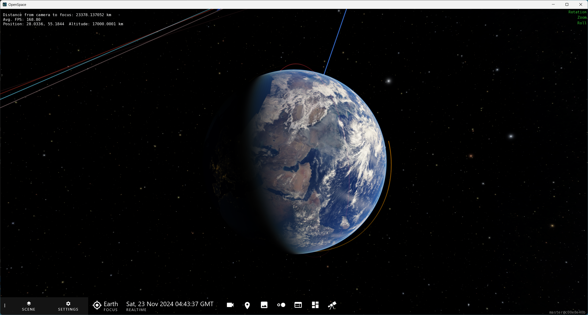
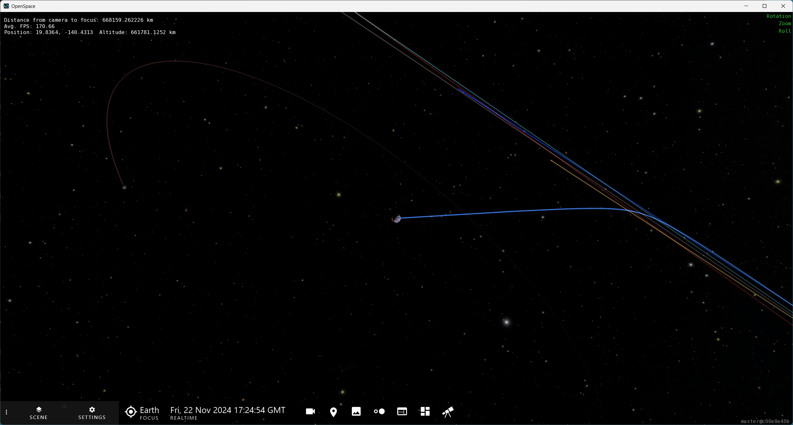
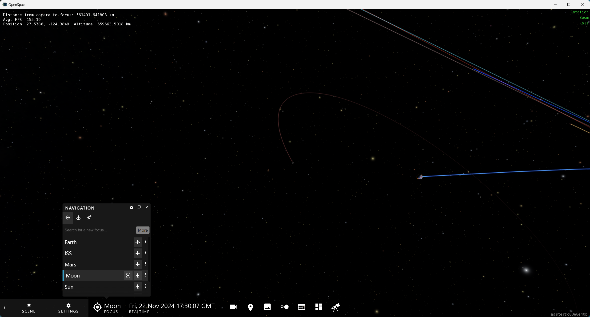
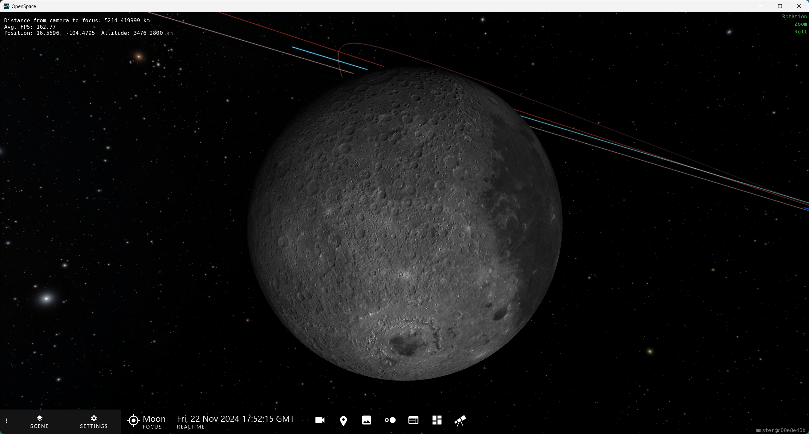
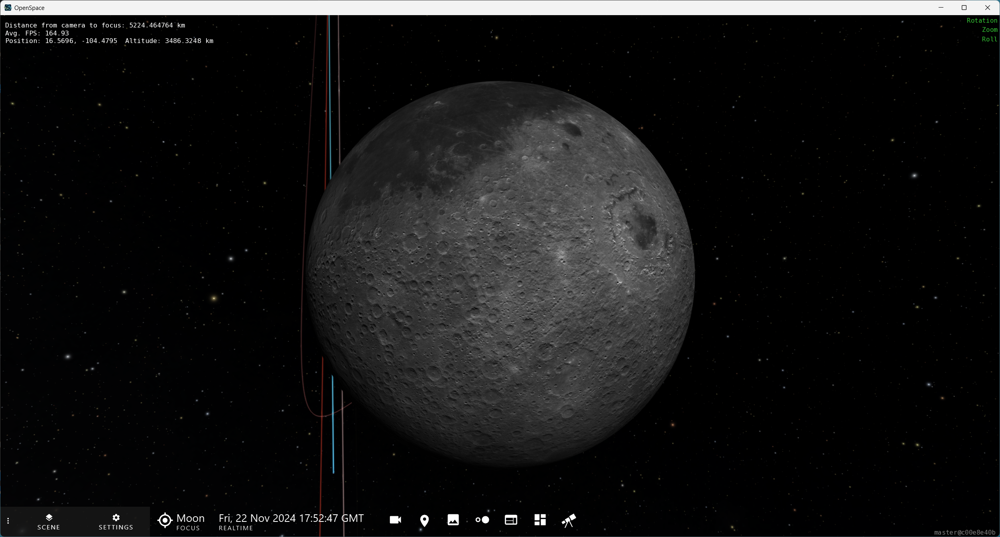
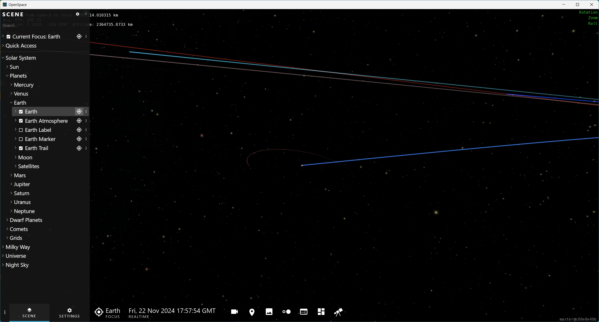
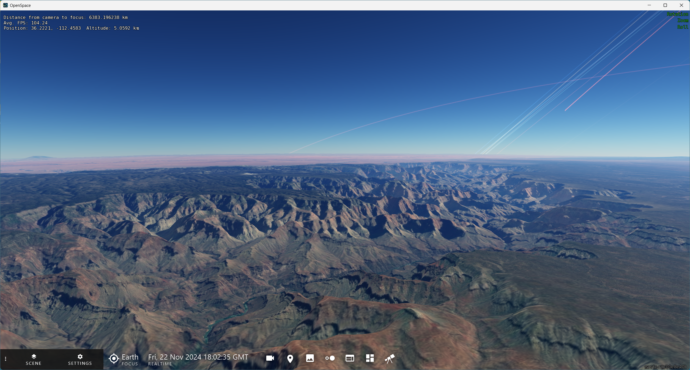
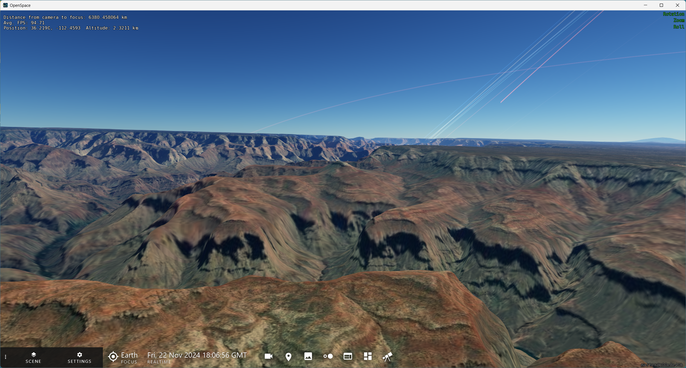
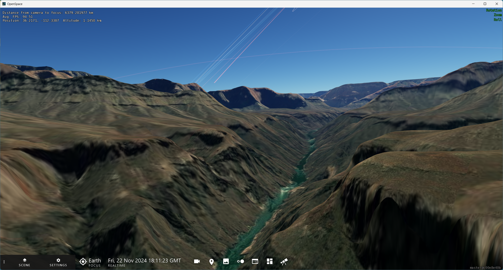

---
authors:
  - name: Brian Abbott, Micah Acinapura, Megan Villa
    affiliation: American Museum of Natural History
---

# Navigation

Navigating in OpenSpace, or "flying," is fairly straightforward and intuitive. Several types of flight are possible and enable you to manipulate a scene to your liking.

By default, we navigate around and through data sets using the mouse and keyboard. See  for information on using a joystick to navigate in OpenSpace.

:::{tip}
A three-button mouse is recommended, but not necessary.
:::

::::::::{tab-set}
:::::::{tab-item} Overview

## Overview

### Flight Modes

::::{list-table}
:header-rows: 0
:stub-columns: 1

* - Rotation
  - {kbd}`left mouse`
  - Press the {kbd}`left mouse button` and drag your mouse to orbit around your target---the object in Focus indicated in the Focus Menu. Your motion will orbit in the direction you drag the mouse. The farther you drag the mouse, the faster the orbital speed.

* - Zoom
  - {kbd}`right mouse`
  - Use the {kbd}`right mouse button` and drag to zoom closer or further from your target. Dragging down will zoom away; dragging up will zoom closer. Again, the farther you drag your mouse the faster the zoom motion will be toward or away from the Focus.

* - Roll
  - {kbd}`middle mouse` or {kbd}`Shift` + {kbd}`left mouse`
  - Using the {kbd}`middle mouse button` (or depressing the scroll wheel) lets you roll the view, like a kaleidoscope. If you do not have a third button, you can achieve Roll motion by holding the {kbd}`Shift` key and dragging while pressing the {kbd}`left mouse button`.

* - Pan
  - {kbd}`Ctrl` + {kbd}`left mouse`
  - Hold the {kbd}`Ctrl` key while dragging the {kbd}`left mouse button` to pan the view away from the Focus. While you're learning, use this movement sparingly. Once you move the Focus out of view, flight motions become counterintuitive, we why explain next.
::::

:::{tip}
Hold the {kbd}`z` key to turbocharge the Zoom Flight Mode.
:::
  

### Navigation and Focus

In OpenSpace, _something_ is always set to the Focus. In the  Profile, Earth is set as the Focus.

What is set to Focus, and more importantly in terms of flying, _where_ that object is relative to your view, is important as you navigate in OpenSpace. 

Ideally, and by default, the focused object is at the center of the Graphics Window and your view. If the focused object is not in your view, navigating can be a bit cumbersome. We will explain...

#### Flight Modes When Focus Is Out of View
{#flight-without-focus-in-view}
::::{list-table}
:header-rows: 0
:stub-columns: 1

* - Rotation
  - {kbd}`left mouse`
  - The orbital motion around the Focus now turns into a motion akin to riding a ferris wheel but looking away from its center or the ground. You're tracing a circle, but objects appear to come toward or away from you. 

* - Zoom
  - {kbd}`right mouse`
  - Here, the motion appears like you're traveling in a spaceship, but looking out the side window as objects pass by.

* - Roll
  - {kbd}`middle mouse` or {kbd}`Shift` + {kbd}`left mouse`
  - Roll moves the view up and down without moving your position. Akin to not moving, but looking up and down.

* - Pan
  - {kbd}`Ctrl` + {kbd}`left mouse`
  - This motion is exactly the same, regardless of where the Focus is relative to your view. In fact, it is the only way to bring the Focus back into your view.
::::

### Friction

As discussed in the , friction brings your motion to a gradual stop if you let your finger off the mouse button. 

The Rotation, Zoom, and Roll Flight Modes are subject to friction by default when you launch OpenSpace. Their status is in the upper-right of the Graphics Window and looks like this:

:::{figure} /getting-started/user-interface/friction_status_default.png
:align: center
:width: 20%
:alt: Friction status is on

Friction status is "on" for each flight mode.
:::

#### Turning Friction On and Off

There are two ways to turn the friction on and off. 
1. Click each word in the Friction Status area. Once friction is off, the word will turn red.
2. Use the keyboard shortcuts---the recommended method:

:::{list-table}
:header-rows: 1
:stub-columns: 1
:align: center
* - Shortcut
  - Function
* - {kbd}`f`
  - Toggle Rotational Friction on and off
* - {kbd}`Shift` + {kbd}`f`
  - Toggle Zoom Friction on and off
* - {kbd}`Ctrl` + {kbd}`f`
  - Toggle Roll Friction on and off
:::

:::{tip}
**Regulating Your Flight Speed**

An effective way of regulating your flight speed is by toggling friction on and off quickly. For example, say you're orbiting an object too fast while friction is disabled, just hit the {kbd}`f` key. The orbital speed will slow. When you see a speed that works, hit {kbd}`f` again to resume drifting. This technique works for Zoom with {kbd}`Shift` + {kbd}`f`, and with Roll using {kbd}`Ctrl` + {kbd}`f`.

This is an extremely useful way to create smooth, graceful flight paths.
:::

#### Compound Motion

Disabling friction on one or more Flight Modes allows you to apply a compound motion to your flight. One of the most effective compound flights is the spiral. For this, disable friction for the Rotation Flight Mode (orbiting), set a rotation at a good speed, then begin flying toward or away from an object. This will produce a spiral flight path. If you're _really_ good, you can disable friction on the Rotation and Zoom Flight Modes, then fly hands off. If you want to induce nausea disable all three frictions and see how long you last.

Similarly, when you fly over the planetary surface, it's nice to have Rotation friction off and use the Zoom flight to control how far off the surface you are flying. We will demonstrate how to do that in the .

:::::::

:::::::{tab-item} Videos

## Videos

### How to Fly Demo

<iframe width="640" height="360" src="https://www.youtube.com/embed/uhbbGGgdcgM" title="YouTube video player" frameborder="0" allow="accelerometer; autoplay; clipboard-write; encrypted-media; gyroscope; picture-in-picture; web-share" referrerpolicy="strict-origin-when-cross-origin" allowfullscreen></iframe>

:::{dropdown} Visual Transcript
| Video time | Description |
|:-------------|:------------------|
| 0:00 | Rotate around Earth by dragging while holding the {kbd}`left mouse button`. |
| 0:39 | Zoom closer to, and further away, from Earth by dragging while holding the {kbd}`right mouse button`. |
| 1:06 | Pan the camera by pressing {kbd}`Ctrl` and dragging while holding the {kbd}`left mouse button`. |
| 1:33 | Roll the camera by dragging while pressing the {kbd}`middle mouse button`. |
| 1:42 | Toggle friction on and off by clicking the words in the upper right of the screen, or use the keyboard shortcuts. |
| 3:48 | Bonus: Land on Earth using a combination of controls. |
:::

### Flight and Focus Demo

<iframe width="640" height="360" src="https://www.youtube.com/embed/mJLMu8FC0OQ?si=FTaheWi81flS-swa" title="YouTube video player" frameborder="0" allow="accelerometer; autoplay; clipboard-write; encrypted-media; gyroscope; picture-in-picture; web-share" referrerpolicy="strict-origin-when-cross-origin" allowfullscreen></iframe>

:::{dropdown} Visual Transcript
| Video time | Description |
|:-------------|:------------------|
| 0:00 | Retarget and fly to the Moon using the focus menu. |
| 0:30 | Change the retargeting speed in the settings menu. |
| 1:09 | The difference between focusing on Jupiter's trail, which will bring you to the Sun, and Jupiter, which will bring you to the planet. |
| 1:39 | Leave the Solar System by zooming away. |

:::::::

:::::::{tab-item} Tutorial

## Tutorial: Navigating OpenSpace

Let's put these navigation skills to the test. In this tutorial we will cover:
- The four Flight Modes: Rotation, Zoom, Roll, and Pan
- Changing the Focus object
- Visiting a planet and hovering above its surface
- Zooming out of the Solar System

### Rotation Flight Mode
::::::{grid} 1 2 2 2

:::::{grid-item}

:::::

:::::{grid-item}
1. Launch OpenSpace.
2. {octicon}`rocket;1.25em;profile-tour-action` From the start-up position, use the Rotation Flight Mode and begin to orbit Earth by pressing the {kbd}`left mouse button` and gently moving the mouse to the right.
3. When you have a speed you like, turn off Rotational Friction by hitting the {kbd}`f` key and take your hand off the mouse. You should see the Rotation Flight Friction Status turn red in the upper-right corner of the Graphics Window.
4. To alter your rotational speed, press {kbd}`f` once, then press it again a second or two later. You will be in a slower orbit around Earth now.
5. Press {kbd}`f` again to enable Rotation Friction once more. Your flight will come to a stop.
:::::
::::::

### Zoom Flight Mode
::::::{grid} 1 2 2 2
:::::{grid-item}

:::::

:::::{grid-item}
1. {octicon}`rocket;1.25em;profile-tour-action` Using the Zoom Flight Mode, press the {kbd}`right mouse button` and begin moving the mouse down slowly to move away from Earth.
2. Continue to zoom away from Earth until you see the Moon's orbit.
3. Remove your finger from the mouse and come to a stop with the Earth and Moon in view, albeit tiny.
:::::
::::::

### Change Focus
::::::{grid} 1 2 2 2
:::::{grid-item}

:::::

:::::{grid-item}
1. {octicon}`telescope;1.25em;profile-tour-action` In the Focus Menu, choose "Moon" from the preloaded list. You will see the Moon move to the center of your view---it is now the Focus and all motion will revolve around it.
2. Click on the plane symbol in the Focus Menu to approach the Moon. This will automatically take you to the Moon.
:::::
::::::

### Roll Motion
::::::{grid} 1 2 2 2
:::::{grid-item}

:::::

:::::{grid-item}
1. {octicon}`rocket;1.25em;profile-tour-action` Use the Roll Flight Mode and "twist" your view. We've not moved positions here, only rotated the view.
:::::
::::::

### Change the Focus Back to Earth
::::::{grid} 1 2 2 2
:::::{grid-item}

:::::

:::::{grid-item}
1. Zoom away from Moon so Earth is in view.
2. Open the Scene Menu. 
3. Navigate to {menuselection}`Solar System --> Planets --> Earth --> Earth`.
4. {octicon}`telescope;1.25em;profile-tour-action` Click on the target icon to the right of Earth. This will set earth to Focus, and is an alternative way to set Focus right from the Scene Menu. Earth is now moved back to the center of your screen.
:::::
::::::

### Find a Place to Land On Earth
::::::{grid} 1 2 2 2
:::::{grid-item}

:::::

:::::{grid-item}
1. Zoom up to Earth and toward the surface.
2. Find a place you'd like to land---we're going to the Grand Canyon.
3. Center your destination in the Graphics Window so that when you Zoom into it, it will come right toward you.
4. Zoom closer to the surface. You might have to wait for some map tiles to load.
:::::
::::::

### Pan Flight Mode---Tilt Earth Down
::::::{grid} 1 2 2 2
:::::{grid-item}

:::::

:::::{grid-item}
1. Use the {kbd}`Ctrl` + {kbd}`left mouse button` and move the mouse up to bring Earth down.
2. Stop when Earth's limb is about halfway down the graphics window, so the bottom half is Earth and the top half is sky. The horizon may be tilted, that's ok.
:::::
::::::

### Zoom Closer to the Surface
::::::{grid} 1 2 2 2
:::::{grid-item}

:::::

:::::{grid-item}
1. Use the Zoom Flight Mode to get closer to the surface. Use the {kbd}`right mouse button` while pushing the mouse up to bring you closer to Earth's surface.
2. While you're here, use the Roll Flight Mode to look around. Use {kbd}`Shift` + {kbd}`left mouse button` and do a 360-degree spin.
:::::

:::::{grid-item}

:::::

:::::{grid-item}
3. Fly even closer to the surface using the Zoom Flight Mode: {kbd}`right mouse button` while pushing the mouse up.
4. Look straight below your position using the Pan Flight Mode. Use {kbd}`Ctrl` + {kbd}`left mouse button` while moving the mouse down.
5. Then, move back up to the the horizon again.
:::::
::::::

### title

::::::{grid} 1 2 2 2
:::::{grid-item}

:::::

:::::{grid-item}

:::::
::::::

Start a slow orbot with left mouse and move the mouse down. Now you're moving forward along the surface.
### title

Turn Rotational Friction off once you get a good speed. Adjust by toggling friction if you need to.

Not get closer to the surface with right mouse and move mouse up.
### title

Back to Normal
### title

Right mouse and push down to leave the surface

Now, have to return Earth to the center of the screen. Pull far enough away, then Ctrl + left mouse to return earth to the centere. You have to pull far enough away to see the entire plane once you pan it back to center.
### title

Turn on constellation in the scene menu
### title

Pull  away from Earth with right mouse plus down. Hit Z to speed your flight out of the solar sustem.

Move out to roughly 50 parsecs. You can see your distance in the Dashboard.
### title

Now, orbit with the left mouse and turn off Rotationasl Friction and enjoy the view.
### title

As you're orbiting in a frictionless flight, move back toward Earth by pressing the right mouse and moving the mouse up. Now, you're on a spiral path back to earth. balance...

When you get sloe to earth, take your fingere off the mouse. Hit the F key to stop the orbit. And that's it.

To close, press Esc (3-second grsce period quit) or use the close button (instantaneous quit) on the window at the top right.

### Land on a Planet

For most flying, particularly through large, dispersed data in space, it is typical to maintain Focus in the center of the screen. However, landing on a planet or moon demands the Focus me moved away from your view.

If you wanted to land on the Surface of Earth and explore the Grand Canyon, let's say, you's first orbit Earth until it's in front of you on Earth's surface. Next you'd zoom in toward it. But, zooming in will eventually crash you into Earth head-first. What you need to do is fly up toward the surface with the Grand Canyon directly in front of you as you fly toward it.

Now, "tip" the Earth a bit by using the Yaw/Pitch motion with {kbd}`Ctrl` + {kbd}`left mouse button`. Move Earth so it heads toward the bottom of your screen, and only a little bit of Earth is visible.

From this position and view, Zoom ({kbd}`right mouse button`) will now move you toward or away from Earth's surface. So, zoom down to the surface. 

From a position just above the canyon, you can now explore it using the Rotation Mode ({kbd}`left mouse button`). This will give you the sense you're flying right above the surface, like a plane. Use the four directions go where you want to explore. Flying forward in this scenario works well. 

When you get adept at landing on planets, you can begin to employ compound motion: set a good speed with the Rotational Flight, then turn friction off (the {kbd}`f` key). Now, use the {kbd}`right mouse button` to change your altitude above and below the surface, going itno the canyon, but them rising higher as you approach the canyon wall.

Landing on planets takes some practice, but it results in breathtaking scenes.

Try out the navigation by rotating around Earth, and trying to find your home town. When you are in the right approximate location, zoom in, and when you are close to Earth use the Yaw/Pitch motion to bring the camera up to see the horizon.

## Orbital Navigation and Focus
In order to fly to another place, you must change the _Focus_ object that the camera is attached to. To change your object of focus use the focus menu, located at the bottom of your screen between the settings and time menus:

:::{figure} focus-menu.png
:align: center
:width: 30%
The focus menu at the bottom of the screen used to change the current _Focus_
:::

Open the focus menu by clicking on it. You can either select your focus from the list or search for another node using the text field at the top of the focus window. Selecting a node will cause the camera to target the new _Focus_, but you still have to fly to it by zooming in. You can also click the airplane icon  which will cause the camera to fly to your selected _Focus_ automatically.

The amount of time taken to change the focus can be adjusted in the settings under {menuselection}`Settings --> Navigation Handler --> Orbital Navigator --> Retarget interpolation time`. The higher the number, the longer it will take to switch between targets. Similarly the {menuselection}`Settings --> Navigation Handler --> Path Navigator --> Speed Scale` allows you to adjust the time taken to automatically fly to another location.

:::{note}
**Many items will focus you on the Sun**

Since focusing on an item will always focus on its center, focusing on many items will appear to target the Sun instead. This is because items like "HII Regions" or "Jupiter Trail" are datasets centered on the sun. For these types of items, there is no point in focusing on them, instead target "Orion Nebula" or 'Jupiter.'
:::

## Leaving the Solar System
As you have just learned, most of the datasets are based around the Sun. To leave the Solar System, you just have to zoom away from your current target. And you will soon be flying among the stars.

### Video Menu
This video illustrates these concepts further:

:::::::

::::::::
