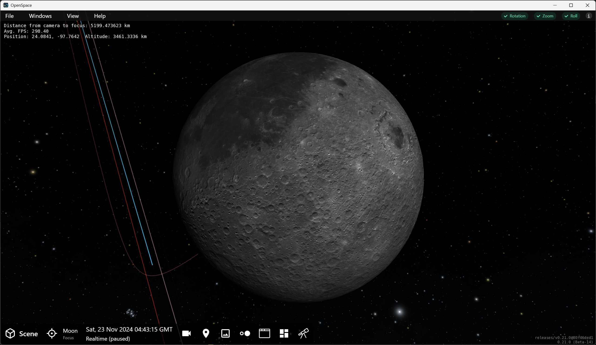
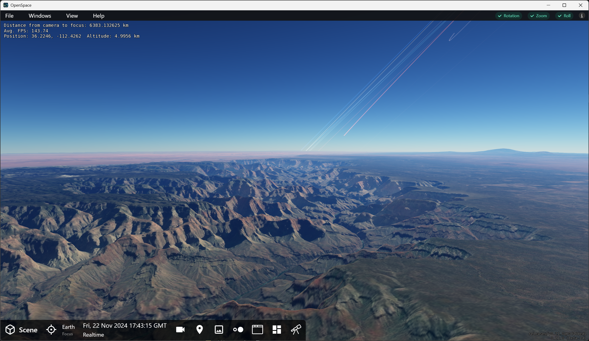
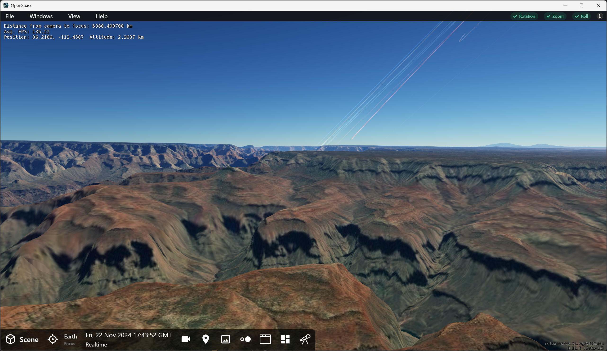
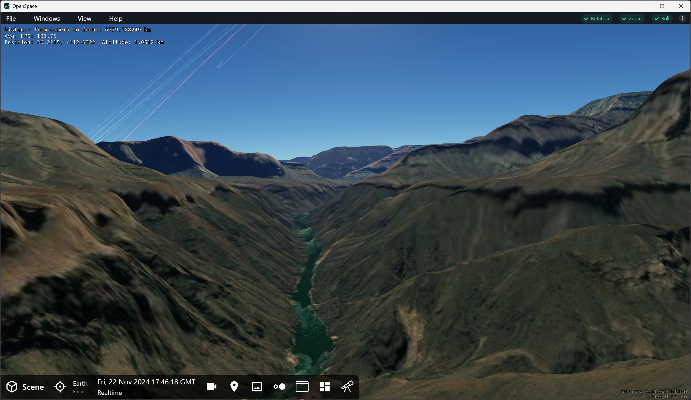
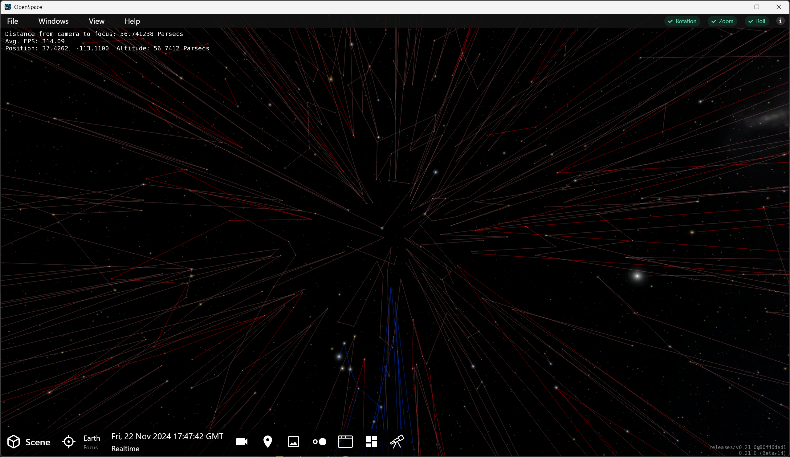
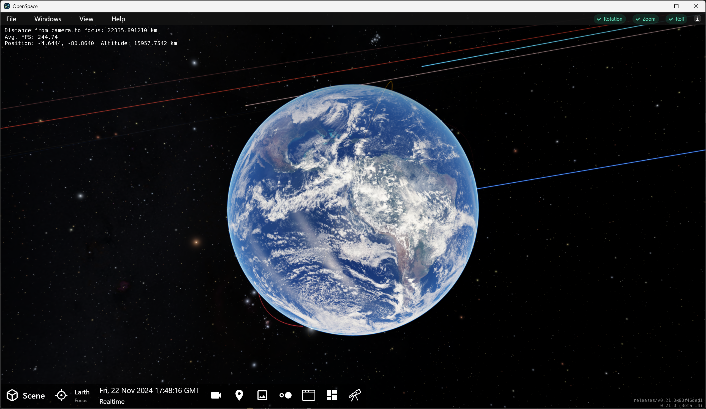

---
authors:
  - name: Brian Abbott, Micah Acinapura, Megan Villa
    affiliation: American Museum of Natural History
---

# Navigation

::::::::{tab-set}
:::::::{tab-item} Overview

## Overview

Navigating in OpenSpace, or "flying," is fairly straightforward and intuitive. Several types of flight are possible and enable you to manipulate a scene to your liking.

By default, we navigate around and through data sets using the mouse and keyboard. See  for information on using a joystick to navigate in OpenSpace.

:::{tip}
A three-button mouse is recommended, but not necessary.
:::

### Flight Modes

::::{list-table}
:header-rows: 0
:stub-columns: 1

* - Rotation
  - {kbd}`left mouse`
  - Press the {kbd}`left mouse button` and drag your mouse to orbit around your target---the object in Focus indicated in the Focus Menu. Your motion will orbit in the direction you drag the mouse. The farther you drag the mouse, the faster the orbital speed.

* - Zoom
  - {kbd}`right mouse`
  - Use the {kbd}`right mouse button` and drag to zoom closer or further from your target. Dragging down will zoom away; dragging up will zoom closer. Again, the farther you drag your mouse the faster the zoom motion will be toward or away from the Focus.

* - Roll
  - {kbd}`middle mouse` or {kbd}`Shift` + {kbd}`left mouse`
  - Using the {kbd}`middle mouse button` (which may be activated by depressing the scroll wheel on your mouse) lets you roll the view, akin to a kaleidoscopic motion. If you do not have a third button, you can achieve Roll motion by holding the {kbd}`Shift` key and dragging while pressing the {kbd}`left mouse button`.

* - Pan
  - {kbd}`Ctrl` + {kbd}`left mouse`
  - Hold the {kbd}`Ctrl` key while dragging the {kbd}`left mouse button` to pan the view away from the Focus. This is comparable to pitch and yaw motion in one mode. While you're learning, use this movement sparingly. Once you move the focused object out of view, flight motions become counterintuitive---we why explain next.
::::

:::{tip}
Hold the {kbd}`z` key to turbocharge the Zoom Flight Mode. See more .
:::
  

### Navigation and Focus

In OpenSpace, _something_ is always set to the Focus. In order to fly to an object, especially a planet, moon, or space probe, it _must_ be set as the Focus. In the  Profile, Earth is set as the Focus.

What is set to Focus, and more importantly in terms of flying, _where_ that object is relative to your view, is important as you navigate in OpenSpace. 

Ideally, and by default, the focused object is at the center of your view in the Graphics Window. If the focused object is not in your view, navigating can be a bit cumbersome. We will explain...

#### Flight Modes When Focus Is Out of View
{#flight-without-focus-in-view}
::::{list-table}
:header-rows: 0
:stub-columns: 1

* - Rotation
  - {kbd}`left mouse`
  - The orbital motion around the Focus now turns into a motion akin to riding a ferris wheel but looking away from its center or the ground. You're tracing a circle, but objects appear to come toward or away from you on circular arcs. 

* - Zoom
  - {kbd}`right mouse`
  - Here, the motion appears like you're traveling in a spaceship, but looking out the side window as objects pass by.

* - Roll
  - {kbd}`middle mouse` or {kbd}`Shift` + {kbd}`left mouse`
  - Roll moves the view up and down without moving your position, as if you're not moving from your position, but are looking up and down.

* - Pan
  - {kbd}`Ctrl` + {kbd}`left mouse`
  - This motion is exactly the same, regardless of where the Focus is relative to your view. In fact, it is the only way to bring the focused object back into view.
::::

### Friction

As discussed in , friction brings your motion to a gradual stop if you let your finger off the mouse button. 

The Rotation, Zoom, and Roll Flight Modes are subject to friction by default when you launch OpenSpace. Their status is in the upper-right corner of the Graphics Window and looks like this:

:::{figure} /getting-started/orientation/friction_status_default.png
:align: center
:width: 20%
:alt: Friction status is on

Friction status is "on" for each flight mode.
:::

#### Turning Friction On and Off

There are two ways to turn the friction on and off. 
1. Click each word in the Friction Status area. Once friction is off, the word will turn red.
2. Use the keyboard shortcuts---the recommended method:

:::{list-table}
:header-rows: 1
:stub-columns: 1
:align: center
* - Shortcut
  - Function
* - {kbd}`f`
  - Toggle Rotation Friction on and off
* - {kbd}`Shift` + {kbd}`f`
  - Toggle Zoom Friction on and off
* - {kbd}`Ctrl` + {kbd}`f`
  - Toggle Roll Friction on and off
:::

:::{tip}
**Regulating Your Flight Speed**

An effective way of regulating your flight speed is by toggling friction on and off quickly. For example, say you're orbiting an object too fast while friction is off, just hit the {kbd}`f` key. The orbital speed will slow. When you see a speed that works, hit {kbd}`f` again to resume drifting. This technique works for Zoom with {kbd}`Shift` + {kbd}`f`, and with Roll using {kbd}`Ctrl` + {kbd}`f`.

This is an extremely useful way to create gradual transitions between flight speeds.
:::

### Advanced Flying Techniques

We describe some ways you can make your flight more graceful, and guide you though flying along a planet's surface.

#### Compound Motion

Disabling friction on one or more Flight Modes allows you to apply a compound motion to your flight.

One of the most effective compound flights is the spiral. To achieve a spiral flight path:
- Set a rotation using the {kbd}`left mouse button`.
- Once you have a speed you like, turn off Rotation Friction using the {kbd}`f` key.
- Next, begin zooming toward or away using the {kbd}`right mouse button`.

If you're _really_ good, you can disable friction on the Rotation and Zoom Flight Modes, then fly hands free on an auto pilot of sorts. If you want to induce nausea, disable all three frictions and see how long you last.

Similarly, when you fly over the planetary surface, it's nice to have Rotation Friction off and use the Zoom Flight Mode to control how close to the surface you are flying. We discuss that next.

{.advanced-topic}
[Advanced]{.advanced}
#### How to Explaore a Planet's Surface

For most flying, particularly through large, dispersed data in space, it is typical to maintain Focus in the center of the screen. However, landing on a planet or moon demands the object in Focus me moved away from your view.

Suppose you want to land on the surface of Mars and explore the great canyon [Valles Marineris](https://en.wikipedia.org/wiki/Valles_Marineris), you'd first target Mars so it is the Focus, fly up to the planet, then orbit Mars until the canyon is in front of you on Mars's surface. 

:::{figure} mars_approaching.png
:align: center
:width: 100%
:alt: Approaching Mars with its moon's orbits

Approaching Mars with its two moon's orbits on and Mars's orbital line coming in from the upper-right.
:::

:::{tip}
If a surface feature is on the dark side of a planet, you can do one of two things:
- Change time to spin the planet's feature into daylight, or
- Turn on global illumination. Use the Actions Menu and choose \
{menuselection}`Actions --> Solar System --> All Globes Global Illumination`, or alternatively, \
{menuselection}`Actions --> Solar System --> Mars --> Mars Global Illumination` \
This will remove the darkness created by the planet's shadow and bring sunlight to the entire planet. Obviously, this violates the laws of physics, but it's often necessary to do that in OpenSpace.
:::

Next you'd zoom in toward it. But, zooming in will eventually crash you into Mars head-first. What you need to do is fly up toward the surface with the canyon directly in front of you as you fly toward it.

:::{figure} mars_500km.png
:align: center
:width: 100%
:alt: Mars's Valles Marineris from 500 km up

Hovering 500 km over Mars's Valles Marineris.
:::

::::{tip}
The default layer for Mars is not high resolution. Once we fly toward the surface though, we need to load a higher-resolution layer. For Mars, load the CTX Blended layer. There are higher-resolution layers, but this gives a good overall level of detail.

You will find it in the Scene Menu: \
{menuselection}`Scene --> Solar System --> Planets --> Mars --> Mars --> Renderable --> Layers --> Color Layers --> CTX Blended`.

:::{figure} mars_500km_layer_ctx_blended.png
:align: center
:width: 100%
:alt: Mars's Valles Marineris from 500 km up in hi-res

Still hovering 500 km over Valles Marineris, but now with the higher-resolution layer on.
::: 

::::

Now, "tip" Mars a bit with the Pan Flight Mode using {kbd}`Ctrl` + {kbd}`left mouse button`. Move Mars so only a little bit of Mars is visible at the bottom of your screen. 

If Mars comes in tilted, you can level the horizon by using the {kbd}`Ctrl` + {kbd}`Shift` + {kbd}`left mouse button`.

:::{figure} mars_hover.png
:align: center
:width: 100%
:alt: Hovering 15 km above the canyon

About 15 km above Mars' Valles Marineris. The orbits of Mars's two moons, Phobos and Deimos, are seen at center, while other planet's orbits are seen to the left in the sky.
:::

From this position and view, Zoom, using the {kbd}`right mouse button`, will now move you toward or away from Mars's surface. So, let's zoom down closer to the surface and inside the canyon.

:::{figure} mars_inside_valles.png
:align: center
:width: 100%
:alt: Inside Valles Marineris

Inside Valles Marineris, you can see the Altitude in the Dashboard says -198 km. This is because we are below the normal altitude of Mars---what would be considered their sea level had all their seas not evaporated away billions of years ago.
:::

From a position just above the canyon, you can now explore it using the {kbd}`left mouse button` in Rotation Mode. This will give you the sense of flying right above the surface, like a plane. Use the four directions and go where you want to explore. Flying forward in this scenario works well.

##### Compound Motion on Planetary Surfaces

Once you are adept at landing on planets, you can begin to employ compound motion:
1. Set a suitable speed with the Rotation Flight Mode
2. Turn friction off using the {kbd}`f` key to drift above the surface like a plane.
3. Use the Pan Flight Mode {kbd}`Ctrl` + {kbd}`left mouse button` to look around in different directions as you fly forward.
4. Continue to fly forward but now alter your altitude, ascending mountains and exploring valleys, using the {kbd}`right mouse button` to change your altitude.

Landing on planets takes some practice, but it results in breathtaking scenes.

:::::::

:::::::{tab-item} Videos

## Videos

### How to Fly Demo

<iframe width="640" height="360" src="https://www.youtube.com/embed/uhbbGGgdcgM" title="YouTube video player" frameborder="0" allow="accelerometer; autoplay; clipboard-write; encrypted-media; gyroscope; picture-in-picture; web-share" referrerpolicy="strict-origin-when-cross-origin" allowfullscreen></iframe>

:::{dropdown} Visual Transcript
| Video time | Description |
|:-------------|:------------------|
| 0:00 | Rotate around Earth while holding the {kbd}`left mouse button` and dragging the mouse. |
| 0:39 | Zoom closer to, and further away from, Earth by dragging while holding the {kbd}`right mouse button`. |
| 1:06 | Pan the camera by pressing {kbd}`Ctrl` and dragging while holding the {kbd}`left mouse button`. |
| 1:33 | Roll the camera by pressing the {kbd}`middle mouse button` and moving the mouse. |
| 1:42 | Toggle friction on and off by clicking the words in the upper right of the screen, or use the [keyboard shortcuts](/using-openspace/keyboard-shortcuts/index). |
| 3:48 | Bonus: Land on Earth using a combination of controls. |
:::

### Flight and Focus Demo

<iframe width="640" height="360" src="https://www.youtube.com/embed/mJLMu8FC0OQ?si=FTaheWi81flS-swa" title="YouTube video player" frameborder="0" allow="accelerometer; autoplay; clipboard-write; encrypted-media; gyroscope; picture-in-picture; web-share" referrerpolicy="strict-origin-when-cross-origin" allowfullscreen></iframe>

:::{dropdown} Visual Transcript
| Video time | Description |
|:-------------|:------------------|
| 0:00 | Retarget and fly to the Moon using the Focus Menu. |
| 0:30 | Change the retargeting speed in the Settings Menu. |
| 1:09 | The difference between focusing on Jupiter's trail, which will bring you to the Sun, and Jupiter, which will bring you to the planet. |
| 1:39 | Leave the Solar System by zooming away. |

:::::::

:::::::{tab-item} Tutorial

## Tutorial: Navigating OpenSpace

:::::{grid} 1 1 1 2

::::{grid-item} 
Let's put these navigation skills to the test. In this tutorial we will cover:
- The four Flight Modes: Rotation, Zoom, Roll, and Pan
- Changing the Focus object
- Visiting a planet and hovering above its surface
- Zooming out of the Solar System
::::

::::{grid-item} 
:::{important}
We use the following symbols in tutorials to indicate actions:

{.no-bullet}
- {octicon}`rocket;1.25em;profile-tour-action` : Flight instructions
- {octicon}`diff-added;1.25em;profile-tour-action` : Turn on a data set
- {octicon}`diff-removed;1.25em;profile-tour-action` : Turn off a data set
- {octicon}`tools;1.25em;profile-tour-action`: Adjust a setting for a data set
- {octicon}`telescope;1.25em;profile-tour-action` :  Target an object
- {octicon}`stopwatch;1.25em;profile-tour-action` : Change the time settings
:::
::::
:::::

### Rotation Flight Mode
::::::{grid} 1 2 2 2

:::::{grid-item}

:::::

:::::{grid-item}
1. Launch OpenSpace.
2. {octicon}`rocket;1.25em;profile-tour-action` From the start-up position, use the Rotation Flight Mode and begin to orbit Earth by pressing the {kbd}`left mouse button` and gently moving the mouse to the right.
3. When you have a speed you like, turn off Rotational Friction by hitting the {kbd}`f` key and take your hand off the mouse. You should see the Rotation Flight Friction Status turn red in the upper-right corner of the Graphics Window.
4. To alter your rotational speed, press {kbd}`f` once, then press it again a second or two later. You will now be in a slower orbit around Earth.
5. Press {kbd}`f` again to enable Rotation Friction once more. Your flight will come to a stop.
:::::
::::::

### Zoom Flight Mode
::::::{grid} 1 2 2 2
:::::{grid-item}

:::::

:::::{grid-item}
1. {octicon}`rocket;1.25em;profile-tour-action` Press the {kbd}`right mouse button` and begin moving the mouse down slowly to move away from Earth in the Zoom Flight Mode.
2. Continue to zoom away from Earth until you see the Moon's orbit.
3. Remove your finger from the mouse and come to a stop with the Earth and Moon in view, albeit tiny.
:::::
::::::

### Change Focus
::::::{grid} 1 2 2 2
:::::{grid-item}

:::::

:::::{grid-item}
1. {octicon}`telescope;1.25em;profile-tour-action` In the Focus Menu, choose "Moon" from the preloaded list. You will see the Moon move to the center of your view---it is now the Focus and all motion will revolve around it.
:::::
::::::

### To the Moon!
::::::{grid} 1 2 2 2
:::::{grid-item}

:::::

:::::{grid-item}
1. Click on the plane symbol in the Focus Menu to approach the Moon. This will automatically take you to the Moon.
:::::
::::::

### Roll Motion
::::::{grid} 1 2 2 2
:::::{grid-item}

:::::

:::::{grid-item}
1. {octicon}`rocket;1.25em;profile-tour-action` Use the Roll Flight Mode and "twist" your view. We've not moved positions here, only rotated the view.
:::::
::::::

### Change the Focus Back to Earth
::::::{grid} 1 2 2 2
:::::{grid-item}

:::::

:::::{grid-item}
1. {octicon}`rocket;1.25em;profile-tour-action` Zoom away from the Moon so Earth is in view.
2. Open the Scene Menu. 
3. Navigate to {menuselection}`Solar System --> Planets --> Earth --> Earth`.
4. {octicon}`telescope;1.25em;profile-tour-action` Click on the target icon to the right of Earth. This will set Earth to Focus, and is an alternative way to set Focus right from the Scene Menu. Earth is now back to the center of your screen.
:::::
::::::

### Find a Place to Land On Earth
::::::{grid} 1 2 2 2
:::::{grid-item}

:::::

:::::{grid-item}
1. {octicon}`rocket;1.25em;profile-tour-action` Zoom up to Earth and toward the surface.
2. Find a place you'd like to land---we're going to the Grand Canyon.
3. {octicon}`rocket;1.25em;profile-tour-action` Center your destination in the Graphics Window so that when you Zoom into it, it will come right toward you.
4. {octicon}`rocket;1.25em;profile-tour-action` Zoom closer to the surface. You might have to wait for some map tiles to load.
:::::
::::::

### Pan Flight Mode---Tilt Earth Down
::::::{grid} 1 2 2 2
:::::{grid-item}

:::::

:::::{grid-item}
1. {octicon}`rocket;1.25em;profile-tour-action` Use the {kbd}`Ctrl` + {kbd}`left mouse button` and move the mouse up to bring Earth down.
2. Stop when Earth's limb is about halfway down the graphics window, so the bottom half is Earth and the top half is sky. The horizon may be tilted, that's ok.
:::::
::::::

### Get Closer to the Surface
::::::{grid} 1 2 2 2
:::::{grid-item}

:::::

:::::{grid-item}
1. {octicon}`rocket;1.25em;profile-tour-action` Use the {kbd}`right mouse button` while pushing the mouse up to bring you closer to Earth's surface.
2. {octicon}`rocket;1.25em;profile-tour-action` While you're here, use the Roll Flight Mode to look around. Use {kbd}`Shift` + {kbd}`left mouse button` and do a 360-degree spin.
:::::
::::::

### Exploring the Surface
::::::{grid} 1 2 2 2

:::::{grid-item}

:::::

:::::{grid-item}
1. {octicon}`rocket;1.25em;profile-tour-action` Fly even closer to the surface using the Zoom Flight Mode: {kbd}`right mouse button` while pushing the mouse up.
2. {octicon}`rocket;1.25em;profile-tour-action` Look straight below your position using the Pan Flight Mode. Use {kbd}`Ctrl` + {kbd}`left mouse button` while moving the mouse down.
3. Then, look back up to the horizon again.
4. {octicon}`rocket;1.25em;profile-tour-action` Start a slow orbit with the {kbd}`left mouse button` and move the mouse down. This moves you forward along the surface, like a flight simulator.
5. Once you get a speed you like, turn Rotation Friction off using {kbd}`f`. If you want to move a little slower, press {kbd}`f` and {kbd}`f` again.
6. As you're flying over the surface, now get closer to the surface with Zoom by using the {kbd}`right mouse button` and move the mouse up. You can explore valleys and move away from the surface to avoid crashing into mountains.
:::::
::::::

### Fly Away From Earth---Back to Normal Flight
::::::{grid} 1 2 2 2
:::::{grid-item}

:::::

:::::{grid-item}
1. {octicon}`rocket;1.25em;profile-tour-action` Fly away from the surface using the {kbd}`right mouse button` and pull the mouse down.
2. {octicon}`rocket;1.25em;profile-tour-action` To return Earth to the center of the screen, pull far enough away, then use the Pan Flight, with {kbd}`Ctrl` + {kbd}`left mouse button` to bring the Earth, now out of view, back into view and at the center of the screen. Earth should be fairly small when it pops back into view. If it's still taking up the entire screen as it comes in, pull farther away.
:::::
::::::

### Turn on the Constellation Lines
::::::{grid} 1 2 2 2
:::::{grid-item}

:::::

:::::{grid-item}
1. {octicon}`diff-added;1.25em;profile-tour-action` Turn on the [Constellation Lines](/content/milky-way/constellations/constellation-lines/index) using the Scene Menu.
2. Check {menuselection}`Scene --> Milky Way --> Constellations --> Constellation Lines` on.
:::::
::::::

### Leave the Solar System
::::::{grid} 1 2 2 2
:::::{grid-item}

:::::

:::::{grid-item}
1. {octicon}`rocket;1.25em;profile-tour-action` Use Zoom Flight to move away from Earth and the Solar System. Use the {kbd}`z` key to increase your speed, but watch out, it can take you right out of the universe.
2. Fly out to about 50 {term}`parsecs <parsec>` away (monitor the Dashboard Altitude).
3. {octicon}`rocket;1.25em;profile-tour-action` Orbit using the Rotation Flight and enjoy the view.
4. Turn Rotation Friction off using {kbd}`f`.
4. Extra Credit: {octicon}`diff-added;1.25em;profile-tour-action` Turn on Star Labels if you like: {menuselection}`Scene --> Milky Way --> Stars --> Star Labels`.
:::::
::::::

### Spiral Flight Back Home
::::::{grid} 1 2 2 2
:::::{grid-item}

:::::

:::::{grid-item}
1. Continue your orbital motion with friction off.
2. {octicon}`rocket;1.25em;profile-tour-action` Use the Zoom Flight to begin moving back toward Earth. Use the {kbd}`right mouse button` and move the mouse up. Now, you're on a spiral flight that will lead you back to Earth.
3. Find the right balance between orbital motion and zooming until it's a graceful pace.
4. Once you reach Earth so you can see the whole planet, take your finger off the mouse. Now you're only orbiting.
5. Stop your orbital motion by hitting the {kbd}`f` key. This will bring you to a stop.
6. This is the end of the tour, please exit through the gift shop.
7. To quit OpenSpace, either press {kbd}`Esc` for the grace period quit, or press your operating system's close button on the window to quit instantaneously.
:::::
::::::

:::::::
::::::::
