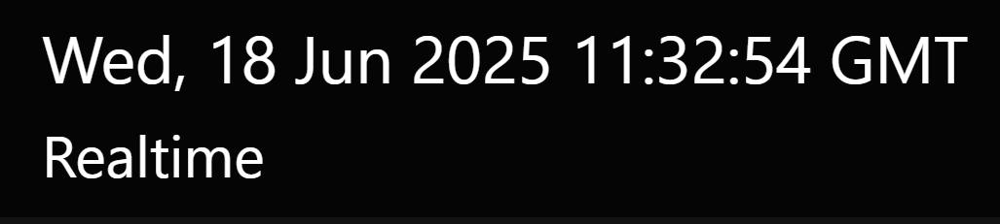
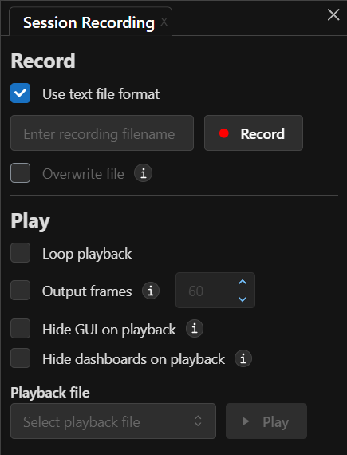
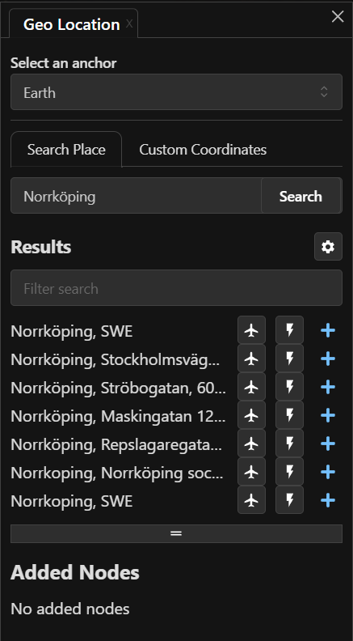

---
authors:
  - name: Brian Abbott, Micah Acinapura
    affiliation: American Museum of Natural History
---

# Orientation

OpenSpace's user interface is unconventional, but straightforward and easy to learn. Here, we will touch on the elements of the interface and discuss the details of each item later.

:::{figure} user_interface_orientation.png
:align: center
:width: 100%
:alt: OpenSpace user interface annotated

The main parts of the OpenSpace user interface.
:::

:::{tip}
**Removing Interface Elements**

You can toggle the text on and off in the Graphics Window using the {kbd}`Shift` + {kbd}`Tab` keys.

You can toggle the Toolbar on and off using the {kbd}`Tab` key.
:::

## Dashboard

The Dashboard reports information in realtime about your status and location in OpenSpace.

:::{figure} dashboard_default.png
:align: center
:width: 60%
:alt: Default Dashboard display.
The default Dashboard display.
:::

It reports on:
- Current date and time in Universal Time (UT)
- The simulation increment
- Your distance to the current focus
- Average frames per second (FPS)---useful for seeing how well OpenSpace is performing on your system
- Position, in Latitude and Longitude, and altitude from the object set to Focus

### Set What is Shown

In Settings Panel, under Dashboard, you can set what appears in the Dashboard, or turn it off completely.

:::{figure} settings_menu_dashboard.png
:align: center
:width: 40%
:alt: The Dashboard settings

{menuselection}`Settings --> Dashboard`
:::

The full-on Dashboard with all items on looks like this:

:::{figure} dashboard_full.png
:align: center
:width: 50%
:alt: The Dashboard with all items on

The Dashboard with all items displayed.
:::

## Flight Friction Status

An important aspect of navigating in OpenSpace, a topic we will discuss soon, is friction. When friction is on and you let off the gas (either let go of the mouse button or your controller), your flight will gradually come to a halt. This is friction.

In OpenSpace you can toggle friction on and off using keyboard shortcuts. There is one for each type of flight: Rotation, Zoom, and Roll.

When you start OpenSpace, friction for each of these types of flight is on. This is indicated by green indicators in the Friction Status, like this:

:::{figure} friction_status_default.png
:align: center
:width: 20%
:alt: Friction status is on

Friction status is "on".
:::

You can use keyboard shortcuts (recommended) or click on the green Flight Mode words to toggle them on and off.

To toggle friction on and off, use these keys:
:::{list-table}
:header-rows: 1
:stub-columns: 1
:align: center
* - Shortcut
  - Function
* - {kbd}`f`
  - Toggle rotational friction on and off
* - {kbd}`Shift` + {kbd}`f`
  - Toggle zoom friction on and off
* - {kbd}`Ctrl` + {kbd}`f`
  - Toggle roll friction on and off

:::

If we turn the rotational friction off, so when we orbit it will continue at a constant pace once we let go of the controller, the Friction Status will look like this:

:::{figure} friction_status_on.png
:align: center
:width: 20%
:alt: Friction status is off for rotational flight (orbiting)

Friction status is "off" for rotational flight (orbiting).
:::

## Toolbar

The Toolbar consists of panels that you use to control aspects of OpenSpace. Each Toolbar Button opens a panel. These panels collect specific functionality to alter time, record your session, access actions, and so on. Clicking on each button will bring up a panel that is attached to its corresponding icon, but may also be detached to float the panel.

:::{figure} panels_orientation.png
:align: center
:width: 100%
:alt: OpenSpace Toolbar annotated.

OpenSpace's Toolbar annotated.
:::

We will discuss details of each of these panels in the [Using OpenSpace](/using-openspace/index) chapter. For now, we will give you an overview of each panel.

### {h=50px} System Panel 

The System Panel exists in the bottom-left corner of the Graphics Window. It offers some high-level operations in OpenSpace, such as "about" information, links to resources and feedback, and quitting the program. Click this symbol to see the panel.

Throughout this guide, we will refer to this panel as {menuselection}`System`.

:::{figure} panel_system.png
:align: center
:width: 60%
:figwidth: 50% 
:alt: The OpenSpace System Menu

OpenSpace's System Menu.
:::

:::{list-table}
:header-rows: 0
:stub-columns: 1

* - About OpenSpace
  - Version information and a short description.
* - Open Web Tutorials
  - Opens this documentation website in your browser.
* - Open Getting Started Tour
  - Launches a wizard panel that will guide you through the basics of OpenSpace.
* - Send Feedback
  - Opens a web form to send feedback.
* - Show keybindings
  - Displays an onscreen, interactive keyboard with the keyboard shortcuts for the loaded profile.
* - Open GUI in Browser
  - Opens the user interface in a separate browser window.
* - Toggle console
  - Displays (or hides) a single-line [console](/using-openspace/scripting/console/index) at the top of the Graphics Window which enables you to enter OpenSpace commands. Use {kbd}`~` to toggle on and off.
* - Toggle native GUI
  - Displays (or hides) an older user interface rendered as an overlay over the main window. Use {kbd}`F1` to toggle on and off.
* - Quit OpenSpace
  - Gives you a 3-second grace period, then quits OpenSpace. The grace period allows you to abort an errant quit during a show if you accidentally quit OpenSpace. Use the shortcut {kbd}`Esc` key to quit, and hit {kbd}`Esc` again to cancel the quit within the grace period.
:::

### {h=50px} Scene Panel

:::::{grid} 1 1 1 2
::::{grid-item}
The Scene Panel collects all the assets (data sets) that were loaded via the profile chosen upon launch. It is, by far, the most used menu in OpenSpace. 

Throughout this guide, we will refer to this panel as {menuselection}`Scene`. 

You will find more detailed information about this panel in the [Using OpenSpace](/using-openspace/scene-panel/index) chapter.

#### List of Data Assets
For the [Default](/profiles/default/index) Profile, all the general data sets for the universe are loaded. This includes the planets, moons, and other objects and satellites in the [Solar System](/content/solar-system/index), the zoo of objects in the [Milky Way](/content/milky-way/index), and the large surveys outside the Galaxy, in [Universe](/content/universe/index).

The panel is essentially a vertical, sidebar menu with expanding items to reveal the data sets inside each hierarchical group. For example, under the Solar System are the groups Sun, Planets, Dwarf Planets, Comets, etc. Each of these reveals a submenu, and so on.

#### Data Adjustments
Under each data set you will find adjustments. You can brighten objects, change their color, change a label size, and so on.
::::

::::{grid-item}
:::{figure} panel_scene.png
:align: center
:width: 70%
:alt: OpenSpace Scene Panel

OpenSpace Scene Panel
:::
::::
:::::

### {h=50px} Settings Panel

:::::{grid} 1 1 1 2
::::{grid-item}
The Settings Panel is rarely used, but has a number of useful items that alter some behaviors or change what's displayed.

Throughout this guide, we will refer to this panel as {menuselection}`Settings`.

We do not have time here to discuss each item---some are too advanced for this section---but here are some of the more relevant ones for the average user.

The **Dashboard** sets what information is visible in the on-screen Dashboard. We discuss the particulars of the Dashboard [earlier on this page](#dashboard).

The **OpenSpace Engine** has a setting called Property Visibility. It sets the level of detailed information about an asset in the Scene Panel based on the user level you choose. Choices include Novice User, User, Advanced User, Developer, Everything. 

:::{figure} settings_openspace_engine.png
:align: center
:width: 70%
:alt: The OpenSpace Engine Property Visibility setting

{menuselection}`Settings --> OpenSpace Engine --> Property Visibility`
:::

You might be tempted to choose Everything, but it quickly clutters up the Scene Panel and makes its use more cumbersome. The more advanced categories are really useful when adding your own data or working in the source code and you want additional information reported to you about an asset.
::::

::::{grid-item}
:::{figure} panel_settings.png
:align: center
:width: 70%
:alt: OpenSpace Setting Panel

OpenSpace Settings Panel.
:::
::::
:::::

### {h=50px} Navigation Panel

:::::{grid} 1 1 1 2
::::{grid-item}
The Navigation Panel is where you choose a target to act as your Focus and fly to that target.

We will refer to this panel as {menuselection}`Navigation` throughout this guide.

The Navigation Panel has a iconized menu at the top with buttons for Focus, Anchor, and Aim.
-  Focus: In every OpenSpace session, *something* needs to be set as Focus. This is an object around which navigation is centered. With this chosen in the top menu, simply pick an object in the list, or search for an object, to set as Focus. See  for more on this.
-  Anchor: Acts similarly to Focus and is used with Aim to tailor a more complex scene.
-  Aim: When used with Anchor, Aim will set your view toward one object while maintaining focus on another object. (See  for more on using Anchor & Aim.)

For each object in the list, there are three items for navigation:
-  Pan & Fly To: Flight moves along a straight line, and gracefully pans until the object is in view.
-  Fly To: Automatically takes you to the object using a curved path.
-  Context Menu: opens a smaller subpanel with these options:
  *  Jump To: Fades to black, then takes you directly to the object.
  * A reappearance of the other options for Focus, Fly To, and Pan & Fly To. 
::::

::::{grid-item}

::::
:::::

### {h=50px} Time Panel

:::::{grid} 1 1 1 2
::::{grid-item}
The Time Panel is where you set your date and time. We refer to this panel in the guide as {menuselection}`Time`.

Here, you can set a specific time. Or, increase the clock speed by choosing the unit (Seconds, Minutes, etc.) and either entering a number in the box below or use the Quick Adjust slider to vary the rate.

The pause and two play buttons (one for forward, the other for backward) set the clock going.

The `Realtime` button sets you back to 1 second per second, and the `Now` button resets the date to the current date and time.
::::

::::{grid-item}

::::
:::::

### {h=50px} Record Panel

:::::{grid} 1 1 1 2
::::{grid-item}
The Record Panel enables session recording. Press the `Record` button and begin flying, turning data sets on and off, then hit `Stop`. This will save a file that may then be read in for playback.

Reading in this file for playback will not only loop you through the sequence in OpenSpace, but it can also output frames. These frames, a set of images at each point along the path, can then be used to create video content outside OpenSpace. It will save a _lot_ of files, so ensure you have adequate space before outputting frames.
::::

::::{grid-item}

::::
:::::

### {h=50px} GeoLocation Panel

:::::{grid} 1 1 1 2
::::{grid-item}
The GeoLocation panel takes you to any place on Earth. Choose how you want to get there---Fly To, Jump To, or add it as the Focus---enter a place in the search box, choose a result and OpenSpace will take you there.
::::

::::{grid-item}

::::
:::::

{.advanced-topic}
[Advanced]{.advanced}
### {h=50px} Screenspace Renderables Panel

:::::{grid} 1 1 1 2
::::{grid-item}
The Screenspace Renderable Panel places an image or video in a floating window. You can place a URL of an image, give it a name, then add it. Once it's in the list, you have many options to adjust where it is, how large it is, and so forth.

We will discuss this more in  [coming soon!].
%%%% LINK
::::

::::{grid-item}

::::
:::::

### {h=50px} Exoplanet Systems Panel

:::::{grid} 1 1 1 2
::::{grid-item}
The Exoplanet Systems Panel is used to visualize individual exoplanetary systems. You choose the system you want, or search by host star name, and add the system.

Once added, it appears in the list and you can aim toward it, fly to it, and access its settings.

In this guide, we refer to this panel as {menuselection}`Exoplanet Systems`.

See  for more on using this panel.
::::

::::{grid-item}

::::
:::::

{.advanced-topic}
[Advanced]{.advanced}
### {h=50px} User Controls Panel

:::::{grid} 1 1 1 2
::::{grid-item}
A relatively new panel, the User Controls Panel enables prescripted, custom panels to control OpenSpace. These are built elsewhere and may be used here.

We will discuss these in future sections.
::::

::::{grid-item}

::::
:::::

### {h=50px} Actions Panel

:::::{grid} 1 1 1 2
::::{grid-item}
The Actions Panel is a powerful set of buttons that can execute OpenSpace commands. For example, you can turn all the planet, moon, and satellite trails off with the press of one button. 

The panel is a series of folders and buttons, broken down by topic (object type or functionality).

These actions are asset files and can be built. We will discuss that later.

In this guide, {menuselection}`Actions` refers to the Actions Panel.
::::

::::{grid-item}

::::
:::::

### {h=50px} SkyBrowser Panel

:::::{grid} 1 1 1 2
::::{grid-item}
The SkyBrowser Panel offers a telescopic view of the night sky. Powered by AAS's Worldwide Telescope, it allows you to point anywhere on the sky and see a high-resolution image of that area.

This enables you to see a patch of sky wherever you point the crosshair. There are over 3,000 images to choose from. These will appear in a floating window and you can zoom into them in that window. 
::::

::::{grid-item}

::::
:::::

### {h=50px} Mission Panel

:::::{grid} 1 1 1 2
::::{grid-item}
The Mission Panel loads when there is an asset that calls for it. It is a special panel that displays information on a specific space mission. For example, if you load the JWST Profile, it will load the Mission Panel.

The Mission Panel is informational but also interactive. You will see a vertical timeline and you can click on that timeline for mission events. It will also move time to that epoch of the mission and set the scene for the location and orientation of the spacecraft.

Buttons on the bottom allow you to go to the beginning or end of the mission.
::::

::::{grid-item}

::::
:::::

## Version

In the bottom-right of the Graphics Window is the version number you are running. This cryptic string reflects the current build you are using, and can be useful for troubleshooting.

The string is the branch and commit you are running, for those who speak [Git](https://github.com/OpenSpace).

## Quitting OpenSpace

To quit OpenSpace you have three options:
1. Use your Operating System's quit button in the top of the window.
2. Press {kbd}`Esc` and you will see a three-second timer. At the end of that three seconds, OpenSpace will close and quit. However, if you errantly quit, you can hit {kbd}`Esc` again to cancel the quit.
3. Use the System Menu: {menuselection}`System --> Quit OpenSpace`. This is the same as using the {kbd}`Esc` key, with the three-second grace period before quitting.