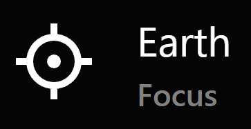
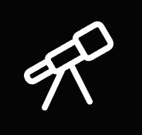

---
authors:
  - name: Brian Abbott, Micah Acinapura
    affiliation: American Museum of Natural History
---

# Orientation

OpenSpace's user interface is unconventional, but straightforward and easy to learn. Here, we will touch on the elements of the interface and discuss the details of each item later.

:::{figure} user_interface_orientation.png
:align: center
:width: 800px
:alt: OpenSpace user interface annotated

The main parts of the OpenSpace user interface.
:::

:::{tip}
**Hiding Interface Elements**

**{kbd}`F1`:** Toggles the Top Bar, Toolbar, and Flight Friction Status elements on and off. \
**{kbd}`Shift` + {kbd}`F1`:** Toggles the Dashboard, Version, and any messages on and off.
:::

## Top Menu Bar

:::::{grid} 1 1 1 2
::::{grid-item}
The Top Bar is similar to that of other applications, and includes four submenus: File, Windows, View, and Help.
::::
::::{grid-item}

::::
:::::

:::::{grid} 1 1 1 2
::::{grid-item}
### File Menu
The File Menu lists the currently loaded profile and offers options for getting more detail on the profile, displying the [Console](/using-openspace/scripting/console/index) (an advanced topic we discuss later), and quitting the software.
::::
::::{grid-item}
:::{figure} topbar_menu_file.png
:align: center
:width: 70%
:alt: Top Bar File Menu
:::
::::
:::::

:::::{grid} 1 1 1 2
::::{grid-item}
### Windows Menu
The Windows Menu includes a list of all available panels and indicates which are currently open. 

Click a button in the list to open that particular panel; use the `X` to close the panel. 

We discuss each panel in the [Toolbar section below](#toolbar).
::::
::::{grid-item}
:::{figure} topbar_menu_windows.png
:align: center
:figwidth: 90%
:width: 60%
:alt: Top Bar Windows Menu

The Windows Menu, indicating the Actions Panel is currently open.
:::
::::

::::{grid-item}
### View Menu
The View Menu determines what is shown in the user interface. Most notably, which panel buttons are shown in the Toolbar (currently referred to as Task Bar in the menu). The Task Bar submenu allows you to customize the Toolbar and reorder the buttons. There are also settings for saving and loading a Toolbar configuration.

GUI Settings establishes the number of items that appear in the Scene Panel. The five categories---`Novice User`, `User`, `Advanced User`, `Developer`, and `Everything`---reveal increasing levels of detailed settings for assets in the Scene Panel.

While you may be tempted to choose `Everything`, the downside is it clutters the Scene Panel with settings you're unlikely to use and makes using the panel more cumbersome. For the most part, `Developer` and `Everything` are useful for those who are adding their own data or working within the OpenSpace source code and desire more options and reporting on assets.

At the bottom of this subpanel is a Scale magnifier, which allows you to adjust the size of the interface elements.
::::
::::{grid-item}
:::{figure} topbar_menu_view.png
:align: center
:width: 70%
:alt: Top Bar View Menu and Visibility Level Setting
:::
::::

::::{grid-item}
### Help Menu
The Help Menu offers a getting started tour, resources for help and sending feedback, and enables some high-level operations in OpenSpace, such as opening the user interface in a browser for external control.

Open Web Tutorials
: Opens our YouTube page in your browser.

Open Getting Started Tour
: Launches a wizard panel that will guide you through the basics of OpenSpace.

Open Routes Page
: Opens a menu where you can navigate to alternative user interfaces, such as the ShowComposer.

Send Feedback
: Opens a web form to send feedback.

Open GUI in Browser
: Opens the user interface in a separate browser window.

About
: Version information and a short description about OpenSpace.

::::
::::{grid-item}
:::{figure} topbar_menu_help.png
:align: center
:width: 80%
:alt: Top Bar Help Menu
:::
::::

:::::

## Dashboard

The Dashboard reports information in realtime about your status and location in OpenSpace.

:::{figure} dashboard_default.png
:align: center
:width: 60%
:alt: Default Dashboard display.
The default Dashboard display.
:::

It reports on:
- Current date and time in Universal Time (UT).
- The simulation increment.
- Your distance to the current focus.
- Average frames per second (FPS)---useful for seeing how well OpenSpace is performing on your system.
- Position, in latitude and longitude, and altitude from the object set to Focus.

### Set What is Shown

In Settings Panel, under Dashboard, you can set what appears in the Dashboard, or turn it off completely by unchecking the `Enabled` option.

:::{figure} settings_menu_dashboard.png
:align: center
:width: 40%
:alt: The Dashboard settings

The {menuselection}`Settings --> Dashboard` submenu.
:::

The full-on Dashboard with all items on looks like this:

:::{figure} dashboard_full.png
:align: center
:width: 50%
:alt: The Dashboard with all items on

The Dashboard with all items displayed.
:::

## Flight Friction Status

An important aspect of gracefully navigating in OpenSpace is friction. When friction is on and you let off the gas (either let go of the mouse button or your controller), your flight will gradually come to a halt. This is friction, and there is a toggle for each type of flight: Rotation, Zoom, and Roll.

When you start OpenSpace, friction for each of these types of flight is on. This is indicated by check marks and green buttons in the Friction Status, like this:

:::{figure} friction_status_default.png
:align: center
:width: 256px
:alt: Friction status is on

Friction status is "on".
:::

You can toggle the friction modes on and off using keyboard shortcuts (recommended) or click on the green buttons. To toggle friction on and off using the keyboard, use these keys:
:::{list-table}
:header-rows: 1
:stub-columns: 1
:align: center
* - Shortcut
  - Function
* - {kbd}`f`
  - Toggle rotational friction on and off
* - {kbd}`Shift` + {kbd}`f`
  - Toggle zoom friction on and off
* - {kbd}`Ctrl` + {kbd}`f`
  - Toggle roll friction on and off

:::

If we turn the rotational friction off, when we orbit it will continue at a constant speed once we let go of the controller, and the Friction Status will look like this:

:::{figure} friction_status_on.png
:align: center
:width: 256px
:alt: Friction status is off for rotational flight (orbiting)

Friction status is "off" for rotational flight (orbiting).
:::

## Toolbar

The Toolbar consists of panels that you use to control aspects of OpenSpace. Each Toolbar Button opens a panel. These panels collect specific functionality to alter time, record your session, access actions, and so on. Clicking on each button will bring up a panel that is attached to its corresponding icon, but may also be detached to float the panel.

<!-- Only add the figure text to the last image, because otherwise it shows up twice -->
:::{figure} panels_orientation.png
:align: center
:width: 100%
:class: only-light
:alt: OpenSpace Toolbar annotated.
:::

:::{figure} panels_orientation_dark.png
:align: center
:width: 100%
:class: only-dark
:alt: OpenSpace Toolbar annotated.

OpenSpace's Toolbar annotated.
:::

We discuss details of each of these panels in the [Using OpenSpace](/using-openspace/index) chapter. For now, we will give you an overview of each panel.

(orientation_scene_panel)=
### {h=45px} Scene Panel

:::::{grid} 1 1 1 2
::::{grid-item}
The Scene Panel collects all the assets (data sets) that were loaded via the profile chosen upon launch. It is, by far, the most used menu in OpenSpace.

Throughout this guide, we will refer to this panel as {menuselection}`Scene`.

You will find more detailed information about this panel in the [Using OpenSpace](/using-openspace/toolbar/scene/index) chapter.

#### List of Data Assets
For the [Default](/profiles/default/index) Profile, all the general data sets for the universe are loaded. This includes the planets, moons, and other objects and satellites in the [Solar System](/content/solar-system/index), the zoo of objects in the [Milky Way](/content/milky-way/index), and the large surveys outside the Galaxy, in [Universe](/content/universe/index).

The panel is essentially a vertical, sidebar menu with expanding items to reveal the data sets inside each hierarchical group. For example, under the Solar System are the groups Sun, Planets, Dwarf Planets, Comets, etc. Each of these reveals a submenu, and so on.

#### Data Adjustments
Under each data set you will find adjustments. You can brighten objects, change their color, change a label size, and so on. These adjustments will appear in a new panel at the bottom of the Scene Panel.
::::

::::{grid-item}
:::{figure} panel_scene.png
:align: center
:width: 70%
:alt: OpenSpace Scene Panel

OpenSpace Scene Panel
:::
::::
:::::

### {h=45px} Settings Panel

:::::{grid} 1 1 1 2
::::{grid-item}
The Settings Panel is rarely used, but has a number of useful items that alter some behaviors or change what's displayed. It is not shown in the Toolbar by default.

Open the Settings Panel from the Top Bar using {menuselection}`Windows --> Settings`. 

Use {menuselection}`View --> Task Bar --> Settings` to add the Settings Panel button to the Toolbar.

Throughout this guide, we will refer to this panel as {menuselection}`Settings`.

We do not have time here to discuss each item in the Settings Panel---most are too advanced for this section. One useful example is the settings for the **Dashboard**, covered [earlier on this page](#dashboard).
:::
::::

::::{grid-item}
:::{figure} panel_settings.png
:align: center
:width: 70%
:alt: OpenSpace Setting Panel

OpenSpace Settings Panel.
:::
::::
:::::

### {h=45px} Navigation Panel

:::::{grid} 1 1 1 2
::::{grid-item}
The Navigation Panel is where you choose a target to act as your Focus and fly to that target.

We will refer to this panel as {menuselection}`Navigation` throughout this guide.

The Navigation Panel has two modes, accessed through an iconized menu at the top:
- {h=20px} Focus: In every OpenSpace session, *something* needs to be set as Focus. This is an object around which navigation is centered. With this chosen in the top menu, simply pick an object in the list, or search for an object, to set as Focus. See [Navigation and Focus](/getting-started/navigation/index.md#navigation-and-focus) for more on this.
- {h=20px} Anchor & Aim: This more complex navigation mode uses two objects: an *Anchor* that acts similarly to Focus in that the camera navigates around it, and an *Aim* that the view will be set to point towards. See [Navigation](/using-openspace/toolbar/navigation/index) for more on using Anchor & Aim.
::::
::::{grid-item}

:::{figure} panel_navigation.png
:align: center
:width: 70%
:alt: OpenSpace Navigation Panel
:::

::::

:::::

Focus Mode is most commonly used. For each object in the entry list there are three items for navigation:
- {h=2em} Pan & Fly To: Flight moves along a straight line, and gracefully pans until the object is in view.
- {h=2em} Focus: Rotates to look at the object and sets it as the focus for navigation.
- {h=2em} Fly To: Automatically flies to the object using a curved path.
- {h=2em} Jump To: Fades to black, then jumps directly to the object.

### {h=45px} Time Panel

:::::{grid} 1 1 1 2
::::{grid-item}
The Time Panel is where you set your date and time. We refer to this panel in the guide as {menuselection}`Time`.

Here, you can set a specific time. Or, increase the clock speed by choosing the unit (Seconds, Minutes, etc.) and either entering a number in the box below or use the Quick Adjust slider to vary the rate.

The pause and two play buttons (one for forward, the other for backward) set the clock going.

The `Realtime` button sets you back to 1 second per second, and the `Now` button resets the date to the current date and time.
::::

::::{grid-item}

:::{figure} panel_time.png
:align: center
:width: 70%
:alt: Time Panel
:::

::::

:::::

### {h=45px} Record Panel

:::::{grid} 1 1 1 2
::::{grid-item}
The Record Panel enables session recording. After entering a name for your recording, press the `Record` button and begin flying. Feel free to turn data sets on and off or make adjustments. To end your recording, hit `Stop`. This will save a file that may then be read in for playback.

Reading in this file for playback will not only loop you through the sequence in OpenSpace, but it can also output frames if you check the Output Frames box on. These frames, a set of images at each point along the path, can then be used to create video content outside OpenSpace. It will save a _lot_ of files, so ensure you have adequate space before outputting frames.
::::

::::{grid-item}

:::{figure} panel_record.png
:align: center
:width: 70%
:alt: Record Panel
:::

::::
:::::

### {h=45px} GeoLocation Panel

:::::{grid} 1 1 1 2
::::{grid-item}
The GeoLocation panel takes you to any place on Earth. Enter a place in the search box, choose a result and how you want to get there: Fly To ({h=2em}), Jump To ({h=2em}), or add it as the Focus.

You may also save custom latitude, longitude and altitude coordinates in the Custom Coordinates tab.
::::

::::{grid-item}

:::{figure} panel_geolocation.png
:align: center
:width: 70%
:alt: GeoLocation Panel
:::

::::
:::::

{.advanced-topic}
[Advanced]{.advanced}
### {h=45px} Screenspace Renderables Panel

:::::{grid} 1 1 1 2
::::{grid-item}
The Screenspace Renderable Panel places an image or video in a floating window. You can place a URL of an image, give it a name, then add it. Once it's in the list, you have many options to adjust where it is, how large it is, and so forth.

We will discuss this more in  [coming soon!].
%%%% LINK
::::

::::{grid-item}

:::{figure} panel_screenspace_renderables.png
:align: center
:width: 70%
:alt: Screenspace Renderables Panel
:::

::::
:::::

### {h=45px} Exoplanet Systems Panel

:::::{grid} 1 1 1 2
::::{grid-item}
The Exoplanet Systems Panel is used to visualize individual exoplanetary systems. You choose the system you want, or search by host star name, and add the system.

Once added, it appears in the list and you can aim toward it, fly to it, and access its settings.

In this guide, we refer to this panel as {menuselection}`Exoplanet Systems`.

See  for more on using this panel.
::::

::::{grid-item}

:::{figure} panel_exoplanet_systems.png
:align: center
:width: 70%
:alt: Exoplanet Systems Panel
:::

::::
:::::

{.advanced-topic}
[Advanced]{.advanced}
### {h=45px} User Panels

:::::{grid} 1 1 1 2
::::{grid-item}
A relatively new panel, the User Panels menu enables prescripted, custom panels to control OpenSpace. These are built elsewhere and may be used here.

We will discuss these in future sections.
::::

::::{grid-item}

:::{figure} panel_user_panels.png
:align: center
:width: 70%
:alt: User Panels  Panel
:::

::::
:::::

### {h=45px} Actions Panel

:::::{grid} 1 1 1 2
::::{grid-item}
The Actions Panel is a powerful set of buttons that can execute OpenSpace commands. For example, you can turn all the planet, moon, and satellite trails off with the press of one button.

The panel is a series of folders and buttons, broken down by topic (object type or functionality).

These actions are asset files and can be built. We will discuss that later.

In this guide, {menuselection}`Actions` refers to the Actions Panel.
::::

::::{grid-item}

:::{figure} panel_actions.png
:align: center
:width: 70%
:alt: Actions Panel
:::

::::
:::::

### {h=45px} SkyBrowser Panel

:::::{grid} 1 1 1 2
::::{grid-item}
The SkyBrowser Panel offers a telescopic view of the night sky. Powered by AAS's Worldwide Telescope, it allows you to point anywhere on the sky and see a high-resolution image of that area.

This enables you to see a patch of sky wherever you point the crosshair. There are over 3,000 images to choose from. These will appear in a floating window and you can zoom into them in that window.
::::

::::{grid-item}

:::{figure} panel_skybrowser.png
:align: center
:width: 70%
:alt: SkyBrowser Panel
:::

::::
:::::

### {h=45px} Mission Panel

:::::{grid} 1 1 1 2
::::{grid-item}
The Mission Panel loads when there is an asset that calls for it. It is a special panel that displays information on a specific space mission. For example, if you load the JWST Profile, it will load the Mission Panel.

The Mission Panel is informational but also interactive. You will see a vertical timeline and you can click on that timeline for mission events. It will also move time to that epoch of the mission and set the scene for the location and orientation of the spacecraft.

Buttons on the bottom allow you to go to the beginning or end of the mission.
::::

::::{grid-item}

:::{figure} panel_mission.png
:align: center
:width: 70%
:alt: Mission Panel
:::

::::
:::::

## Version

In the bottom-right of the Graphics Window is the version number you are running. This cryptic string reflects the current build you are using, and can be useful for troubleshooting.

The string is the branch and commit you are running, for those who speak [Git](https://github.com/OpenSpace).

:::{tip}
**Hiding the Version**

You can remove the version from the screen using the **{kbd}`Shift` + {kbd}`F1`** shortcut, which toggles the Dashboard, Version, and any messages on and off.

To turn off only the version, use {menuselection}`Settings --> Render Engine --> Shows the version on-screen information` to toggle it on and off.
:::

## Quitting OpenSpace

To quit OpenSpace you have three options:
1. Use your Operating System's quit button in the top of the window.
2. Use the File Menu in the Top Bar: {menuselection}`File --> Quit OpenSpace`. This will prompt you to confirm that you want to quit. Once confirmed, you will see a three-second timer. At the end of that three seconds, OpenSpace will close and quit. During those three seconds you may press anywhere to abort the quitting.
3. Press {kbd}`CTRL` + {kbd}`Q`. This will also trigger the three-second timer, during which you can abort the quitting by clicking any key or press anywhere with the mouse.
