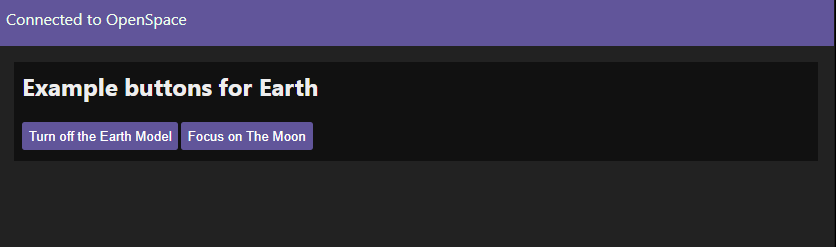
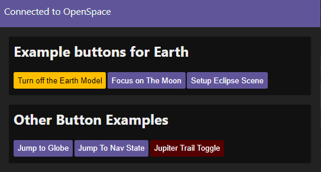

# HTML Controls Setup Guide
:::{sidebar}
Many thanks to Dylan Salas from the [California Academy of Sciences](https://calacademy.org/) for providing this guide
:::

This guide provides an overview over the usage of the JavaScript API to create an external webpage that can be used to create a custom show flow that interacts with OpenSpace.


## Required files
For reference, these are the files being explained in this guide:
  - The OpenSpace JavaScript API: {download}`openspace-api.js`
  - Style sheet for the page: {download}`main2.css`
  - HTML page: {download}`openspace_control_template.html`


## Setting up the HTML document
We typically have most of the controls in the head of the HTML document.

```html
<html>
  <head>
    <title>Basic OpenSpace Controls</title>
    <link rel="stylesheet" type="text/css" href="main2.css">
    <script type="text/javascript" src="openspace-api.js"></script>
    <script type="text/javascript">
```

  - Starting with title: `<title>Basic OpenSpace Controls</title>`
  - Link to stylesheet: `<link rel="stylesheet" type="text/css" href="main2.css">`
  - Include OpenSpace JavaScript API code: `<script type="text/javascript" src="openspace-api.js"></script>`
  - And finally opening another script block in which we will define all our buttons and functions

Then we usually start by defining a few useful functions we may use later:

```js
//variable for js libarary
var openspace = null;
//helper function for nicely fading groups of trails
var showTrails = (objects) => {
  objects.map(async (object) => {
    let isEnabled = false;
    const returnValue = await openspace.getPropertyValue("Scene." + object + "Trail.Renderable.Enabled");
    if (returnValue) {
      isEnabled = returnValue[1];
    }
    if (!isEnabled) {
      openspace.setPropertyValue("Scene." + object + "Trail.Renderable.Opacity", 0)
      openspace.setPropertyValue("Scene." + object + "Trail.Renderable.Enabled", true)
    }
    openspace.setPropertyValue("Scene." + object + "Trail.Renderable.Opacity", 1, 1)
  })
}
//helper function to fade out and then disable trails
async function hideAllTrails() {
  const duration = 1;
  openspace.setPropertyValue("Scene.*Trail.Renderable.Opacity", 0, 1)
  setTimeout(() => {
    openspace.setPropertyValue("Scene.*Trail.Renderable.Enabled", false)
  }, duration * 1000)
}
//helper function to set the focus target
var setFocus = (focus) => {
  openspace.setPropertyValue('NavigationHandler.OrbitalNavigator.Anchor', focus);
  openspace.setPropertyValue('NavigationHandler.OrbitalNavigator.RetargetAnchor', null);
}
```

We can now start writing the buttons. As an example I'll start with an object called `earthButtons` with two properties, "title" and "buttons".

```js
var earthButtons = {
  title: "Example buttons for Earth",
  buttons: {

  }
};
```

We can define as many of these sections as needed to organize the buttons. The actual buttons will then be key value pairs where the string to be displayed on the button is the key and a corresponding arrow function to be executed on click is the value. As a simple example a button to turn off the model of the earth would be as follows:

```js
var earthButtons = {
  title: "Example buttons for Earth",
  buttons: {
    'Turn off the Earth Model': () => {openspace.setPropertyValueSingle('Scene.Earth.Renderable.Enabled', false)},
  },
};
```

We can also add a button which uses one of the helper functions defined earlier:
```js
var earthButtons = {
  title: "Example buttons for Earth",
  buttons: {
    'Turn off the Earth Model': () => {openspace.setPropertyValueSingle('Scene.Earth.Renderable.Enabled', false)},
    'Focus on The Moon': () => {setFocus('Moon')},
  },
};
```

To get these buttons displayed on the page we first define a new array with all the names of each section, in this case we only have the earthButtons section. We will then define a function to map the JavaScript to HTML:

```js
var buttonGroups = [earthButtons];
//helper function to map the buttons to html
function mapButtons(openspace) {
  buttonGroups.map((action, id) => {
    var cardHTML = "<div class='card'><h2>" + action.title + "</h2>";
    if (action.description) {
      action.description.split('\n').map(item => {
        cardHTML += "<p>" + item + "</p>";
      });
    }
    if (action.buttons) {
      Object.keys(action.buttons).map(button => {
        const fn = action.buttons[button];
        cardHTML += '<button data-id="' + button + '" onClick="(' + fn + ')(event)">' + button + '</button>';
      });
    }
    cardHTML += "</div>";
    document.getElementById('main').innerHTML += cardHTML;
  });
}
```

In this code the `mapButtons` function generates an HTML card for each section provided in the `buttonGroups` array. Each card will contain a title (taken from the title property), buttons, and an optional description (not shown in this example). The function iterates over the key value pairs in each section and generates an HTML button for each one using the key as a label and calling the corresponding function on click. Each button will also be given a `data-id` equal to the button label which will be useful for styling individual buttons.

Next, we will also need a function to connect to OpenSpace:

```js
//helper function to connect to openspace
var connectToOpenSpace = () => {
  //setup the api params
  var host = document.getElementById('ipaddress').value;
  var api = window.openspaceApi(host, 4682);
  //notify users on disconnect
  api.onDisconnect(() => {
    console.log("disconnected");
    document.getElementById('container').className = "disconnected";
    var disconnectedString = "Connect to OpenSpace: ";
    disconnectedString += '<input id="ipaddress" type=text placeholder="Enter ip address" /> ';
    disconnectedString += '<button onClick="connectToOpenSpace();">Connect</button>';
    document.getElementById('connection-status').innerHTML = disconnectedString;
    openspace = null;
  });
  //notify users and map buttons when connected
  api.onConnect(async () => {
    try {
      document.getElementById('container').className = "connected";
      document.getElementById('connection-status').innerHTML = "Connected to OpenSpace";
      openspace = await api.library();
      console.log('connected');
      mapButtons(openspace);
    } catch (e) {
      console.log('OpenSpace library could not be loaded: Error: \n', e)
      return;
    }
  })
  //connect
  api.connect();
};
```

We can then close out the document and define more elements to enter an IP address when disconnected.

```html
</script>
</head>
<body>
  <!-- HTML Containers -->
  <div id="container" class="disconnected">
    <div id="connection-status" class="connection-status">
      Connect to OpenSpace:
      <input id='ipaddress' type=text placeholder="Enter ip address" />
      <button onClick="connectToOpenSpace();">Connect</button>
    </div>
    <div id="main">
    </div>
    <script type="text/javascript">
      connectToOpenSpace('localhost');
    </script>
  </div>
  <body>
</html>
```

Here we are also creating an empty div with id=main in which the `mapButtons` function will populate the generated buttons. Once opened in a browser (and with OpenSpace running on the same machine) it should look something like this:



This will of course also depend on the CSS, the file we are using is linked at the top of this document.

## How to get OpenSpace commands from the script log
An easy way to generate the commands to assign to buttons is to first perform the sequence using the GUI then add the output of the script log to a button. The script log can be found in the OpenSpace directory under `OpenSpace-0.X.X/Logs/ScriptLog.txt`.

For example, to setup a scene showing the April 8th, 2024 eclipse in the OpenSpace GUI you might:
  - Jump to Earth at a specific location
  - Set time to April 8th
  - Set the visible layer to Blue Marble
  - Speed up time to view the path of the eclipse

The ScriptLog would then contain:
```lua
return openspace.globebrowsing.goToGeo("Earth","33.1","-106.9","6000000")
return openspace.time.setTime("2024-04-08T17:30:13.184")
openspace.setPropertyValueSingle("Scene.Earth.Renderable.Layers.ColorLayers.ESRI_VIIRS_Combo.Enabled", false)
openspace.setPropertyValueSingle("Scene.Earth.Renderable.Layers.ColorLayers.Blue_Marble.Enabled", true)
return openspace.time.interpolateDeltaTime(60)
```

We then add these commands to a button to easily return to this scene. First, taking everything after "return" and replacing the double quotes with single quotes, then adding the commands to an arrow function:
```js
'Setup Eclipse Scene': () => {
  openspace.globebrowsing.goToGeo('Earth','33.1','-106.9','6000000')
  openspace.time.setTime('2024-04-08T17:30:13.184')
  openspace.setPropertyValueSingle('Scene.Earth.Renderable.Layers.ColorLayers.ESRI_VIIRS_Combo.Enabled', false)
  openspace.setPropertyValueSingle('Scene.Earth.Renderable.Layers.ColorLayers.Blue_Marble.Enabled', true)
  openspace.time.interpolateDeltaTime(60)
},
```

## Other buttons
We also use various built in methods available in JavaScript to build buttons with slightly more complex functionality. These allow for adding toggles, delays, and logic to our control pages for easier and faster control of OpenSpace. Some examples of these are listed below. Note that the fading examples also make use of the `RenderEngine.BlackoutFactor` to fade the rendering to black before the transition occurs.

### Fade to a location on a globe
```js
'Jump to Globe': () => {
  openspace.setPropertyValueSingle('RenderEngine.BlackoutFactor',0,2)
  setTimeout(() => {
    openspace.time.interpolateDeltaTime(1,1.000000E+00)
    openspace.globebrowsing.goToGeo('Earth',37.7,-122.5, 3000000)
    openspace.setPropertyValueSingle('RenderEngine.BlackoutFactor',1,2)
  }, 2001)
},
```

### Fade to a navigation state
To get the nav state first run `openspace.navigation.saveNavState('C:/path/to/nav/state')` in the OpenSpace [console](/users/console/index). Then to add the output to JavaScript code replace all square brackets `[`, `]` with curly brackets `{`, `}` and all equal signs (`=`) with colons (`;`).

```js
'Jump To Nav State': () => {
  openspace.setPropertyValueSingle('RenderEngine.BlackoutFactor',0,2)
  setTimeout(() => {
    openspace.time.interpolateDeltaTime(1,1.000000E+00)
    openspace.navigation.setNavigationState({Anchor:'Jupiter',Pitch:-0.0014499759046284187, Position:[-3189986816.909851,346218424.33447266,861250117.1674805],ReferenceFrame:'Root',Up:[0.21129035032949686,0.8779118851872826,0.4296825685369957],Yaw:-2.16690017729807e-05})
    openspace.setPropertyValueSingle('RenderEngine.BlackoutFactor',1,2)
  }, 2001)
},
```

### Toggle button
```js
'Jupiter Trail Toggle': async () => {
  var togglevar = await openspace.getPropertyValue('Scene.JupiterTrail.Renderable.Enabled');
  if (togglevar[1] > 0.1) {
    openspace.setPropertyValueSingle('Scene.JupiterTrail.Renderable.Opacity', 0.0, 2)
    setTimeout(() => {
      openspace.setPropertyValueSingle('Scene.JupiterTrail.Renderable.Enabled', false)
    }, 3000)
    } else {
    openspace.setPropertyValueSingle('Scene.JupiterTrail.Renderable.Opacity', 1.0, 2)
    openspace.setPropertyValueSingle('Scene.JupiterTrail.Renderable.Enabled', true)
  }
},
```

## Conditional formatting
Since we have access to the OpenSpace API, we can subscribe to various properties and use their status to conditionally format different buttons. We find this most useful for toggles, and overall styling to reflect if the webpage is connected to OpenSpace.

To achieve this we add a new block of JavaScript code toward the end of our document. In this script block we define several arrays and functions which will setup the subscription topics and update the button styling based on the returned value:

```js
var api = window.openspaceApi('localhost', 4682);
  let intervalIds = [];
  api.onConnect(function () {

  //declaring the toggles Object with key value pairs, the keys are the button names you want to be updated
  //the values are the corresponding openspace properties to subscribe to
  var toggles = {
    'Turn off the Earth Model':'Scene.Earth.Renderable.Enabled',
    'Jupiter Trail Toggle':'Scene.JupiterTrail.Renderable.Enabled',
  };

  //create the pairs array - an array consisting of sub-arrays which contain the button-property pairs
  //did this for easy indexing but might be able to use a Map instead?
  let pairs = Object.entries(toggles);

  //creating empty array for intervalIds generated by using setInterval so I can stop the loop onDisconnect
  let intervalIds = [];

  //the button-updating function:
  //takes in the button id to be updated and the OpenSpace Topic to subscribe to
  //this was adapted from an example from the OpenSpace team
  function updateButtonStyle(buttonId, topic) {
    topic.iterator().next().then(function(it) {
    const enabled = it.value.Value;
    //const button = document.getElementById(buttonId);
    const button = document.querySelectorAll(`[data-id=${CSS.escape(buttonId)}]`);

    // Update the button's CSS style based on if the property is enabled
    if (enabled === true || Math.round(enabled) > 0.2) { //adding an OR > to allow for opacity checks and rounding to account for error when = 0
      button.forEach(function(item) {
        item.classList.add('ButtonGreen');
        item.classList.remove('ButtonRed');
      });
    } else {
      button.forEach(function(item) {
        item.classList.add('ButtonRed');
        item.classList.remove('ButtonGreen');
      });
    }
    });
  }
  //An initial function call to set the starting colors,
  pairs.forEach(function(item) {
    const topic = api.subscribeToProperty(item[1]);
    updateButtonStyle(item[0], topic);
  });

  //loooping through each element in the pairs array
  //outside the setInterval I am declaring the button id for each and subscribing to the corresponding property
  pairs.forEach(function(item) {
    const buttonId = item[0];
    const topic = api.subscribeToProperty(item[1]);
    const intervalId = setInterval(function() { //using setInterval to call the function once per second
      updateButtonStyle(buttonId, topic);
    }, 1000);
    intervalIds.push(intervalId);//pushing the intervalId to the array for stopping the loop later and avoiding errors
  });

  });

  api.onDisconnect(function() {
  console.log("Disconnected");
  intervalIds.forEach(clearInterval); //clearing the Intervalids to stop the topic subscriptions
  });

  api.connect();
```

With all these additions the control page now looks like this:



Here the two buttons are highlighted based on the property they change, to be more color-blind friendly we have set it to orange for ON and red for OFF.

