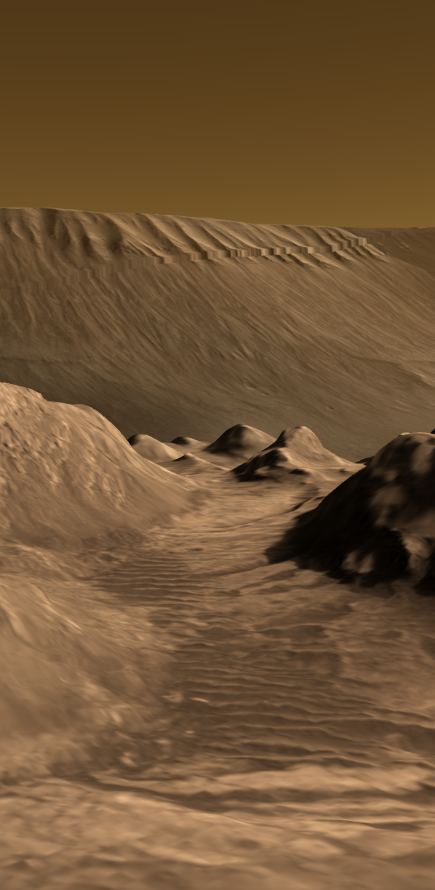

# OpenSpace User Guide

You've arrived at the official documentation for [OpenSpace](https://openspaceproject.com). OpenSpace is an open-source, interactive data visualization software designed to visualize the entire known universe at all possible scales.

:::{attention}
This site is in the midst of an overhaul. Sections break down into:
- {octicon}`check-circle-fill;1.25em` Completely overhauled,
- {octicon}`check-circle;1.25em` Relatively complete, but perhaps some bits missing,
- {octicon}`alert;1.25em` A hybrid of work in progress plus old documentation pages,
- {octicon}`x-circle;1.25em` Untouched from the old documentation version.

In the near future we will try to mark these sections as such.
:::

::::::{grid} 1 1 2 2 
:::::{grid-item}

{.glossary .index-list}
[Getting Started](/getting-started/index) {octicon}`check-circle-fill;0.8em`
: How to install & launch OpenSpace, a brief orientation, and how to fly.

[Using OpenSpace](/using-openspace/index) {octicon}`alert;0.8em`
: Section not yet complete.

[Profiles](/profiles/index) {octicon}`alert;0.8em`
: Profiles load data and settings, here are the profiles that ship with OpenSpace.

[Content](/content/index) {octicon}`check-circle;0.8em`
: A description of each data set in OpenSpace.

[Importing Data](/creating-data-assets/index) {octicon}`x-circle;0.8em`
: How to add your own data and media, build asset files, actions, and events.

[Reference](/reference/index) {octicon}`check-circle;0.8em`
: A reference section for OpenSpace commands, asset examples, and its scripting API.

[Contribute](/contribute/index) {octicon}`x-circle;0.8em`
: How **you** can contribute to the OpenSpace's development via coding of documentation.

[Glossary](/glossary/index) {octicon}`check-circle-fill;0.8em`
: Glossaries of terms on astronomy, coding, or documentation.

[About](/about/index) {octicon}`x-circle;0.8em`
: The whos, hows, and maybe even whys of OpenSpace.

[Community](/community/index) {octicon}`x-circle;0.8em`
: How to reach the team and communicate with others in the OpenSpace community.

:::::

:::::{grid-item}

:::::
::::::

## Releases
You can find a list of all releases of OpenSpace [here](about/releases/index.md).

<!--
  Sidebar
-->

:::{toctree}
:maxdepth: 1
:hidden:

getting-started/index
:::

:::{toctree}
:maxdepth: 1
:hidden:

using-openspace/index
:::

:::{toctree}
:maxdepth: 1
:hidden:

profiles/index
:::

:::{toctree}
:maxdepth: 1
:hidden:

content/index
:::

:::{toctree}
:maxdepth: 1
:hidden:

creating-data-assets/index
:::

:::{toctree}
:maxdepth: 1
:hidden:

reference/index
:::

:::{toctree}
:maxdepth: 1
:hidden:

contribute/index
:::

:::{toctree}
:maxdepth: 1
:hidden:

glossary/index
:::

:::{toctree}
:maxdepth: 1
:hidden:

about/index
:::

:::{toctree}
:maxdepth: 1
:hidden:

community/index
:::

