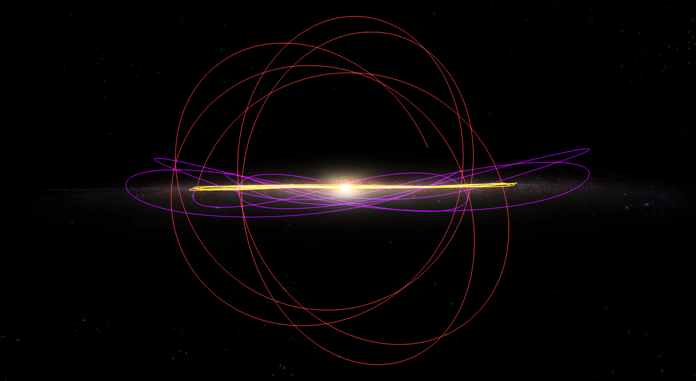
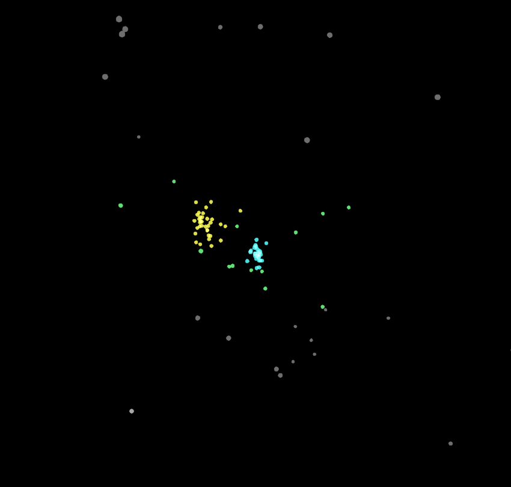
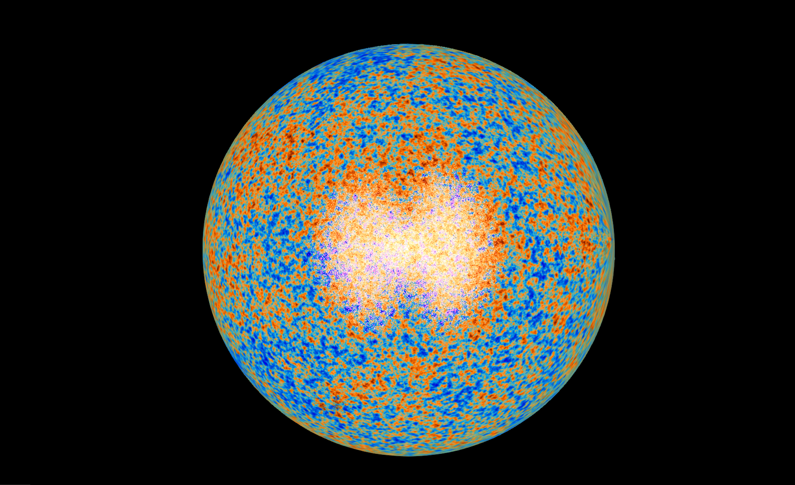

---
authors:
  - name: Brian Abbott
    affiliation: American Museum of Natural History
---

# Default (Grand Tour)
% This profile is enabled on default and provides the ability to look at detailed terrain models of the Earth, Moon, Mars, other planets, and the Digital Universe extrasolar catalog.

% The view defaults on Earth at the current time with the ESRI VIIRS Combo enabled. This uses the Suomi VIIRS daily images when viewing the whole Earth, and switches to high-detail imagery from ESRI when zooming in.

The default profile loads the basic data sets that enable a broad tour of the universe. It loads the base asset file, which includes an array of data from Earth out to the most distant objects we can see, along with many default keyboard shortcuts, and some actions as well.

::::::::{tab-set}

:::::::{tab-item} Tour

## Tour

::::::{grid} 1 2 2 2

:::::{grid-item}
We always begin our exploration of the universe with what's most familiar---Earth, our home. This tour will give you a sense of what's out there, and where we are in the observable universe.

In this tour, we will explore the Universe from Earth to the most distant objects we see. Obviously, we will gloss over many details---these tours are designed from our hour-long talks we give to audiences.
:::::

:::::{grid-item}
:::{important}

{.no-bullet}
- {octicon}`rocket;1.25em;profile-tour-action` : Flight instructions
- {octicon}`diff-added;1.25em;profile-tour-action` : Turn on a data set
- {octicon}`diff-removed;1.25em;profile-tour-action` : Turn off a data set
- {octicon}`tools;1.25em;profile-tour-action`: Adjust a setting
- {octicon}`telescope;1.25em;profile-tour-action` :  Target an object
- {octicon}`stopwatch;1.25em;profile-tour-action` : Change the time settings

:::
:::::
::::::

### Earth & Moon

#### Earth

{octicon}`rocket;1.25em;profile-tour-action` Start a slow orbit around Earth.

Earth is, of course, home to everyone you know, and we're mostly huddled on those parts of the planet that are above present sea level---about 30% of the planet's surface. Earth remains a dynamic planet, with plate tectonics, active volcanoes, and crust formation.

Earth formed about 4.6 billion years ago, but our modern species appeared only about 200,000 years ago. In that time, we have populated all corners of the planet, developed agriculture circa 10,000 years ago, and produce enough food to be able to think beyond our own survival and about things that enrich our lives and advance civilization.

::::{grid} 1 2 3 3
:gutter: 1 1 1 2

:::{grid-item-card} 

:::
::::

:::{tip}
Use the {kbd}`f` key to turn friction on and off for orbital motion. If you orbit too fast, you can tap {kbd}`f` to slow down, then tap {kbd}`f` again to maintain a new, slower speed.
:::

#### Distance of the Moon
{octicon}`rocket;1.25em;profile-tour-action` Pull away from Earth so that the Moon's orbit is in full view, and continue orbiting Earth.

The Moon is Earth's only natural satellite. Its average distance is 384,400 km (almost 239,000 miles), but it ranges from 362,000 km at its nearest to 405,000 km at its most distant (that's 225,000 miles to 251,600 miles).

The Moon is the farthest humans have ventured into space. In fact, the record for the farthest humans from Earth belongs to the crew of Apollo 13, the failed mission to the Moon. On April 15, 1970, their flightpath took them 254 km (158 miles) above the far side of the Moon, or 400,171 km (248,655 miles) from Earth. We have sent probes farther into space, but we have not set foot on any other world beyond the Moon. We last left the Moon on December 14, 1972, over fifty years ago.

::::{grid} 1 2 3 3
:gutter: 1 1 1 2

:::{grid-item-card} 

:::
::::

:::::{admonition} Light Travel Time
We can also express distance in terms of light travel time. You may be familiar with the term {term}`light year`, which is the _distance_ over which light travels in one year. The Moon is so close, we need to talk about the light travel time in light seconds. Its average distance is equal to about 1.3 light seconds, so it takes 1.3 seconds for light to travel from Earth to the Moon. When the astronauts were walking on the Moon, it took 1.3 seconds for Houston to relay a message to them, and another 1.3 seconds for their response to reach Houston.
:::::

#### Distance of the Sun

{octicon}`rocket;1.25em;profile-tour-action` Pull out from Earth to see the planets of the inner Solar System.

The Sun, our host star, is, on average, 150 million km (93 million miles) from Earth, which we can also state as 8 light minutes---it takes 8 minutes for the Sun's light to reach your eyes on Earth. When you look at the Sun (which you should never do directly), you're seeing it as it was 8 minutes ago. In this way, we're looking back in time as we look out into the universe.

***

### Outer Solar System

#### The Planets

{octicon}`rocket;1.25em;profile-tour-action` Fly away from Earth so that the entire Solar System is in view,  continue orbiting.

From outside the orbit of Neptune, we see the eight planets of the Solar System. The inner, rocky planets are huddled near the Sun. The outer, gaseous planets are far larger and each harbor a complex system of moons.

The planets align very well within a common plane. Mercury is inclined about 7&deg; to this plane, but the other seven planets are all within two degrees of the plane.

#### Pluto

{octicon}`diff-added;1.25em;profile-tour-action` {menuselection}`Scene --> Solar System --> Dwarf Planets --> Pluto --> Pluto Keplarian Trail` \
{octicon}`tools;1.25em;profile-tour-action` Uncheck {menuselection}`... --> Pluto Keplarian Trail --> Renderable --> Appearance --> Enable Line Fading of Old Points` to see the entire orbit.

In contrast to the eight planets, Pluto is inclined 17&deg; to this plane, clearly demonstrating it's different. When viewed from above the plane, you can see that the trajectory of Pluto is interior to Neptune's orbit for a portion of its 248-year journey around the Sun.

Once we discovered Kuiper Belt objects in 1992---small, rock-ice worlds beyond Neptune---astronomers understood that Pluto resembles these objects, and belongs with its Kuiper Belt brethren. Pluto is now one of a many [dwarf planets](/content/solar-system/dwarf-planets/index) in the Solar System, and one of over 2,000 known objects orbiting in the Kuiper Belt.

::::{grid} 1 2 3 3
:gutter: 1 1 1 2

:::{grid-item-card} 

:::
::::

:::::{admonition} Composition of the Solar System
The Solar System is composed of an exotic variety of objects that orbit the Sun. The Sun, a rather average star, contains the vast majority of the mass of the Solar System (99.85%). Jupiter, the largest planet, is 317 times the mass of Earth, but all the planets account for only 0.135% of the Solar System's mass. The remaining 0.015% is made up of asteroids, dwarf planets, meteoroids, and smaller objects.
:::::

% DO WE PUT VOYAGER INTO THE DEFAULT PROFILE?
% IF SO, GET TEXT FROM pdf

***

### Constellations & Stars

#### Constellation Lines

{octicon}`diff-added;1.25em;profile-tour-action` {menuselection}`Scene --> Milky Way --> Constellations --> Constellation Lines`

Even from this great distance, with the constellation lines on, we still see the same star patterns traced in the starry sky. The familiar Ursa Major ("Big Dipper"), Orion, Scorpius, and the other constellations remain the same from this perspective because the stars are very far away. We also see the band of light we call the Milky Way.

The constellation lines connect stars that trace the figures outlined in the night sky. The sky is divided into eighty-eight constellations, each claiming a region of the sky as a country's borders claim part of a continent.

::::{grid} 1 2 3 3
:gutter: 1 1 1 2

:::{grid-item-card} 

:::
::::

:::{tip}
You can see more historical information on [main constellation page](/content/milky-way/constellations/index).
:::

#### Nearby Stars

{octicon}`diff-added;1.25em;profile-tour-action` {menuselection}`Scene --> Solar System --> Sun --> Sun Label` \
{octicon}`rocket;1.25em;profile-tour-action` Fly away from Earth until you begin to see the nearby stars move.

As you fly away from the Sun and Earth, you will begin to see some of the nearby stars move. The constellation lines will become distorted as the two-dimensional sky transforms into three-dimensional space.

#### Star Names

{octicon}`diff-added;1.25em;profile-tour-action` {menuselection}`Scene --> Milky Way --> Stars --> Star Labels` \
{octicon}`rocket;1.25em;profile-tour-action` Continue orbiting.

Some of the nearby stars are easily distinguished. In particular, Sirius, the brightest star in the sky (due to its intrinsic brightness and its distance), is about 9 light years from the Sun. Nearby is Procyon, about 11.5 light years from us. Opposite the Sun is Vega, 25 light years away, and Altair, around 16 light years from Earth. Several dimmer stars also populate the solar neighborhood.

::::{grid} 1 2 3 3
:gutter: 1 1 1 2

:::{grid-item-card} 

:::
::::

#### A Variety of Stars

{octicon}`diff-removed;1.25em;profile-tour-action` {menuselection}`Scene --> Milky Way --> Stars --> Star Labels` \
{octicon}`diff-removed;1.25em;profile-tour-action` {menuselection}`Scene --> Solar System --> Sun --> Sun Label`

From this location, you may notice that the stars exhibit various brightnesses and colors, as they do in the night sky. Stars come in a variety of masses, which determine their temperatures, colors, and luminosities. Bluer stars are more massive and hotter. These stars have short lifetimes and there are far fewer of them in the Galaxy. Redder stars, on the other hand, are less massive and cooler, and are abundant throughout the Milky Way. The Sun is generally average in terms of brightness and will remain a star for another five billion years.

***

### Exoplanets

#### Exoplanet Systems

{octicon}`diff-added;1.25em;profile-tour-action` {menuselection}`Scene --> Milky Way --> Exoplanets --> Exoplanet Systems` \
{octicon}`rocket;1.25em;profile-tour-action` Continue flying away to examine the exoplanet data.

It appears we are now lost in a sea of stars and the constellation lines connecting some of them, but we can now explore objects on larger scales beyond the solar neighborhood.

Each exoplanet marker indicates a star with a confirmed planetary system. None of these were known before 1995, so this is a relatively new branch of astrophysics, and a burgeoning one at that. We now know of over 5,000 planets outside our Solar System, and some of these systems have multiple planets, indicated by the parenthetical number in their label (no number signifies only one known planet).

::::{grid} 1 2 3 3
:gutter: 1 1 1 2

:::{grid-item-card} 

:::
::::

{octicon}`diff-removed;1.25em;profile-tour-action` {menuselection}`Scene --> Milky Way --> Constellations --> Constellation Lines`

As you fly farther from the Sun, it quickly becomes clear that the constellations are only practical from our perspective in the Solar System. Once you're a few light years away, they begin to distort. Farther still, and they only serve to visually distract, so let's turn off the constellation lines to simplify the view.

#### The Radio Sphere

{octicon}`diff-added;1.25em;profile-tour-action` {menuselection}`Scene --> Milky Way --> Graphics --> Radio Sphere`

From this vantage point, turn on the Radio Sphere. The Radio Sphere is a hypothetical boundary that traces the extent of Earth's radio signals.

Earth began broadcasting to the universe around 1940. Before that, signals did not escape the atmosphere. But, in 1940, stronger signals were able to pass through the atmosphere and travel into space at one light year per year---as all light does. This results in an ever-expanding bubble we call the Radio Sphere.

At the boundary, roughly 80 light years away, are Earth's oldest
signals, like the initial broadcast of [_I Love Lucy_](https://en.wikipedia.org/wiki/I_Love_Lucy). As we look closer to Earth, we will find more recent signals, until we arrive at Earth, where today's signals are being emitted.

::::{grid} 1 2 3 3
:gutter: 1 1 1 2

:::{grid-item-card} 

:::
::::

:::{admonition} All Light Dims... Even Radio Signals
We mentioned earlier that this is a hypothetical boundary because these signals lose strength as they travel out into space---as all light does. The intensity of light falls off as the radius increases---the farther you are from a candle, the dimmer it appears---and Earth's signals are no different.

In reality, by the time our radio signals reach the outer Solar System, their strength is equal to that of the cosmic noise, the background signals that randomly float throughout the Galaxy. The radio sphere remains a hypothetical boundary, but exemplifies our farthest reach into the universe, not by humans or machines, but by light we produced on Earth.
:::

#### The Farthest Exoplanets

{octicon}`rocket;1.25em;profile-tour-action` Zoom away from Earth a bit more \
{octicon}`tools;1.25em;profile-tour-action` Increase the size of the exoplanets: {menuselection}`... --> Exoplanet Systems --> Renderable --> Sizing --> Scale Exponent`

As you pull away from the Sun even farther, you can see the exoplanets in the context of the Milky Way Galaxy. While the exoplanet systems seemed evenly distributed around the Sun when we were closer to it, now we see some peculiarities. You see a cone of exoplanet systems extending away from the Sun (above the Sun in this image). This is the Kepler Mission's field of view, which we'll discuss next. 

Imagine how many planets we'd see today if Kepler was able to look at the entire sky...

#### Exoplanet Candidates

{octicon}`diff-added;1.25em;profile-tour-action` {menuselection}`Scene --> Milky Way --> Exoplanets --> Exoplanet Candidates`

Initially, we observed large planets in nearby stars---all the known planets were relatively close to the Sun. In 2009, the Kepler Telescope was launched into space. Its mission was to stare at one patch of sky near the constellation Cygnus, and find planets in that patch of sky using one [detection method](/content/milky-way/exoplanets/index). Later, in 2018, TESS was launched and is scanning the entire sky for planets.

The Exoplanet Candidates are stars, colored by mission, that are thought to be strong candidates for hosting planets. We see the yellow Kepler footprint clearly in the Exoplanet data---it used to be more prominent but many former candidates are now confirmed exoplanet systems and appear in that data set instead.

::::{grid} 1 2 3 3
:gutter: 1 1 1 2

:::{grid-item-card} 

:::
::::

::::::{admonition} Exoplanet Candidate Colors
- [**Yellow**]{.galaxy-survey-yellow}: Kepler mission candidates
- [**Orange**]{.galaxy-survey-orange}: K2 misison candidates
- [**Green**]{.galaxy-survey-green}: TESS mission candidates
::::::

***

### Milky Way Galaxy

{octicon}`diff-removed;1.25em;profile-tour-action` {menuselection}`Scene --> Milky Way --> Exoplanets --> Exoplanet Candidates` \
{octicon}`diff-removed;1.25em;profile-tour-action` {menuselection}`Scene --> Milky Way --> Exoplanets --> Exoplanet Systems` \
{octicon}`rocket;1.25em;profile-tour-action` Zoom out so the entire Galaxy is visible.

#### Our Place in the Galaxy

As you move farther away, keep your eye on the 160-light-year-diameter Radio Sphere as it becomes smaller and smaller. In this image, it's reduced to a tiny green dot and marks our location in the Milky Way Galaxy---about 26,000 light years from its center.

Just as we went from the two-dimensional sky into the three-dimensional stars, we now see how that band of light in the night sky we call the Milky Way is actually a vast complex of stars, gas, and dust.

#### Galactic Parts

{octicon}`rocket;1.25em;profile-tour-action` Continue to orbit the Galaxy.

The Galaxy is composed of over 100 billion stars, gas, and {term}`dust <astrophysical dust>`. This gas and dust is arranged in spiral arms that emanate from the center of the Galaxy and are confined to a relatively thin disk. Its bright center is rife with stars and a supermassive black hole. The black hole is considered inactive, with a low rate of accretion.

The Galaxy is about 100,000 light years across, but the disk is only about 1,000 light years thick in the spiral arms. Galaxies, generally, are star factories, where stars are born from this gas and provide light in the otherwise dark universe. When stars die, they return some fraction of their gas back into the Galaxy to form a new star one day. The Sun formed about five billion years ago from such a cloud, and has about five billion years left before it evolves into a [white dwarf](/content/milky-way/stellar-remnants/white-dwarfs/index)---an Earth-sized, dim object that will ultimately fade away.

% Stars form in the disk of the Milky Way---the part we see now---but, the Galaxy has a spherical component called the halo. The spherical halo stretches beyond the disk and is filled with cool, dim stars. Cooler stars have much longer lifetimes (they burn their fuel more slowly), and live long enough to be sent on a trajectory out of the disk of the Galaxy, where they formed. Over time, the halo has been populated with such stars.

::::{grid} 1 2 3 3
:gutter: 1 1 1 2

:::{grid-item-card} [Image](/content/milky-way/galaxy/milky-way-image/index)

:::

:::{grid-item-card} [Volume](/content/milky-way/galaxy/milky-way-volume/index)

:::
::::

#### Extent of the Night-sky Stars

{octicon}`diff-added;1.25em;profile-tour-action` {menuselection}`Scene --> Milky Way --> Constellations --> Constellation Lines` \
{octicon}`rocket;1.25em;profile-tour-action` Continue to orbit the Galaxy.

All of the stars we see in the night sky with our eye (about 9,000 total---6,000 over the course of one night) are very close to the Sun. We cannot see stars this far away from the Sun without sophisticated telescopes. We can use the constellation lines to delineate the extent of those stars from this vantage point.

Given that the Milky Way has hundreds of billions of stars, it's compelling to wonder just how many planets might be in our own Galaxy. Not all stars will necessarily have planets, but astronomers estimate that the number could be over 500 billion planets.

***

### Star Orbits Around the Galaxy

#### The Sun's Orbit

{octicon}`diff-removed;1.25em;profile-tour-action` {menuselection}`Scene --> Milky Way --> Constellations --> Constellation Lines` \
{octicon}`diff-added;1.25em;profile-tour-action` {menuselection}`Scene --> Milky Way --> Stars --> Star Orbits --> Sun`

Everything moves in and around the Galaxy. We can see the trajectory of the Sun over the next billion years by turning on the Sun's orbit. The Sun, and its accompanying planets, orbit about the center of the Milky Way about once every 225 million years. This makes us about 20 galactic years old, in other words, we've made about 20 revolutions around the Galaxy since the Sun was born.

The Sun has only moved about 145 light years in the time since humans have walked on Earth, a tiny fraction of its galactic orbit and a distance that could fit inside the [Radio Sphere](/content/milky-way/graphics/radio-sphere/index).

::::{grid} 1 2 3 3
:gutter: 1 1 1 2

:::{grid-item-card} 

:::
::::

:::::{admonition} Marking Galactic Years
If Earth has been orbiting the Sun for 4.6 billion years, and the Sun orbits the Galaxy once every 225 million years, then we can mark time on Earth in galactic years.

| Event | Earth Years | Galactic Years |
| ----- | ----------- | -------------- |
| Life appears | 4.0 billion | 17 |
| Multicellular life appears | 1.5 billion | 6.7 |
| Animals appear | 600 million | 2.7 |
| First vertebrate land animals | 380 million | 1.7 |
| Dinosaurs exist | 230--66 million | 1--0.29 |
| Homo erectus appear | 2 million | 0.009 |
| Homo sapiens appear | 200,000 | 0.0009 |
:::::

#### A Variety of Orbits

{octicon}`diff-added;1.25em;profile-tour-action` Turn on a variety of star orbits in {menuselection}`Scene --> Milky Way --> Stars --> Star Orbits`

The Sun's orbit is remarkably stable, in contrast to other stars that orbit the Galaxy in irregular, unstable orbits, inside and outside the Galactic disk. Turn on some of the other star orbits to see just how unstable they are.

One remarkable star orbit is the star PM J13420-3415 (red in this image). This is a star that travels high above the Milky Way's disk. Imagine your view from a planet around this star. For part of your year, the entire night sky would be filled with a view of the Milky Way below.

***

### Nearby Galaxies

#### The Local Group

Contemplating the Milky Way and its hundreds of billions of stars, we now turn to what lies outside the Galaxy and the multitude of worlds that lie beyond our home star system.

::::{tip}
By default, [Tully](/content/universe/nearby-surveys/tully-galaxies/index), [2Df](/content/universe/deep-sky-surveys/2df-galaxies/index), and [Sloan DSS](/content/universe/deep-sky-surveys/sloan-galaxies/index) galaxies are on and will appear when you reach a distance from the Sun that triggers them to appear. For an audience, I like to have control of when they appear, so I turn them off. \
{octicon}`diff-removed;1.25em;profile-tour-action` {menuselection}`Scene --> Universe --> Nearby Surveys --> Tully Galaxies` \
{octicon}`diff-removed;1.25em;profile-tour-action` {menuselection}`Scene --> Universe --> Deep Sky Surveys --> 2dF Galaxies` \
{octicon}`diff-removed;1.25em;profile-tour-action` {menuselection}`Scene --> Universe --> Deep Sky Surveys --> Sloan DSS Galaxies`
::::

#### Dwarf Galaxies

{octicon}`diff-removed;1.25em;profile-tour-action` {menuselection}`Scene --> Milky Way --> Stars --> Star Orbits --> Sun` \
{octicon}`diff-added;1.25em;profile-tour-action` {menuselection}`Scene --> Universe --> Nearby Surveys --> Local Group` \
{octicon}`rocket;1.25em;profile-tour-action` Fly away from the Milky Way to examine the Local Group.

The Milky Way is surrounded by many smaller objects called dwarf galaxies. Dwarf galaxies are small systems with up to several billion stars. They often orbit and interact with larger galaxies, which play a part in their evolution. The Milky Way has many such dwarfs in its sphere of influence. These include the Large and Small Magellanic Clouds (LMC and SMC, if you have the labels on), and many other small star systems, a few of which are colliding with the Milky Way right now.

The Milky Way dominates this area, but nearby is the Andromeda galaxy, another large spiral galaxy about 2.5 million light years away. It is slightly larger than the Milky Way, and also has a number of dwarf galaxies caught in its gravitational pull. These two large spiral galaxies, along with another called Triangulum (or, Messier 33), and the many dwarf galaxies, comprise what's called the Local Group.

:::{admonition} Farthest Naked-eye Object
At 2.5 million light years, the Andromeda Galaxy is the farthest object we can see with the unaided eye.
:::

::::{grid} 1 2 3 3
:gutter: 1 1 1 2

:::{grid-item-card} 

:::
::::

::::::{admonition} Local Group Colors
The Local Group's galaxies are given these colors:
- [**Aqua**]{.galaxy-survey-aqua}: Galaxies under the gravitational influence of the Milky Way
- [**Yellow**]{.galaxy-survey-yellow}: Galaxies in Andromeda's sphere of influence
- [**Green**]{.galaxy-survey-green}: Other Local Group members
- **Gray**: Other nearby galaxies
::::::

#### Colliding Galaxies

{octicon}`rocket;1.25em;profile-tour-action` Fly farther away to see the entire Local Group.

All of these galaxies are influencing one another gravitationally. In fact, the Milky Way (center of the aqua points) and Andromeda (center of the yellow points) are on a collision course toward one another. In about four billion years, the two mammoth galaxies will begin their dance, ramming directly into one another.

Eventually, these two galaxies will coalesce into one large system, long after Earth becomes inhospitable and the Sun is extinguished.

Far off in the future, circa 150 billion years from now, all the galaxies of the Local Group will have coalesced into one large galaxy, but that's a topic for another tour.

#### Tully Galaxies

{octicon}`diff-added;1.25em;profile-tour-action` {menuselection}`Scene --> Universe --> Nearby Surveys --> Tully Galaxies` \
{octicon}`rocket;1.25em;profile-tour-action` Fly out a bit to see the galaxies that surround the Local Group.

As we pull away from the Local Group, we begin to see the local universe is populated with many galaxies. These galaxies are in the Tully Catalog compiled by Brent Tully, and is one of the earliest three-dimensional catalogs of the nearby universe. Beginning in the 1980s and completed in the 1990s, its roughly 30,000 galaxies remain one of the richest galaxy atlases, with properly scaled and inclined images.

::::{grid} 1 2 3 3
:gutter: 1 1 1 2

:::{grid-item-card} 

:::

:::{grid-item-card} 

:::
::::

::::::{admonition} Galaxy Survey Colors
Galaxy surveys all use the same color scheme based on local density. We count how many neighbors each galaxy has within 5 {term}`megaparsecs <parsec>` (16 million light years), and set the color based on how many neighbors it has within this bubble.
- [**Orange**]{.galaxy-survey-orange}: Galaxy is in a very dense area
- [**Yellow**]{.galaxy-survey-yellow}: Galaxy is a moderately dense area
- [**Green**]{.galaxy-survey-green}: Galaxy is in a less dense area
- [**Aqua**]{.galaxy-survey-aqua}: Galaxy is off on its own in a low density area
::::::

#### Galaxy Groups

{octicon}`diff-added;1.25em;profile-tour-action` {menuselection}`Scene --> Universe --> Nearby Surveys --> Galaxy Group Labels` \
{octicon}`rocket;1.25em;profile-tour-action` Explore the Galaxy Groups.

With the Galaxy Group Labels on, you can see a number of groups that are akin to our Local Group. None of these other groups are as rich as the Local Group because we cannot see tiny dwarf galaxies from such great distances. From out here, we would likely only see Andromeda, Milky Way, and Triangulum---the large, luminous galaxies of the Local Group---and that type of galaxy is what represents the scant members of these far-off galaxy groups. 

Many of the Messier galaxies are somewhat local, like M81, M101, M51. One can imagine a cadre of small dwarf galaxies around each of these groups.

::::{grid} 1 2 3 3
:gutter: 1 1 1 2

:::{grid-item-card} 

:::
::::

:::{admonition} The Messier Catalog
The [Messier Catalog](https://en.wikipedia.org/wiki/Messier_object) is a compilation of fuzzy objects in the night sky recorded by Charles Messier in the 18th century. He was searching for comets, and noted these stationary look-alikes so as not to confuse his search. M51, for example, is the 51st object in the catalog, and is also called the [Whirlpool Galaxy](https://en.wikipedia.org/wiki/Whirlpool_Galaxy).
:::

#### Seeing Structure

{octicon}`rocket;1.25em;profile-tour-action` Fly farther away to see the large cluster of orange points.

A little farther out and we can see the galaxy clusters in orange. The Virgo Cluster is the nearest, large cluster to us. It's about 60 million light years away, and contains over 1,000 galaxies. This is the bustling center in our corner of the universe.

We are beginning to see the web-like distribution of galaxies around us.

% With the boundaries off, we now see the nearby galaxies more clearly. As you orbit more quickly, the web-like structure of the local universe becomes more apparent. We see clusters of galaxies connected by strands and filaments of galaxies. Between them, we see relatively empty areas, called Voids.

% The Virgo Cluster is the heart of the Virgo Supercluster. A supercluster is a conglomeration of galaxy clusters and groupings. They are among the largest structures known. But, their constituent clusters and galaxies are not necessarily bound gravitationally, their motions are guided more by the overall expansion of the universe. With the Virgo Supercluster Boundary on, you can see the Local Group is only a tiny part of the supercluster, and located far from its center.

% In 2014, Brent Tully and a group of astronomers discovered that we are part of an even larger structure which they named the Laniakea Supercluster. This humongous region contains the Milky Way and many thousands of galaxies. The Virgo Supercluster is now just one region among a larger complex of galaxy clusters, connecting strands, and filaments. -->

#### Galaxy Clusters

{octicon}`diff-added;1.25em;profile-tour-action` {menuselection}`Scene --> Universe --> Nearby Surveys --> Galaxy Cluster Labels` \
{octicon}`rocket;1.25em;profile-tour-action` Pull out to explore the galaxy groups.

The galaxy Cluster Labels reveal the location of the major clusters in our corner of the universe. Like the Virgo Cluster, these clusters contain hundreds and sometimes over a thousand galaxies.

Opposite the Virgo Cluster is the Fornax Cluster at about 60 million light years. It is smaller than Virgo, but is the second-closest rich cluster to us.

Other clusters and structures are labeled, such as the Ursa Major Filament, which is a tube-like structure adjacent to the Virgo Cluster. It appears to run from the Constellation Virgo up toward Ursa Major in the night sky, hence its name.

From this vantage point, we clearly see the universe is structured. The sponge-like structure is made up of these clusters, with filaments connecting them, and large [voids](/content/universe/nearby-surveys/voids/index) where there is a dearth of matter.

::::{grid} 1 2 3 3
:gutter: 1 1 1 2

:::{grid-item-card} 

:::
::::

#### Zone of Avoidance

{octicon}`rocket;1.25em;profile-tour-action` Fly completely outside the Tully Galaxies.

Once you're outside the 30,000 galaxies in Tully, you'll notice that it forms a cube. The universe, of course, is not cube shaped. This squared-off boundary ensures that these data remain consistent. In other words, including galaxies beyond this area would selectively include the brighter galaxies, but not the dimmer ones represented in Tully's data. These data would no longer be representative of the structure of the universe. This pertains to the {term}`completeness` of these data.

You may also notice a cleft in the middle of the data set as you orbit around these data. This is what astronomers call the _zone of avoidance_, though we prefer to call it the _zone of obscuration_. Regardless of what we call it, it is an observational effect whereby the band of light in the night sky---the Milky Way---blocks our view of what lies beyond. We cannot see the galaxies that surely exist in these areas because we exist within the Milky Way Galaxy and when we look  toward its disk, what lies beyond is obscured from our view.

***

### Deep-sky Surveys

The Tully Catalog is special because it's an all-sky survey---galaxies were observed in all directions. As we look to more distant objects, it becomes more difficult to achieve this because it takes far more time to peer deeper into the universe.

Deep-sky galaxy surveys cover only part of the sky. If one viewed them from Earth, they form distinct patches on the sky, but in three dimensions, they fill out a conical shape, and galaxies lie across a range of distances for each line of sight. The dark areas outside these surveys is simply the areas astronomers have not yet pointed their telescopes.

#### Two-degree Field Survey

{octicon}`diff-added;1.25em;profile-tour-action` {menuselection}`Scene --> Universe --> Deep Sky Surveys --> 2dF Galaxies` \
{octicon}`rocket;1.25em;profile-tour-action` Continue to pull out to see the bulk of the 2dF Galaxies.

The Two-Degree Field Survey (2dF) project was designed to observe along two strips of sky that are opposite one another, but in three dimensions they are narrow fins, shaped like a bow tie, if you will. We benefit, visually, from their narrowness because we can see the rich structure within these fins.

The 2dF's 229,000 galaxies show the same sponge-like, large-scale structure, with clusters, filaments, and voids. We also see larger-scale structures like _sheets_ and so-called _walls_ of galaxies. Walls are a special type of galaxy filament.

::::{grid} 1 2 3 3
:gutter: 1 1 1 2

:::{grid-item-card} 

:::
::::

#### Sloan DSS Galaxies

{octicon}`diff-added;1.25em;profile-tour-action` {menuselection}`Scene --> Universe --> Deep Sky Surveys --> Sloan DSS Galaxies` \
{octicon}`rocket;1.25em;profile-tour-action` Continue zooming out to see the Sloan Galaxies.

Peering even deeper, the Sloan Digital Sky Survey covers more of the sky. It contains over 2.8 million galaxies, and also echoes the large-scale structure we observe in other surveys.

With these surveys, it's important not to lose sight of the fact that each point you see is a large galaxy akin to the Milky Way. Each point has billions of stars, and who knows how many planets---conservatively, at least a hundred billion.

These deep surveys remind us that we are only one small planet, orbiting an ordinary star, in an unremarkable galaxy, in a nondescript part of the universe.

::::{grid} 1 2 3 3
:gutter: 1 1 1 2

:::{grid-item-card} 

:::
::::

#### Quasars

{octicon}`diff-added;1.25em;profile-tour-action` {menuselection}`Scene --> Universe --> Deep Sky Surveys --> Quasars` \
{octicon}`rocket;1.25em;profile-tour-action` Fly out to examine the quasars.

Beyond the galaxy surveys are quasars---the farthest objects we see. Quasar is just another name for an active galaxy. An active galaxy is one where the central black hole is gobbling up material at a rapid rate. This process causes immense amounts of energy to be released just outside the black hole, as the material accretes into it, making these objects extremely luminous. The Milky Way is no longer this active, but may have been earlier in its evolution.

Upon initial observation, these mystery objects were called quasi-stellar objects, and the shortened name, quasar, stuck. But, really we're mapping active galactic nuclei, or, in another sense, you can think of this as a catalog of supermassive black holes.

This catalog consists of over 700,000 quasars, and you can see they extend to far greater distances than the galaxies. However, we are now only seeing the brightest objects, so no discernible structure is apparent. There are radial artifacts where more quasars lie, but these are not real, they result from how the data were observed.

::::{grid} 1 2 3 3
:gutter: 1 1 1 2

:::{grid-item-card} 

:::
::::

:::{admonition} The Farther We Look, the Younger the Universe Appears
You may notice that there are no quasars near the Milky Way. We only see so called _normal_ galaxies around us, like our own. Why is this?

As we look deeper into the universe, we are looking back in cosmic time. When we gaze upon the 2.5-million-light-year-distant Andromeda galaxy with our eyes or a telescope, we're seeing it as it was 2.5 million years ago. When we see one of these quasars, we're seeing light that left billions of years ago. So, we're looking at an earlier epoch in the universe. It's likely that these quasars have evolved into normal galaxies by now, but that light has not had enough time to reach our eyes. All the quasars that once dominated our neighborhood have now evolved into normal galaxies along with the Milky Way, so their light has had enough time to reach our eyes on Earth.

The farther out we look into the Universe, the further back in time we see.
:::

***

### Cosmic Microwave Background

:::{tip}
The Cosmic Microwave Background demands a fair bit of explanation. It should not be squeezed into the last two minutes of a presentation. Without adequate time to discuss it, it can, and should, be skipped.
:::

#### Planck's Map

{octicon}`diff-added;1.25em;profile-tour-action` {menuselection}`Scene --> Universe --> Cosmic Microwave Background --> Planck`

Quasars may be the most distant objects we see, but there is light from an earlier epoch of the universe that remains visible to us. The so called "baby picture of the universe" is the cosmic microwave background (CMB). It is light we observe in microwave wavelengths, and marks an important transition in the young universe.

The Planck mission delivered the most recent survey of the CMB in 2013. It is a map of temperature variation in microwave light. The differences between the orange (hotter) and blue (cooler) areas is 1/100,000 of a degree, so the telescope that detects these differences is very precise. This light marks the the time when the proverbial fog lifted and light could freely travel across the Universe.

We can also think about this light as tiny density differences in the early universe. The question astronomers now ponder is how do these early density fluctuations in the universe result in the large-scale structure we see today.

::::{grid} 1 2 3 3
:gutter: 1 1 1 2

:::{grid-item-card} 

:::
::::

:::{tip}
For more on the origin and meaning of the CMB, see our [main CMB page](/content/universe/cosmic-microwave-background/index).
:::

#### CMB Image Placement

{octicon}`rocket;1.25em;profile-tour-action` Resist the temptation to fly outside the CMB.

We place the CMB on a sphere that signifies the boundary of our observable universe. **This is misleading.** While this is the earliest light we can see, it is ubiquitous throughout the universe, even in the Solar System.

And, what does it mean to fly outside the observable universe? It is not physically relevant, but represents, at best, a thought experiment. We prefer to stay within the bounds of what we see.

***

### A Cosmic Perspective

{octicon}`rocket;1.25em;profile-tour-action` From the outskirts of the observable universe, with friction off, start a nice orbital pace, and then start flying back to Earth. Try to achieve balance in this compound motion.

:::{tip}
Remember, {kbd}`f` controls orbital friction, and {kbd}`Shift` + {kbd}`f` controls your zoom friction. \
I usually use {kbd}`f` and zoom back to Earth on manual flight.
:::

#### The Observable Universe

We've now covered the observable universe. Does that cover the
entire universe? No. In a way, this defines a bubble that surrounds everything we can possibly see. Imagine if you lived on one of these far-off quasars, our bubble would be centered on that quasar, giving us a different perspective on the universe.

#### Does the Universe Have a Center?

These surveys might tempt us to think we're at the center of everything. This is merely an artifact of our perspective---everything you see in this atlas is observed data seen from our vantage point. And, every point in the universe has its own unique vantage point.

In fact, the universe has no center. The best analogy to describe the fabric of spacetime that comprises the universe is to imagine inflating a balloon. As the balloon grows larger, the distance between any two points on its surface increases. And, more importantly, everything in the universe exists on the surface of the balloon. To go from point A to point B, one cannot go through the center of the balloon, one must travel along the surface of the balloon. The universe behaves in a similar manner, albeit with far greater complexity.

#### Revising the Cosmic Scales

As we return to Earth, we traverse the scales of the universe, from a view that encompass billions of light years, down to objects in the Milky Way that are tens to hundreds of light years in size, to the kilometer-scale continents on earth. Our ability to bridge all these scales allows us to see these data in one, consistent scene, all within the context of the scales that surround it.

#### Potential for Life

Upon returning to Earth, it's easy to see just how small we are and how insignificant Earth is, even in our own galaxy, let alone the rest of the universe. But, it also reveals the staggering probability that life (in some form or fashion) exists somewhere, in another far-off galaxy, or even within the Milky Way. The possibility is just too great to assume that life exists only on Earth.

#### Final Thoughts

That's the grand tour. Hopefully, you have an idea of the scale of the observable universe, and what surrounds us in the Solar System, the Milky Way galaxy, and outside the Galaxy. We are a tiny spec among many other specs in the universe, and we've come to understand so much about how the universe formed, our place within it, and its ultimate fate. The universe never fails to invoke a sense of wonder and, in its light, presents pieces to a puzzle that we yearn to solve.

:::::::

:::::::{tab-item} Keyboard Shortcuts

## Keyboard Shortcuts

::::{include} /using-openspace/keyboard-shortcuts/default.md
:heading-offset: 2
::::

::::{include} /using-openspace/keyboard-shortcuts/base.md
:heading-offset: 2
::::

:::::::

:::::::{tab-item} Data Sets

## Data Sets

### Solar System

:::{warning}
This section is missing some data sets. Mostly planet moons and satellites whose documentation has not yet been written.
:::

#### Sun
::::{grid} 1 2 3 4
:gutter: 1 1 1 2

:::{grid-item-card} 

:::

:::{grid-item-card} 

:::

:::{grid-item-card} 

:::

::::

#### Planets
::::{grid} 1 2 3 4
:gutter: 1 1 1 2

:::{grid-item-card} 

:::

:::{grid-item-card} 

:::

:::{grid-item-card} 

:::

:::{grid-item-card} 

:::

:::{grid-item-card} 

:::

:::{grid-item-card} 

:::

:::{grid-item-card} 

:::

:::{grid-item-card} 

:::

::::

#### Dwarf Planets

::::{grid} 1 2 3 4
:gutter: 1 1 1 2

:::{grid-item-card} 

:::
 
::::

#### Comets
::::{grid} 1 2 3 4
:gutter: 1 1 1 2

:::{grid-item-card} 

:::

::::

### Milky Way

#### Stars
::::{grid} 1 2 3 4
:gutter: 1 1 1 2

:::{grid-item-card} 

:::

:::{grid-item-card} 

:::

:::{grid-item-card} 

:::

:::{grid-item-card} [Distance Uncertainty](/content/milky-way/stars/star-distance-uncertainty/index)

:::

:::{grid-item-card} 

:::

:::{grid-item-card} 

:::

::::

#### Constellations
::::{grid} 1 2 3 4
:gutter: 1 1 1 2

:::{grid-item-card} [Lines](/content/milky-way/constellations/constellation-lines/index)

:::

:::{grid-item-card} [Art](/content/milky-way/constellations/constellation-art/index)

:::

:::{grid-item-card} [Boundaries](/content/milky-way/constellations/constellation-boundaries/index)

:::

::::

#### All-sky Images
::::{grid} 1 2 3 4
:gutter: 1 1 1 2

:::{grid-item-card} [Hydrogen-alpha](/content/milky-way/all-sky-images/hydrogen-alpha/index)

:::

:::{grid-item-card} [Visible](/content/milky-way/all-sky-images/visible-milky-way/index)

:::

::::

#### Substellar Objects
::::{grid} 1 2 3 4
:gutter: 1 1 1 2

:::{grid-item-card} 

:::

::::

#### Exoplanets
::::{grid} 1 2 3 4
:gutter: 1 1 1 2

:::{grid-item-card} 

:::

:::{grid-item-card} 

:::

::::

#### Star Clusters
::::{grid} 1 2 3 4
:gutter: 1 1 1 2

:::{grid-item-card} 

:::

:::{grid-item-card} 

:::

:::{grid-item-card} 

:::

::::

#### Nebulae
::::{grid} 1 2 3 4
:gutter: 1 1 1 2

:::{grid-item-card} 

:::

:::{grid-item-card} 

:::

:::{grid-item-card} 

:::

::::

#### Stellar Remnants
::::{grid} 1 2 3 4
:gutter: 1 1 1 2

:::{grid-item-card} 

:::

:::{grid-item-card} 

:::

::::

#### Galaxy
::::{grid} 1 2 3 4
:gutter: 1 1 1 2

:::{grid-item-card} [Image](/content/milky-way/galaxy/milky-way-image/index)

:::

:::{grid-item-card} [Volume](/content/milky-way/galaxy/milky-way-volume/index)

:::

:::{grid-item-card} [Arm Labels](/content/milky-way/galaxy/milky-way-arm-labels/index)

:::

::::

#### Graphics
::::{grid} 1 2 3 4
:gutter: 1 1 1 2

:::{grid-item-card} 

:::

::::

### Universe

#### Nearby Surveys
::::{grid} 1 2 3 4
:gutter: 1 1 1 2

:::{grid-item-card} 

:::

:::{grid-item-card} 

:::

:::{grid-item-card} 

:::

:::{grid-item-card} 

:::

:::{grid-item-card} 

:::

:::{grid-item-card} 

:::

:::{grid-item-card} 

:::

:::{grid-item-card} 

:::

:::{grid-item-card} 

:::

::::

#### Deep-sky Surveys
::::{grid} 1 2 3 4
:gutter: 1 1 1 2

:::{grid-item-card} 

:::

:::{grid-item-card} 

:::

:::{grid-item-card} 

:::

:::{grid-item-card} 

:::

:::{grid-item-card} 

:::

::::

#### Cosmic Microwave Background
::::{grid} 1 2 3 4
:gutter: 1 1 1 2

:::{grid-item-card} 

:::

:::{grid-item-card} 

:::

:::{grid-item-card} 

:::

::::

:::::::

:::::::{tab-item} Dossier

## Dossier

:::{list-table}
:header-rows: 0
:stub-columns: 1
:align: left
:width: 90%

* - Name:
  - Default
* - File:
  - `data/profiles/default.profile`
* - Anchor:
  - [Earth](/content/solar-system/planets/earth/earth/index)
* - Time:
  - Yesterday, 24 hours ago
* - Author:
  - OpenSpace Team
* - License:
  - [MIT](https://github.com/OpenSpace/OpenSpace/blob/master/LICENSE.md)
* - Version:
  - 1.0
:::

:::::::

::::::::

% Need to add these cards when we get them into /content/solar-system/...  documentation
% 
% 
% 
% 
%
% 
% 
% 
% 
% 

% asset.require("./misc/brightest")
% asset.require("./communications/geostationary")
% asset.require("./navigation/gps")
% asset.require("./misc/spacestations")
% asset.require("./misc/iss")
% asset.require("./misc/tiangong")
% asset.require("./misc/tle-new")

% Other assets we need to add once we get them into /content
% asset.require("scene/digitaluniverse/grids")
% asset.require("nightsky/nightsky")
% asset.require("customization/globebrowsing")
% asset.require("actions/default_actions")
% asset.require("modules/skybrowser/skybrowser")
