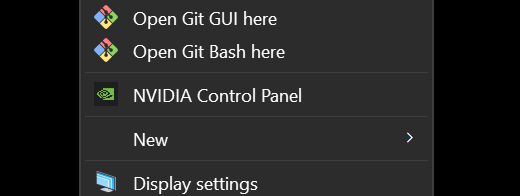
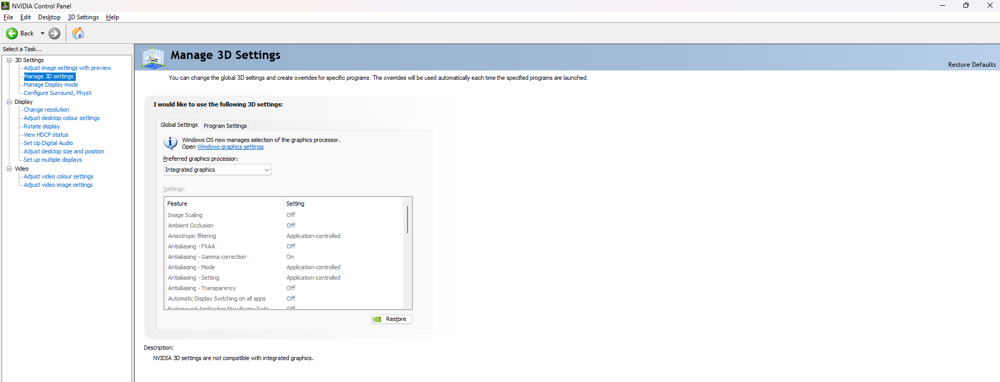

# FAQ
## Windows
### 1. Low framerate on a computer with a modern dedicated graphics card
The most likely cause is that OpenSpace is using the _Integrated_ graphics card, rather than the _Dedicated_ one, the former of which is less powerful. If you are using an NVIDIA dedicated graphics card, you can change this by right clicking the Desktop and selecting "NVIDIA Control Panel" in the context menu. In the window that opens, select "Manage 3D settings" from the menu on the left and then search for the Dropdown menu called "Preferred graphics processor". It should say "Integrated graphics" right now, but double-click that setting and chose "High-Performance NVIDIA processor" instead.

After changing this setting and restarting OpenSpace, it should run at a better framerate.

## Using in Planetariums
### 1. How do I get a fulldome (fisheye) output from OpenSpace?
When you first start up OpenSpace, you get a screen where you can choose a _Profile_ and choose _Window Options_. _Window Options_ is where you can choose to use a fisheye configuration.

### 2. How can I save screenshots in a resolution higher than my screen resolution? For example, my computer screen can only display 1920x1080, but I want to capture 4096x4096 pngs using the session recording function.
You can choose to display a different resolution, and render at a different resolution. The `single.json` _Window Options_ configuration file is an example that has a display resolution of 1280x720 (the `"size"` parameter) but renders PNGs at 2560x1440 (the `"res"` parameter). These configuration files are located in the `config` directory --- you can write your own for your desired resolution.

### 3. How can I get rid of the text and GUI elements in my planetarium display?
There are several ways to do this. For example, you could
- press {kbd}`TAB` and {kbd}`SHIFT+TAB` to toggle visibility of the GUI and text elements respectively
- create or use a _Window Options_ configuration file which renders the GUI and the data visualization separately on different windows, for example the `single_fisheye_gui.json` configuration file
- create a [HTML control page](/how-to/html-controls-setup/index) and use that to control the navigation, hiding the GUI

### 4. How do I ensure that all the data sets I need are loaded before playing back a recorded path? Can I play back without an internet connection?
Go into the `openspace.cfg` file and set {menuselection}`ModuleConfigurations --> GlobeBrowsing --> MRFCacheEnabled` to `true`. Run OpenSpace again it will cache the globe browsing data for planet/moon locations you visit. Then later, it should use the cached data for those same locations. There is also an `offline` profile that you can select from the launcher, and see if that has the content you want.

## Related to running OpenSpace on MacOS, Linux and unsupported hardware
### 1. Why do you only provide Intel Mac packages? Why not packages for Apple Silicon Macs?
When starting an x86 or x64 application on MacOS, it automatically runs through the Rosetta 2 translation layer, so that the ARM chip in the machine can execute the instructions.  That part is not really a big deal and it would come with some performance loss that could be acceptable.  However, we are using OpenGL as our graphics pipeline, which Apple has deprecated on their platforms for a number of years now.  The way they still support it on M1 is a separate conversion layer that transforms the OpenGL calls into Metal 3 (the Apple-specific graphics API) before it gets executed by the GPU cores on the M1/M2 chip.  Apple decided for some very strange reason to not support double precision floating point operations (https://developer.apple.com/metal/Metal-Shading-Language-Specification.pdf Section 2.1) which we use everywhere in OpenSpace to get enough precision for the whole universe. So as soon as we run any OpenGL that uses double precision, it no longer uses the GPU cores built into the chip, but reverts to software-based rendering, which kills the performance entirely.

Asahi Linux has successfully ported OpenGL to Apple Silicon Macs, so those with Apple Silicon Macs could, if they're feeling adventurous, [install Asahi Fedora remix](https://asahilinux.org/fedora/) and try to compile and run OpenSpace on their Apple Silicon Macs.

### 2. Does OpenSpace run on Linux?
Yes. Linux users can compile and run OpenSpace using the MIT licensed code on [GitHub](https://github.com/OpenSpace/OpenSpace). Also see the [Compile instructions](/dev/compiling/index) on this page.

### 3. I don't have an NVidia graphics card. Can I still run the Windows executable on my Windows laptop which has integrated Intel graphics?
Yes. The executable will run, but as integrated Intel cards are generally less powerful than dedicated graphics cards, the frame rate would be very low.

Futhermore, AMD cards work in principle, but might have some non-fatal rendering glitches.

### 4. What keyboard shortcuts does OpenSpace support?
You can view the keyboard bindings included in the current _Profile_ by clicking on the left-most {menuselection}`Kebab button (three vertical dots)` in the GUI and choosing the {menuselection}`Show Keybindings` menu item. You can also add more keyboard shortcuts or keybindings by editing the _Profile_ on startup. The full list of properties for which you can add keybindings can be found in the _index.html_ file under the _documentation_ directory of your installation.
