---
authors:
  - name: Brian Abbott, Micah Acinapura
    affiliation: American Museum of Natural History
---

# Navigation Panel: Focus & Fly

:::{figure} toolbar_navigation.png
:align: center
:width: 1000px
:alt: Toolbar with the Navigation Panel highlighted
:::

::::::::{tab-set}

:::::::{tab-item} Overview

The Navigation Panel is primarily used to target objects and navigate to those objects.

The name of the object that is set to Focus will appear in the toolbar button, in this case Earth is set to Focus as seen in the above image. If you focus on the James Web Space Telescope, then the button would expand to accommodate that name in the Toolbar.

:::{figure} /getting-started/orientation/panel_navigation.png
:align: center
:width: 400px
:alt: OpenSpace's Navigation Panel

The Navigation Panel, with a top, iconized menu that determines which menu is displayed below.
:::

The panel has an iconized submenu at the top that determines what you see in the panel:
- {h=2em} --- The target button shows the list of objects that you can quickly designate as Focus, and includes a search box to choose other data sets that don't appear in the menu.
- {h=2em} --- The achor and aim button brings up a menu where you can choose one object to anchor to and another one to aim toward.

## Focus

In OpenSpace, there must be an object that is set as the Focus. This can be any asset that you load in the profile, or it can be the _root_: {math}`(0, 0, 0)`. In most profiles, Earth is set as the Focus because most data sets and navigation takes place around Earth.

The Focus is important because it affects _how_ one flies through data. With Earth as the default Focus, you will orbit around Earth with the {menuselection}`left mouse button` and you will zoom in and out relative to Earth with the {menuselection}`right mouse button`.

As long as the focused object remains in view, your flying will make sense. If the object that is set to Focus is out of view in the Graphics Window, then flying will be a little counterintuitive. We discuss this more in .

:::{note}
See  in  for details about the Flight Modes and how the Focus affects each of them.
:::

### Change Your Focus

In order to visit another object in OpenSpace, it is easier, and often necessary, to make that object the Focus. This is particularly true if you want to visit another planet, moon, or spacecraft.

:::{note}
All of the large data sets in OpenSpace are observed from telescopes on Earth, or in low-earth orbit. These data sets are typically centered on Earth, so there is little need to change Focus to them because you're not attempting to fly up to an object, per se. Rather, you will examine these data from a macro level that allows you to view the entire data set.

There is no need to change focus unless you're planning to visit an individual point in space or object in the Solar System.
:::

To change the focus, make sure {w=25px} is selected in the panel's top menu, then you can do one of three things:
- Click on the object in the resulting list, or
- If the object you're looking for is not there, you can search for it, or
- If you don't know the name of the object you're looking for, hit the {menuselection}`More` button and an alphabetical list of all loaded assets will appear.

:::{dropdown} Changing the Focus Transition Time

The time it takes to transition from one object to the newly focused object can be adjusted in the Settings Menu using Retarget Interpolation Time. \
{menuselection}`Settings --> Navigation Handler --> Orbital Navigator --> Retarget Interpolation Time`.

The higher the number, the longer it will take between the two targets.
:::

Once you select an object, OpenSpace will center that object up for you, but it will not fly there for you. That is the next step...

## Flying to an Object

Once you change your target, there are several ways to fly to that object.
- Because OpenSpace has centered the object up, you can use the Zoom Flight Mode and fly directly to it yourself at your own pace.
- {w=25px} You can use the Refocus Button to have OpenSpace fly there by taking a straight line to the object but panning your view for a graceful tansition.
- {w=25px} You can use the Fly To Button to have OpenSpace fly to the object using a curved path to the target.
- {w=25px} The Jump To Button which fades your view to black, then fades back up beside the object.

:::{dropdown} Changing the Flight Transition Time
The time it takes to fly to a target can be adjusted in the Settings Menu using the Speed Scale. \
{menuselection}`Settings --> Navigation Handler --> Path Navigator --> Speed Scale`.
:::

## Anchor & Aim

While Focus chooses an object to center and navigate around, Anchor and Aim allow you to essentially set an object as the focus, then set a different object to aim toward.

### Anchor an Object

{h=2em} The Anchor panel menu reveals the list of possible objects to set as your anchor. Once you choose an object from the list, or search for an existing asset, it sets that object to the Focus. So, like Focus Mode, it will center the object up in the Graphics Window, and your navigation will revolve around that object.

### Aim Toward an Object

{h=2em} Once an object is set to Anchor, you can then set a different object to aim toward. This allows you to keep one object as your focus while looking toward another object. This is useful when, for example, you want to follow the space station as it orbits Earth, but keep Earth in view as time moves forward.

:::::::

:::::::{tab-item} Tutorial

## Tutorial

::::::{grid} 1 2 2 2

:::::{grid-item}
This tutorial will demonstrate how you can use the Navigation Panel to explore data in OpenSpace. We will:
- Explore the Focus Mode.
- Understand how flying works with your focus.
- Use the Anchor & Aim Mode to orchestrate more complex scenes.

We will also use the Time Panel, which we will cover in more detail.
:::::

:::::{grid-item}
:::{important}

{.no-bullet}
- {octicon}`rocket;1.25em;profile-tour-action` : Flight instructions
- {octicon}`diff-added;1.25em;profile-tour-action` : Turn on a data set
- {octicon}`diff-removed;1.25em;profile-tour-action` : Turn off a data set
- {octicon}`tools;1.25em;profile-tour-action`: Adjust a setting
- {octicon}`telescope;1.25em;profile-tour-action` :  Target an object
- {octicon}`stopwatch;1.25em;profile-tour-action` : Change the time settings

:::
:::::
::::::

### Begin at Earth

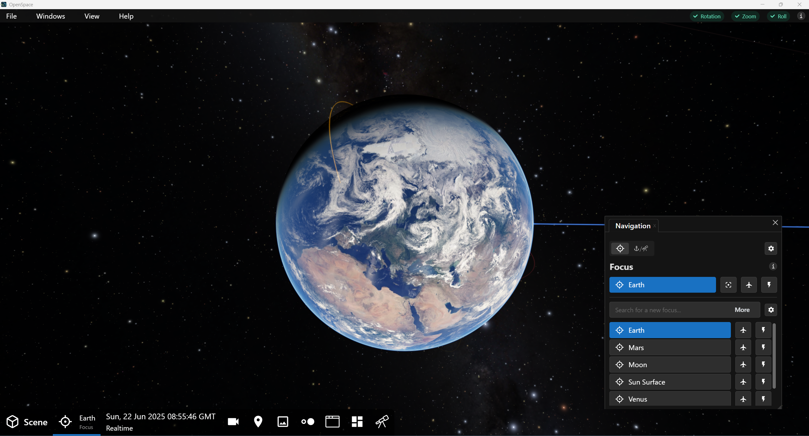

{.tutorial}
1. Bring up the Navigation Panel by clicking its button in the Toolbar.
2. Move the panel off to the right and out of the way.

### Zoom Out to the Moon's Orbit

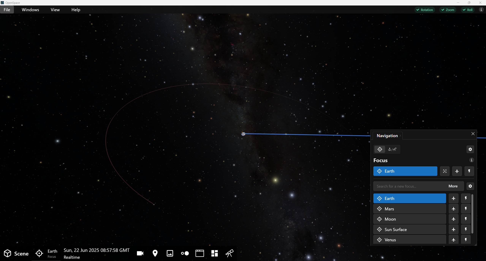

{.tutorial}
1. {octicon}`rocket;1.25em;profile-tour-action` Zoom away from Earth until you see the Moon's orbit.
2. Note that Earth remains the Focus.

### Focus on the Moon

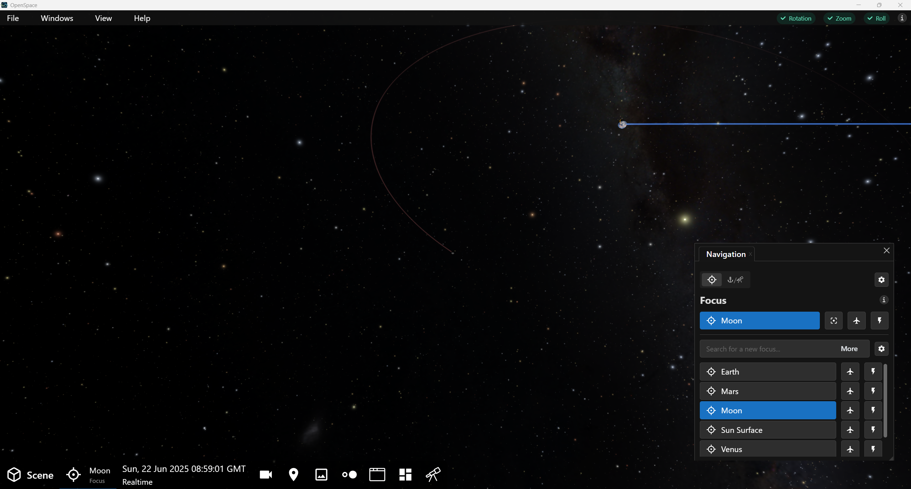

{.tutorial}
1. {octicon}`telescope;1.25em;profile-tour-action` Choose Moon in the Focus Panel. This will set the Focus to the Moon and center it.
2. {octicon}`rocket;1.25em;profile-tour-action` Orbit a bit to see that motion is now relative to the Moon.

### Fly to the Moon

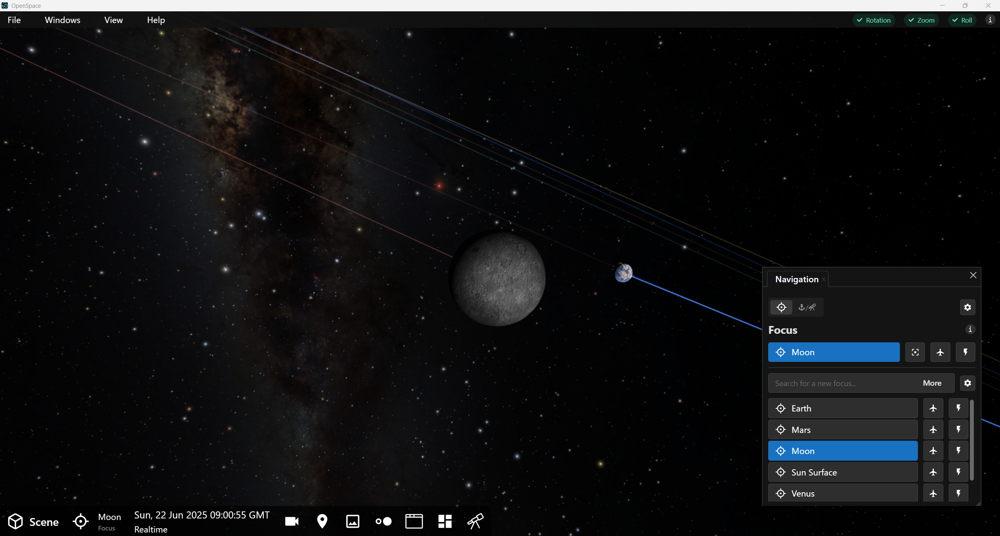

{.tutorial}
1. {octicon}`rocket;1.25em;profile-tour-action` Fly to the Moon manually by holding down the {kbd}`right mouse button`.
2. {octicon}`rocket;1.25em;profile-tour-action` Orbit from a reasonable distance so that you see Earth in the background.

### Anchor the Moon, Aim to Earth

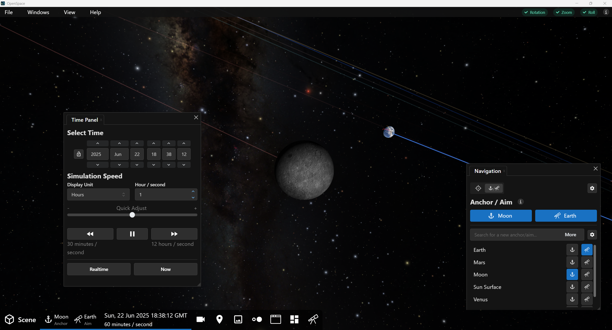

{.tutorial}
1. Open the Anchor and Aim submenu of the panel, confirm that the Moon is set to Anchor.
2. {octicon}`telescope;1.25em;profile-tour-action` Choose Earth as the Aim by clicking the telescopr button next to Earth. This will keep your spaceship aimed toward Earth and move Earth to the center, behind the Moon.
3. {octicon}`rocket;1.25em;profile-tour-action` Orbit a bit to bring Earth back into view.
4. {octicon}`stopwatch;1.25em;profile-tour-action` Use the Time Panel to change the Simulation Speed to 1 hour/second.
5. As the clock goes, we are traveling with the Moon, but looking toward Earth.
6. As the Moon orbits Earth, we will follow alongside it.
7. {octicon}`stopwatch;1.25em;profile-tour-action` Pause time.

### Practice Automated Flight

{.tutorial}
1. {octicon}`telescope;1.25em;profile-tour-action` In the Focus submenu, set Earth as the Focus.
2. {octicon}`rocket;1.25em;profile-tour-action` Fly to Earth using the Pan & Fly Button {h=2em}.
3. {octicon}`rocket;1.25em;profile-tour-action` Fly back out to the Moon manually using the {kbd}`right mouse button`.
4. {octicon}`rocket;1.25em;profile-tour-action` Revisit Earth using the Fly To button {h=2em}. Notice this is a curved path.

### Focus on ISS and Jump to It

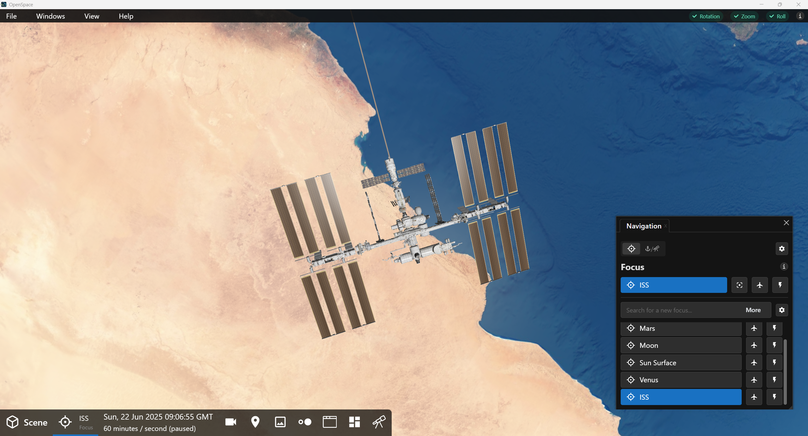

{.tutorial}
1. {octicon}`diff-added;1.25em;profile-tour-action` Turn on the International Space Station (ISS) if it's not already on: \
{menuselection}`Scene --> Solar System --> Planets --> Earth --> Satellites --> ISS`
2. {octicon}`telescope;1.25em;profile-tour-action` In the Navigation Panel, Focus submenu, select `ISS`.
3. {octicon}`rocket;1.25em;profile-tour-action` Fly up to the space station using the {kbd}`right mouse button` or any of the automatic flight buttons.

:::{tip}
You can see where the ISS is by the shading on its orbital path. If the ISS is out of view---in other words, it's on the opposite side of Earth---you run the risk of flying right through Earth. This is inelegant. It's best to manually orbit Earth to bring the ISS into view in front of Earth, then fly toward it.
:::

### Turn off Trails with Action Panel

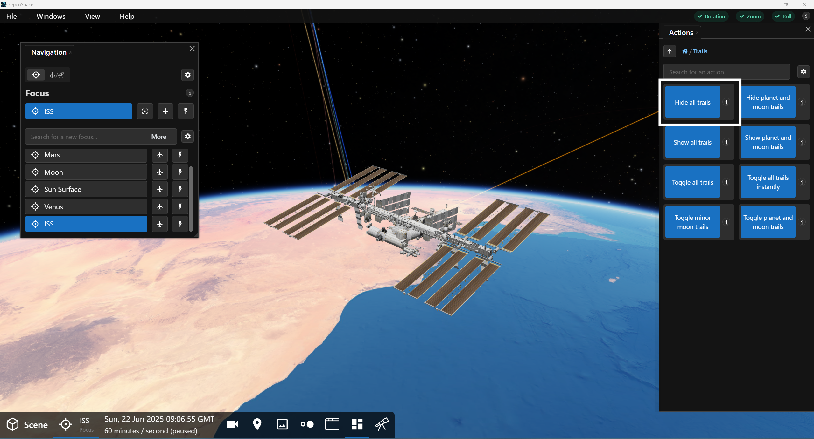

{.tutorial}
1. {octicon}`rocket;1.25em;profile-tour-action` Rotate around ISS to see the Earth's horizon.
2. {octicon}`rocket;1.25em;profile-tour-action` Level the horizon using the {kbd}`Shift` + {kbd}`left mouse button` so that Earth fills the bottom half of your view.
3. {octicon}`diff-removed;1.25em;profile-tour-action` Turn off trails using {menuselection}`Action --> Trails --> Hide All Trails`.
4. {octicon}`stopwatch;1.25em;profile-tour-action` Set the clock speed at 1 second/second by hitting the `Realtime` button.
5. {octicon}`stopwatch;1.25em;profile-tour-action` Use the Time Panel's Quick Adjust slider and move the indicator up one tick, which will be about 4 seconds per second.
6. {octicon}`stopwatch;1.25em;profile-tour-action` Switch the Simulation Speed up to Hours. Earth suddenly starts moving violently. This is because we are focused on the ISS.
7. {octicon}`stopwatch;1.25em;profile-tour-action` Return the Simulation Time to Seconds.

### Aim to Earth

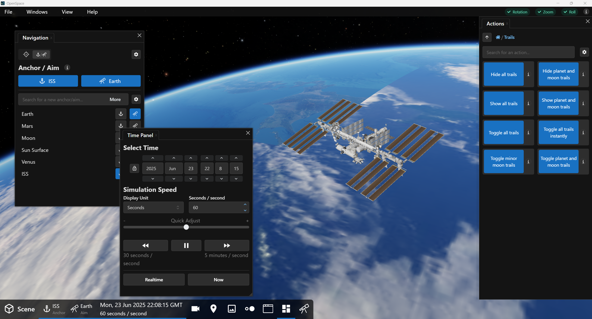

{.tutorial}
1. {octicon}`telescope;1.25em;profile-tour-action` In the Navigation Panel, use the Aim submenu to set the Aim to Earth. This will move you so you're directly looking down on the ISS and Earth.
2. {octicon}`rocket;1.25em;profile-tour-action` Rotate around ISS to see Earth's horizon again.
2. {octicon}`rocket;1.25em;profile-tour-action` Use the Pan Flight Mode ({kbd}`Ctrl` + {kbd}`left mouse button`) to move ISS out of the center.
3. {octicon}`stopwatch;1.25em;profile-tour-action` Increase the Simulation Time to 5 seconds/second. Now, the ISS rotates a bit, but Earth remains stationary in your view as we follow the ISS around it. This is more manageable. You can increase the simulation time with the Quick Adjust Slider to see the ISS rotate more quickly.
4. {octicon}`stopwatch;1.25em;profile-tour-action` Reset the Simulation Time back to normal by pressing the `Realtime` button.

### Use Home key to Focus on Earth Again

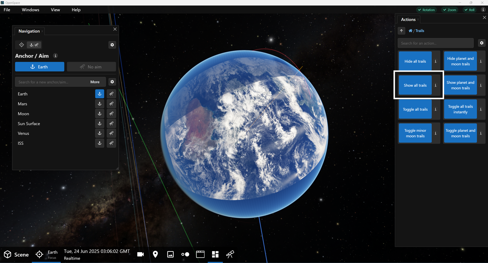

{.tutorial}
1. {octicon}`telescope;1.25em;profile-tour-action` Use the {kbd}`Home` key to return Earth to Focus.
2. {octicon}`rocket;1.25em;profile-tour-action` Zoom away from Earth a bit.
3. {octicon}`diff-added;1.25em;profile-tour-action` Turn trails back on using {menuselection}`Actions --> Trails --> Show All Trails`.

### Focus on Mars

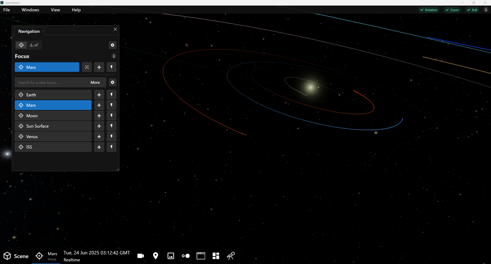

{.tutorial}
1. {octicon}`telescope;1.25em;profile-tour-action` Using the Navigation Panel, select Mars from the Focus submenu.
2. {octicon}`rocket;1.25em;profile-tour-action` Fly up to the system manually, using the Zoom Flight Mode.

### Focus on Phobos

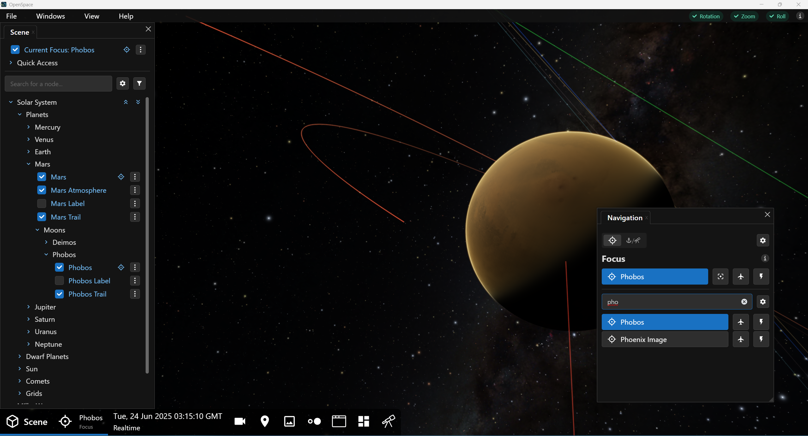

{.tutorial}
1. {octicon}`telescope;1.25em;profile-tour-action` Focus Phobos using one of the following two ways:
  - Using the Scene Menu, set Mars' moon Phobos as the Focus. \
{menuselection}`Scene --> Solar System --> Planets --> Mars --> Moons --> Phobos --> Phobos`.
  - Using the Navigation Menu, search for Phobos in Focus menu and select it.
2. {octicon}`rocket;1.25em;profile-tour-action` Approach Phobos so it's in the foreground.

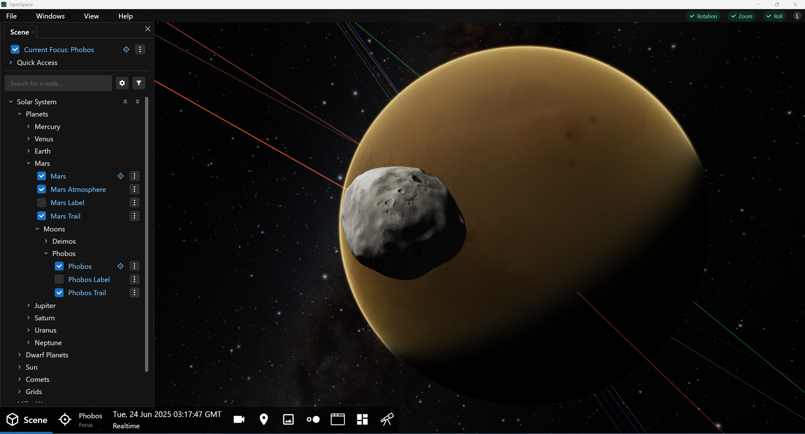

### Aim to Mars

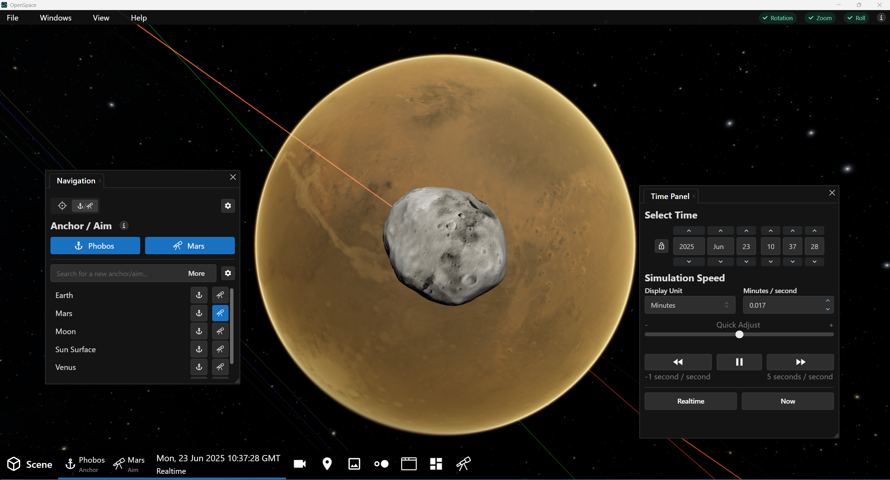

{.tutorial}
1. {octicon}`telescope;1.25em;profile-tour-action` Aim to Mars in the Navigation Panel's Aim submenu.
2. {octicon}`stopwatch;1.25em;profile-tour-action` In the Time Panel, change the Simulation Unit to Minutes.

### Follow Phobos

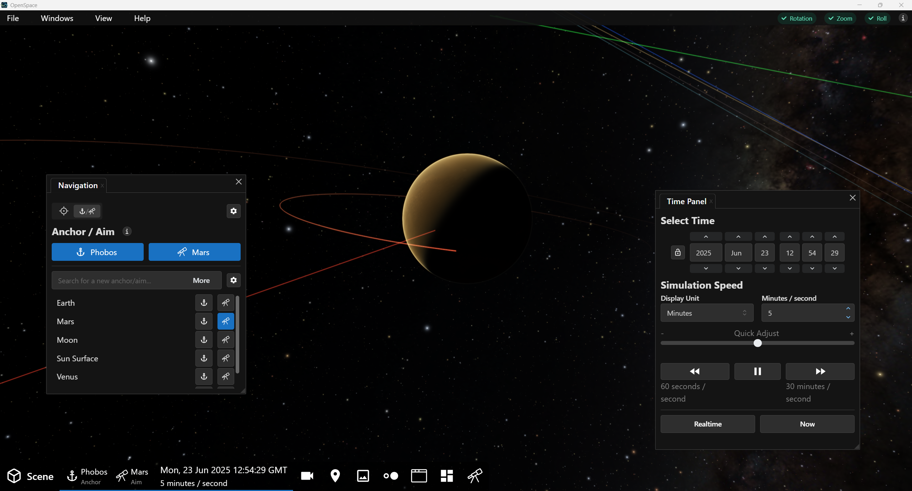

{.tutorial}
1. {octicon}`stopwatch;1.25em;profile-tour-action` Set the Simulation Time to 5 minutes / second by clicking inside the input box and typing `5`.
2. {octicon}`rocket;1.25em;profile-tour-action` Fly out to see Mars and it's moon's orbits.
3. Now, Phobos remains stationary but everything else is moving slowly.

### Focus on Mars

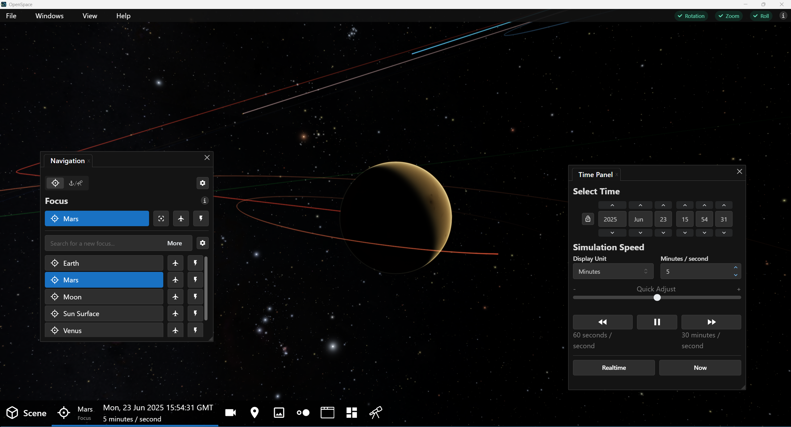

{.tutorial}
1. {octicon}`telescope;1.25em;profile-tour-action` Set Mars back to the Focus.
2. Note now that Mars is stationary and its moons are revolving around the planet. This is as you probably expect---Mars is stationary and the moons are now moving around it.

### Phases of the Moon

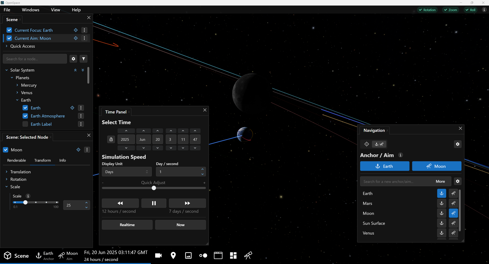

{.tutorial}
1. Jump To Earth, by pressing the Jump To button [Jump to](../../getting-started/orientation/navigation_panel_jump_button.png){h=2em} in the Focus submenu. This takes you directly to Earth and sets it as Focus.
2. {octicon}`stopwatch;1.25em;profile-tour-action` Pause time.
3. {octicon}`rocket;1.25em;profile-tour-action` Orbit to locate the Moon.
4. {octicon}`tools;1.25em;profile-tour-action` Increase the Moon's Scale to 25. {menuselection}`Scene --> Solar System --> Planets --> Earth --> Moon --> Moon --> Scale`. Click in the text input box and type `25`, then press {kbd}`Enter`.
5. {octicon}`telescope;1.25em;profile-tour-action` Aim at the Moon. In the Navigation Panel, select the Anchor & Aim submenu and click the telescope button next to Moon.
6. {octicon}`rocket;1.25em;profile-tour-action` Orbit a bit to move the Moon away from Earth.
7. {octicon}`stopwatch;1.25em;profile-tour-action` Set the Simulation Time to 1 day/second.
8. Watch the Moon's phases as it orbits Earth.
9. {octicon}`stopwatch;1.25em;profile-tour-action` Pause time and {octicon}`telescope;1.25em;profile-tour-action` set Focus to Earth.

### Conclusion

This tutorial exercised your use of the Navigation Panel and, to some degree gave you an introduction to the Time Panel and Scene Panel. We demonstrated several means of navigating around space, whether manually or using one of the automated flight functions. And, we showed the utility and differences between Focus, Anchor, and Aim when bringing an object front and center.

::::::::