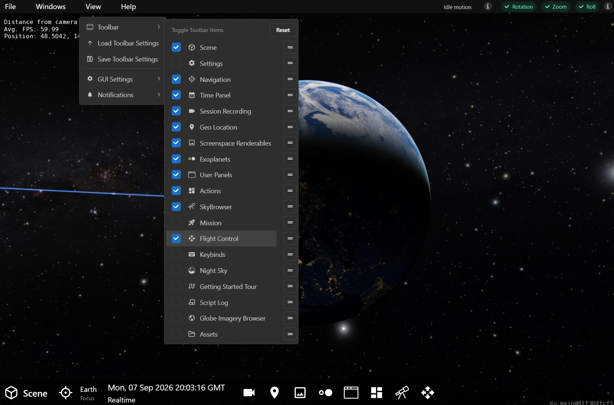
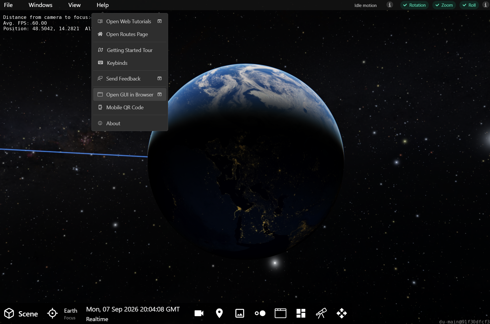
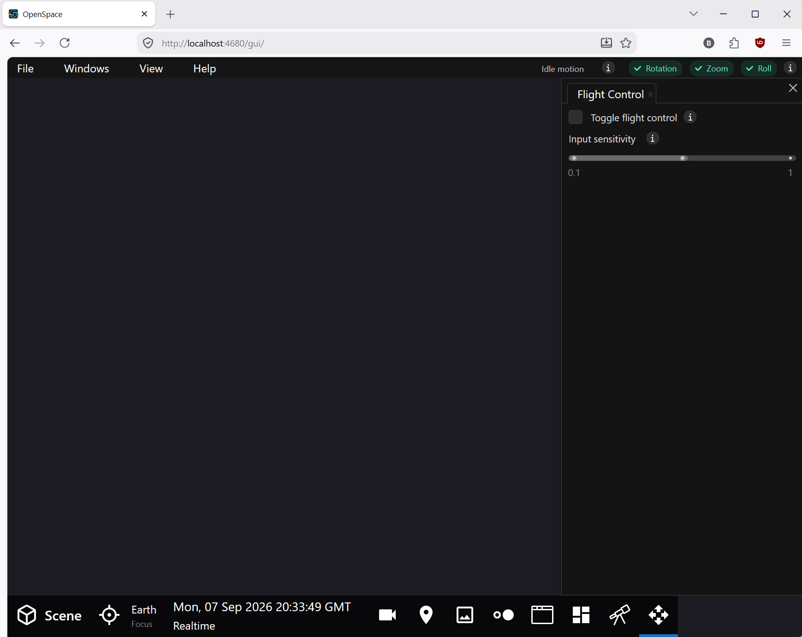
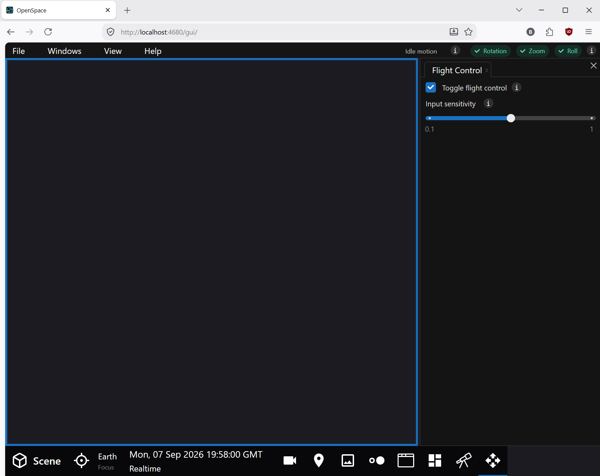

# Flight Control Panel

{menuselection}`Windows --> Flight Control`

The Flight Control Panel is designed to control OpenSpace from a web browser. Used in conjunction with the menu item {menuselection}`Help --> Open GUI in Browser`, Flight Control shifts over the flight capabilities to that browser window.

:::{figure} flight_control_panel.png
:align: center
:width: 80%
:figwidth: 60%
:alt: OpenSpace's Flight Control Panel

OpenSpace's Flight Control Panel.
:::

:::{note}
It is possible to enable the Flight Control on the native OpenSpace window, but this only serves to be redundant to the flight controls that are built into OpenSpace itself. The Flight Control Panel is designed expressly to control the flight from an external browser window.
:::

To understand how this panel works, let's go through the steps.

## 1. Display the Flight Control Panel in the Toolbar

{menuselection}`View --> Toolbar --> Flight Control`

The panel is not shown in the Toolbar by default. Go to the menu item and check the Flight Control item to enable it in the Toolbar.

:::{note}
You can also use {menuselection}`Windows --> Other --> Flight Control` to bring up the panel directly, bypassing the Toolbar, but in this case we do not yet want to open the panel.
:::

## 2. Open the GUI in a Web Browser

{menuselection}`Help --> Open GUI in Browser`

To port the {abbr}`GUI (Graphical User Interface)` over to a web browser, use the menu item indicated above. Once you select that, a window will open in your default web browser with all the menus, buttons, and panels found in OpenSpace; however, you won't have any control over the flight.

## 3. Open the Flight Control Panel in the Browser

Now, open the Flight Contol Panel in the *browser* window using its toolbar button {w=30px}.

## 4. Toggle Flight Control On

Check the {menuselection}`Toggle flight control` item in the panel to enable flight controls in the browser window. You will see a blue outline around the space where the mouse can actively affect navigation in OpenSpace.

