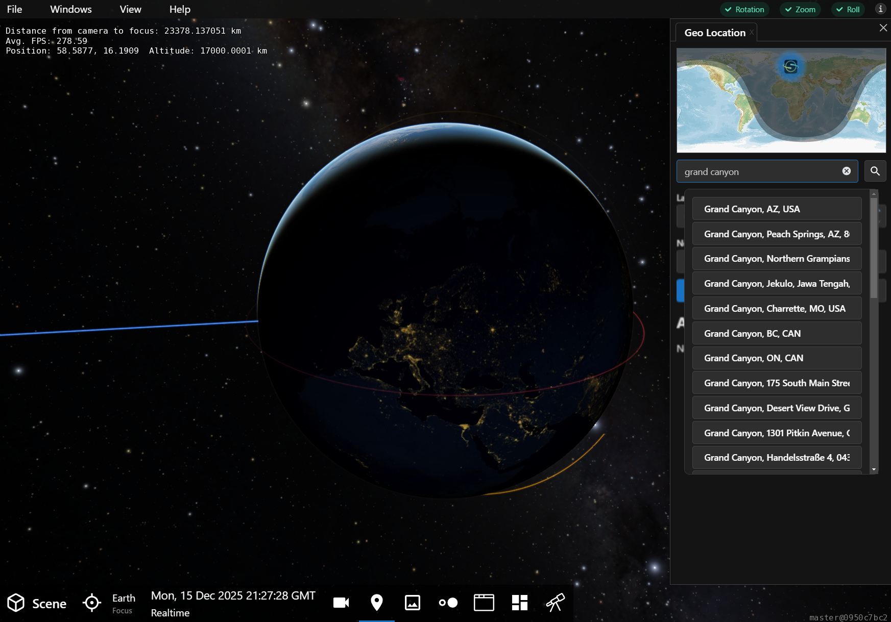
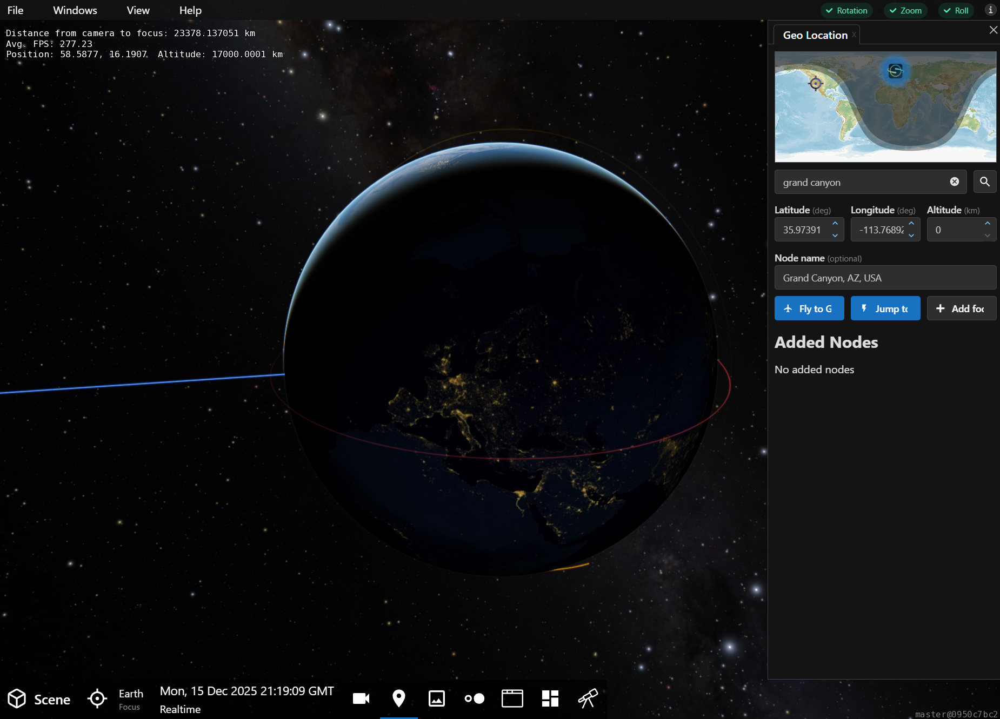
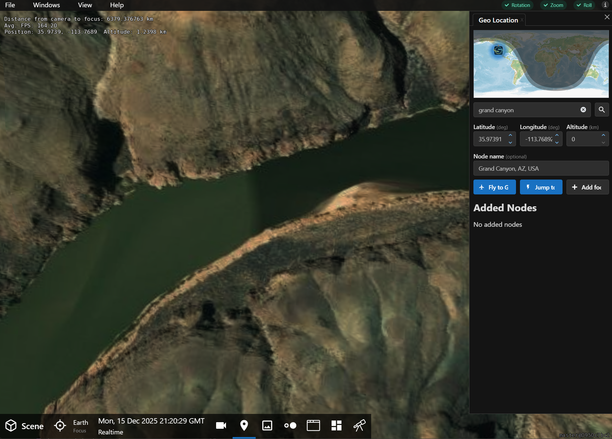
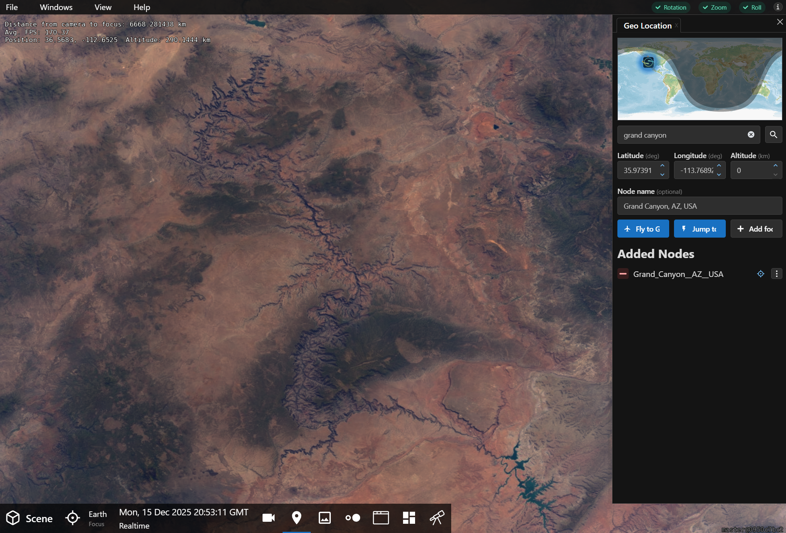
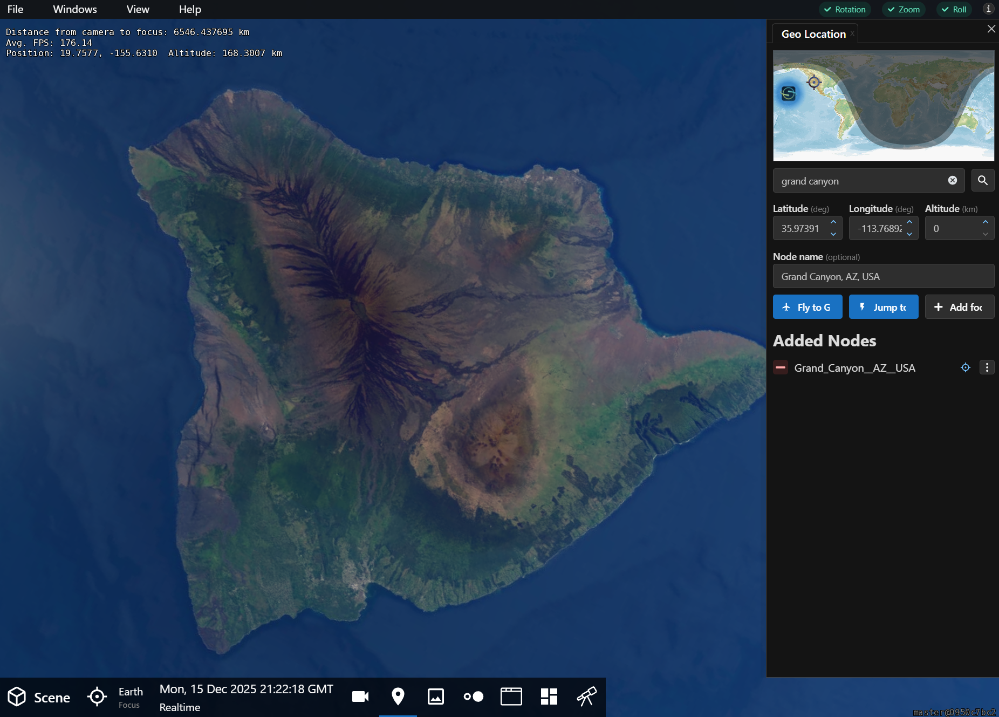

---
authors:
  - name: Brian Abbott
    affiliation: American Museum of Natural History
---

# GeoLocation Panel

::::::::{tab-set}

:::::::{tab-item} Overview

## Overview

Use the GeoLocation Panel to locate places on Earth, navigate to them, and save them as scenes. The panel is straightforward with only few sections: the map, the search area, and a list of any added nodes (locations) to the scene.

:::{figure} geolocation_panel.png
:align: center
:width: 60%
:figwidth: 80%
:alt: OpenSpace's GeoLocation Panel

The GeoLocation Panel in OpenSpace.
:::

### Search

The most precise way to target a place on Earth is to use the search box to enter a place. Once you hit {kbd}`Enter` or the {octicon}`search;1em` button, results will appear below the box. Select the desired place from the list.

:::{figure} geolocation_panel_search.png
:align: center
:width: 100%
:alt: OpenSpace's GeoLocation panel searching for Grand Canyon

A search for "Grand Canyon" in OpenSpace's GeoLocation Panel results in a dropdown list of matches for you to select.
:::

Once you select one of the matches from the list, the location's coordinates appear in the Latitude and Longitude boxes, and a name for the place appears in the Node Name box.

### Map

The map performes a dual role: as an interactive location picker, and to show status.

Instead of using the search box, you can simply use your mouse to pinpoint a place on the map. This is rather imprecise, but allows you choose a location interactively. 

More importantly, the map shows your status. The OpenSpace icon on the map indicates what you are seeing---the camera's position in OpenSpsace. The target icon indicates the location chosen in the GeoLocation Panel. Of course, once you fly to the chosen location, the two indicators will be superimposed. 

### Custom Coordinate

You can also enter specific coordinates and fly to that location. Enter the latitude, longitude, and altitude above Earth, as well as an optional name for the position.

### Navigation Options

Once you have a location chosen, you can use one of the navigation buttons, {menuselection}`Fly To` or {menuselection}`Jump To`, to have OpenSpace navigate to that spot. As usual, Fly To will perform a flight from your current location to the chosen location in the Node Name box. Jump To will fade to black and fade back up at the chosen location.

### Add Focus

Use the {menuselection}`Add focus` button to add the chosen location to the scene. This enables you to build a list of locations and navigate between them for this session. Once a location is in the list, you can target the location using the target button beside the list item, use the submenu for more navigation options, or delete it using the red minus button beside the location. You can also access the location in the Scene Panelunder the {menuselection}`GeoLocation` section.

:::::::

:::::::{tab-item} Tutorial

::::::{grid} 1 2 2 2

:::::{grid-item}
## GeoLocation Panel Tutorial

As a quick exercise, we will fly to the Grand Canyon in the US using the GeoLocation Panel. This will show how the search box, map, and saving a location as a node work together.
:::::

:::::{grid-item}
:::{important}

{.no-bullet}
- {octicon}`rocket;1.25em;profile-tour-action` = Flight instructions
- {octicon}`diff-added;1.25em;profile-tour-action` = Turn on a data set
- {octicon}`diff-removed;1.25em;profile-tour-action` = Turn off a data set
- {octicon}`tools;1.25em;profile-tour-action` = Adjust a setting
- {octicon}`telescope;1.25em;profile-tour-action` = Target an object
- {octicon}`stopwatch;1.25em;profile-tour-action` = Change the time settings

:::
:::::
::::::

### Search for the Location

{.tutorial}
1. Bring up the GeoLocation Panel by clicking the {h=20px} button in the Toolbar.
2. Enter "Grand Canyon" in the search box, and press {kbd}`Enter`, or press the search button beside the box. You will see numerous matching search results.

### Choose the Location

{.tutorial}
1. Choose "Grand Canyon, AZ, USA" from the results. 
2. Once you choose a specific place, its latitude and longitude and a node name will appear in their respective boxes. 
3. Note, too, while the OpenSpace icon has not moved on the map---we are still looking at the same place on Earth---there is a new target indicating the location of the Grand Canyon.

### Fly to the Location

{.tutorial}
1. {octicon}`rocket;1.25em;profile-tour-action` Use the {menuselection}`Jump To` button to have OpenSpace take you to the location directly.
2. Now, the OpenSpace icon on the map has moved to the target position because we are now looking at the target location.

### Fly Away for Context

{.tutorial}
1. {octicon}`rocket;1.25em;profile-tour-action` Fly away using the {menuselection}`right mouse button` from this close-up view to gain more context on the location.

### Fly to a Different Location

{.tutorial}
1. {octicon}`rocket;1.25em;profile-tour-action` Fly to any other locaiton on Earth---here we chose the island of Hawaii. 
2. Note, now, on the map the target remained at the Grand Canyon, while the OpenSpace icon that indicates what you are seeing in OpenSpace has moved. 

:::::::

::::::::