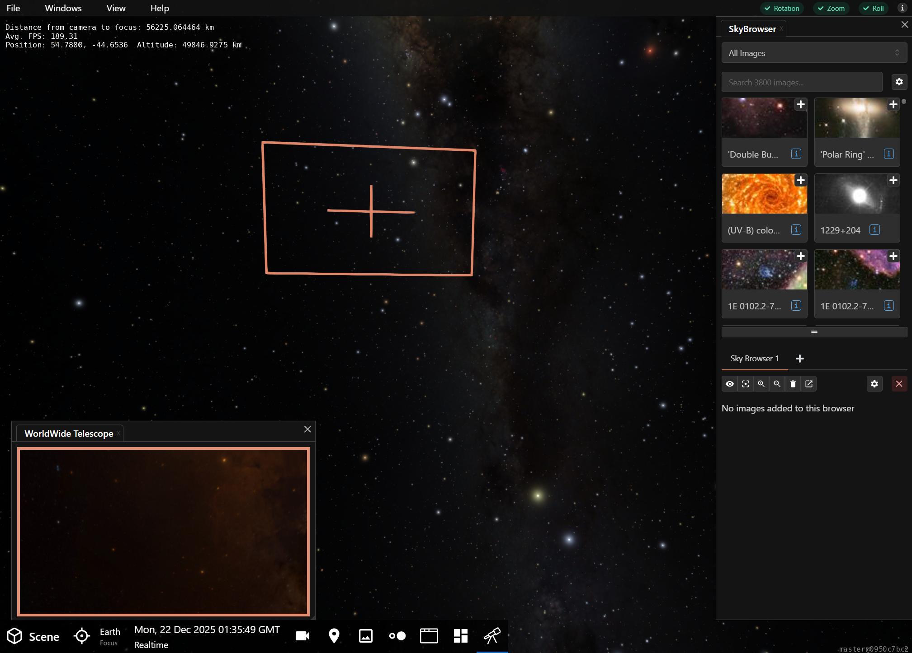
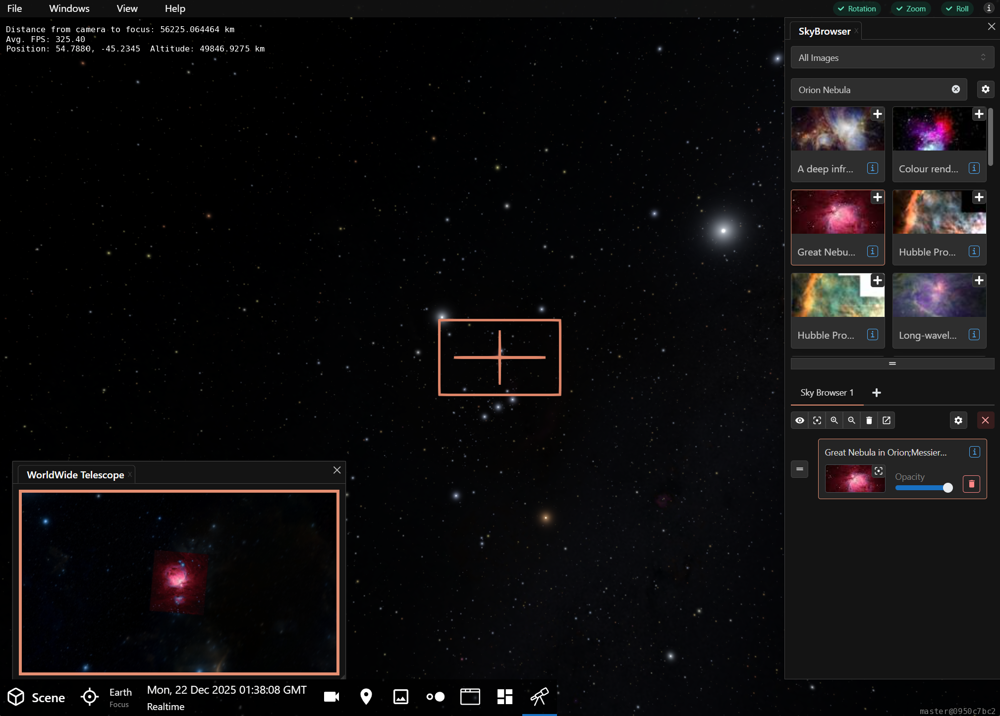
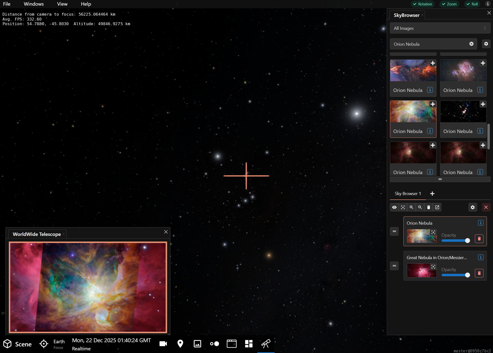
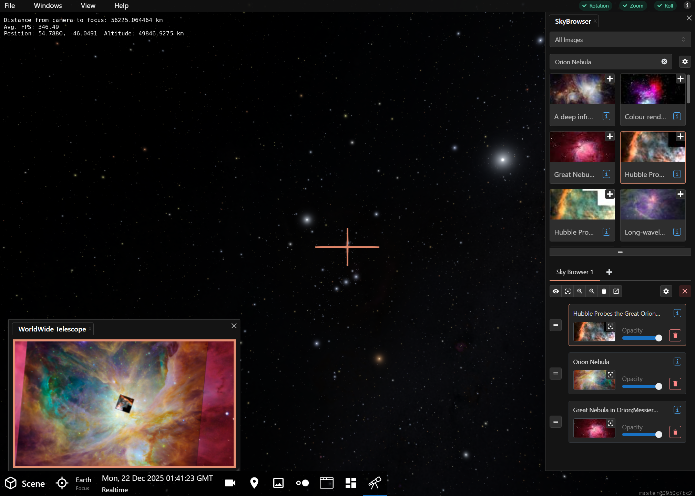
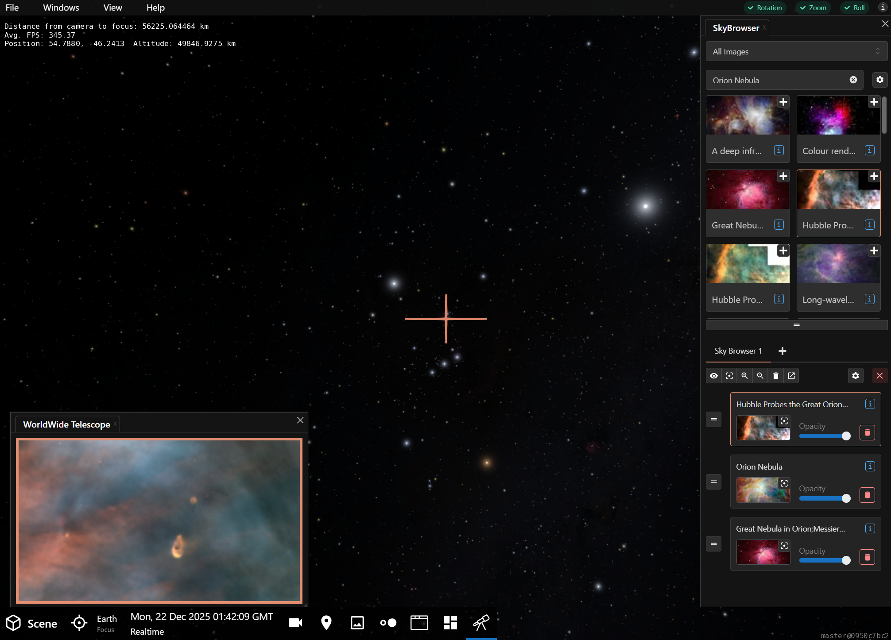
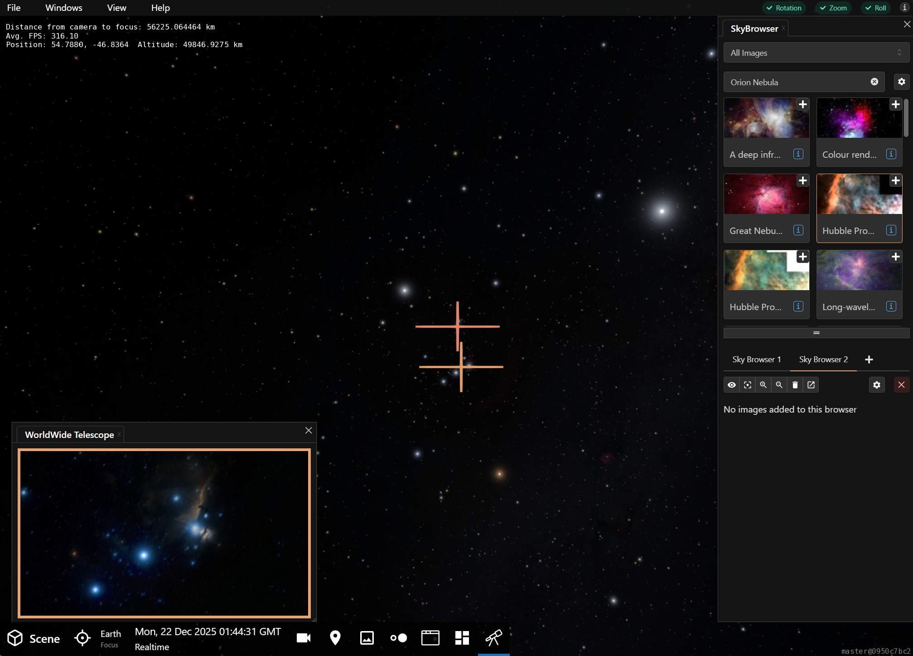
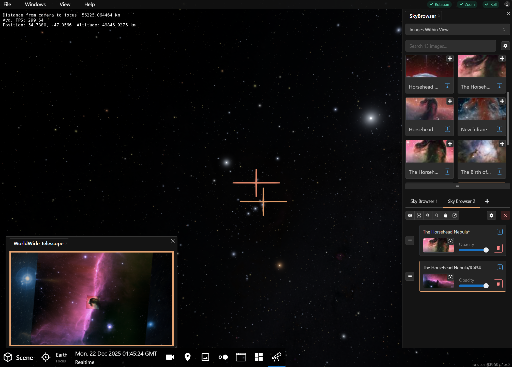

---
authors:
  - name: Brian Abbott, Alex Bok
    affiliation: American Museum of Natural History
---

# SkyBrowser Panel

The Sky Browser is an overlay window---a virtual telescope, if you will---that interactively connects OpenSpace to the night sky. Powered by [WorldWide Telescope](http://worldwidetelescope.org/webclient/), the SkyBrowser displays images in an overlay window that connects to the night sky via a target. 

The SkyBrowser enables you to view the famous, and not-so-famous, images from the world's renown telescopes. Not only are there targeted images, think Eagle Nebula's "pillars of Creation" and the like, but there are also all-sky survey images, giving you a view of the night sky in multiple wavelengths.

## Add a SkyBrowser

When you press {h=30px} on the Toolbar, the panel will appear ready for you to add a browser.

:::{figure} skybrowser_panel_addbrowser.png
:align: center
:width: 50%
:figwidth: 100%
:alt: OpenSpace's (empty) SkyBrowser Panel

The SkyBrowser Panel appearance when opening the panel for the first time. First step is to add a SkyBrowser by pressing the Add Browser button.
:::

Press the {menuselection}`Add Browser` Button to add a new browser. When you add a browser, the SkyBrowser will transform and you will see a target and overlay window:

The main elements of the SkyBrowser are:
- The target on the sky (the large cross). The box around the cross shows your field of view.
- The overlay window, titled WorldWide Telescope, showing you what is visible at the target.
- An image list in the top half of the Skybrowser Panel.
- A tabbed list of browsers in the bottom half of the SkyBrowser Panel.

## Search for an Object

The easiest way to find a specific object is to use the search box at the top of the SkyBrowser Panel. For example, if we search for "Orion Nebula," a list of images that match that term will appear in the images list.

Once you click on an image, the target will move to that location on the sky and, correspondingly, the view in the overlay window will change to reflect the location of the image you selected.

In this example figure, I chose a wide-field image of the Orion Nebula from the list of images (outlined in the same color as the target on the sky). You can see that the field of view of the SkyBrowser is still fairly large, indicated by the square around the target.

Now that I've selected an image, you can see it's now in the list of images in my SkyBrowser in the bottom half of the panel. This is now a layer that can be manipulated.

## Add Image Layers

We can choose images that give us a more detailed view of the Orion Nebula. We can add these as layers, maintaining our previous images while building a visual context.

First, add an image that overlays the center of the nebula. Now that you've added it, you can see it's now in the list of images. You can change the opacity of the images individually to see the image below it for reference, you can also reorder the images to set the order of the layers to your liking---generally smaller images should be on top of larger ones.

Next, we add a Hubble Space Telescope image of the nebula, which is smaller still, and shows far more detail. 

Each image added has some built-in functionality on its list item. You can get information on the image itself, you can fade the image up and down by adjusting its opacity, you can center the target on the image, and you can remove the image from the SkyBrowser.

:::{figure} skybrowser_layer_closeup.png
:align: center
:width: 60%
:alt: OpenSpace's SkyBrowser image list item.

Each image in a SkyBrowser has a list item with some built-in controls.
:::

## Navigate the Browser by Mouse

There are two motions to control the SkyBrowser, each mimic the motions of a telescope. One motion moves across the sky, called slew, and the other effectively is a lens zoom that allows you to see a smaller patch of sky in more detail.

::::{list-table}
:header-rows: 0
:stub-columns: 1

* - Slew
  - {kbd}`left mouse`
  - To move the target on the sky, akin to slewing a telescope. 

* - Zoom
  - {kbd}`mouse scroll wheel`
  - Zoom into or out of the image, similar to increasing or decreasiong your telescope's magnification and narrowing or expanding your field of view.
::::

Using the mouse's scroll wheel to zoom into the Hubble image of the Orion Nebula to see its details:

A close-up of the browser overlay window shows the individual proplyds in the nebula.

:::{figure} skybrowser_zoom_closeup.png
:align: center
:width: 60%
:alt: OpenSpace's SkyBrowser window showing the Orion Nebula.

A close-up of the SkyBrowser window looking at a small patch of the Orion Nebula.
:::

## Add a Second Browser

You can have multiple browsers to show different parts of the sky simultaneously. These browsers will appear as tabs in the bottom half of the SkyBrowser Panel. Go ahead and add a new browser by hitting the **{octicon}`plus;1.25rem`** beside your first "Sky Browser 1" tab.

The new browser will appear somewhere in your view, but you'll likely want to move it somewhere specific. Let's point this one to the Horsehead Nebula, just beside the southernmost belt star in Orion. Alternatively, you can search for it in the image list. You may need to increase your magnification, too, by using your scroll wheel to effectively zoom into that part of the sky.

It will likely be helpful to change the image list filter from "All Images" to "Images Within View" so we only see the images within the browser's view. Now, you can choose images of the Horsehead and overlay them, all without altering your first browser's images of the Orion Nebula. Each browser is independent of one another.

:::{figure} skybrowser_second_addlayer_closeup.png
:align: center
:width: 60%
:alt: OpenSpace's SkyBrowser window showing the Horsehead Nebula.

A close-up of the SkyBrowser window, looking at the Horsehead Nebula in Orion.
:::

## The SkyBrowser Tab Buttons

The SkyBrowser Panel has a series of functions that operate on each SkyBrowser loaded. These are the SkyBrowser Tab Buttons:

:::{figure} skybrowser_menu.png
:align: center
:width: 60%
:alt: OpenSpace's SkyBrowser Tab Buttons.

The SkyBrowser tab's buttons.
:::

::::{list-table}
:header-rows: 0
:stub-columns: 1
:widths: 10 25 65

* - 
  - Look at Target
  - Moves the *camera* so that the target is placed in the center of the view.

* - 
  - Move Target to Center of View
  - Moves the *target* so that it is placed in the current center of the view.

* - 
  - Zoom In
  - Zooms into the current view, a la increasing your magnification. Each click decreases the vertical field of view by 10&deg;.

* - 
  - Zoom Out
  - Zooms out of the current view as if you were reducing your telescopic magnification. This will increase your vertical field of view by 10&deg; with each click of the button.

* - 
  - Remove All Images
  - Removes all the images added to the selected browser. (Individual images can be removed using the trash button that accompanies each image in the list of added images.)

* - 
  - Open Telescope View
  -

* - 
  - SkyBrowser Settings
  - Opens a few panels that allow you customize the active SkyBrowser.

* - 
  - Delete SkyBrowser
  - Removes the active SkyBrowser.
::::

{.advanced-topic}
[Advanced]{.advanced}

## SkyBrowser Settings

### Browser Settings

These settings apply to each browser individually. Most are straightforward, like customizing the color of the browser, the thickness of the border, and setting its position and size.

:::{figure} skybrowser_settings_browser.png
:align: center
:width: 60%
:alt: OpenSpace's SkyBrowser settings.

The SkyBrowser's browser settings.
:::

{menuselection}`Apply Roll`, when checked, ensures that the target's up direction is always aligned with the camera's up direction. 

{menuselection}`Point Spacecraft` will align spacecrafts to point toward the location of the selected image.

### Display Copy Settings

Sometimes it is necessary to show the browser outside of the graphical user interface, for example, if you are in a dome or are using a display wall. To display the sky browser there, you can simply add Display Copies. The Display Copies are rendered in the 3D environment in OpenSpace and will be visible even if the GUI is not shown. If you are in a dome environment, you can add many Display Copies at once in order to spread them out on the Azimuth so that the browser window is visible from all parts of the theater.

:::{figure} skybrowser_settings_display_copy.png
:align: center
:width: 60%
:alt: OpenSpace's SkyBrowser Display Copy settings.

The SkyBrowser's browser Display Copy settings.
:::

Add or remove copies using the {menuselection}`Add` or {menuselection}`Remove` buttons.

{menuselection}`Scale value` sets the height of the display copy window.

{menuselection}`Face Camera` rotates the Display Copy to face the camera.

{menuselection}`Use Radius Azimuth and Elevation` determines whether the location of this screen space plane will be specified using radius, azimuth, and elevation (if 'true') or using Cartesian coordinates. The Cartesian coordinate system is useful if a regular rendering is applied, whereas the radius, azimuth, elevation are most useful in a planetarium environment.
  
{menuselection}`Added Display Copies`: For each added copy, options are available for positioning where the copy is positioned.

### General SkyBrowser Settings

These settings apply to all browsers.

:::{figure} skybrowser_settings_general.png
:align: center
:width: 60%
:alt: OpenSpace's SkyBrowser general settings.

The SkyBrowser's browser general settings.
:::

{menuselection}`Allow Camera Rotation` toggles if the camera should rotate to look at the sky target if it is going outside of the current field of view.
  
{menuselection}`Camera Rotation Speed` sets the speed of the rotation of the camera when the camera rotates to look at a coordinate which is outside of the field of view.
  
{menuselection}`Target Animation Speed` sets the speed of the animation of the target. A higher number means faster speed.

{menuselection}`Field of View Animation Speed` sets the speed of the animation of the field of view. A higher number means faster speed.

{menuselection}`Hide targets and browsers with GUI` hides the targets and browsers when the sky browser panel is minimized.

{menuselection}`Inverse Zoom Direction`, if checked, reverses the zoom direction of the scroll wheel in the browser window.

{menuselection}`Spacecraft Animation Time` sets the duration (in seconds) of the animation of the spacecraft when it is pointed to browser target.
  
  
